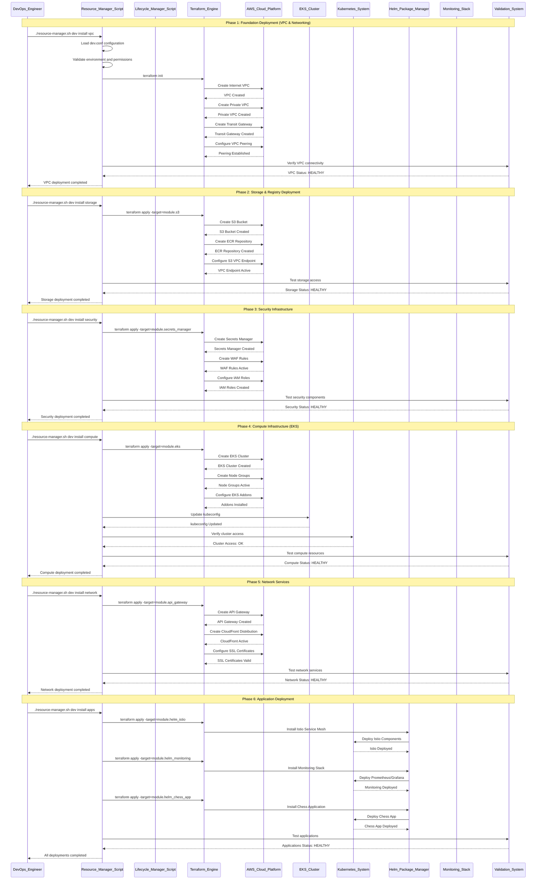
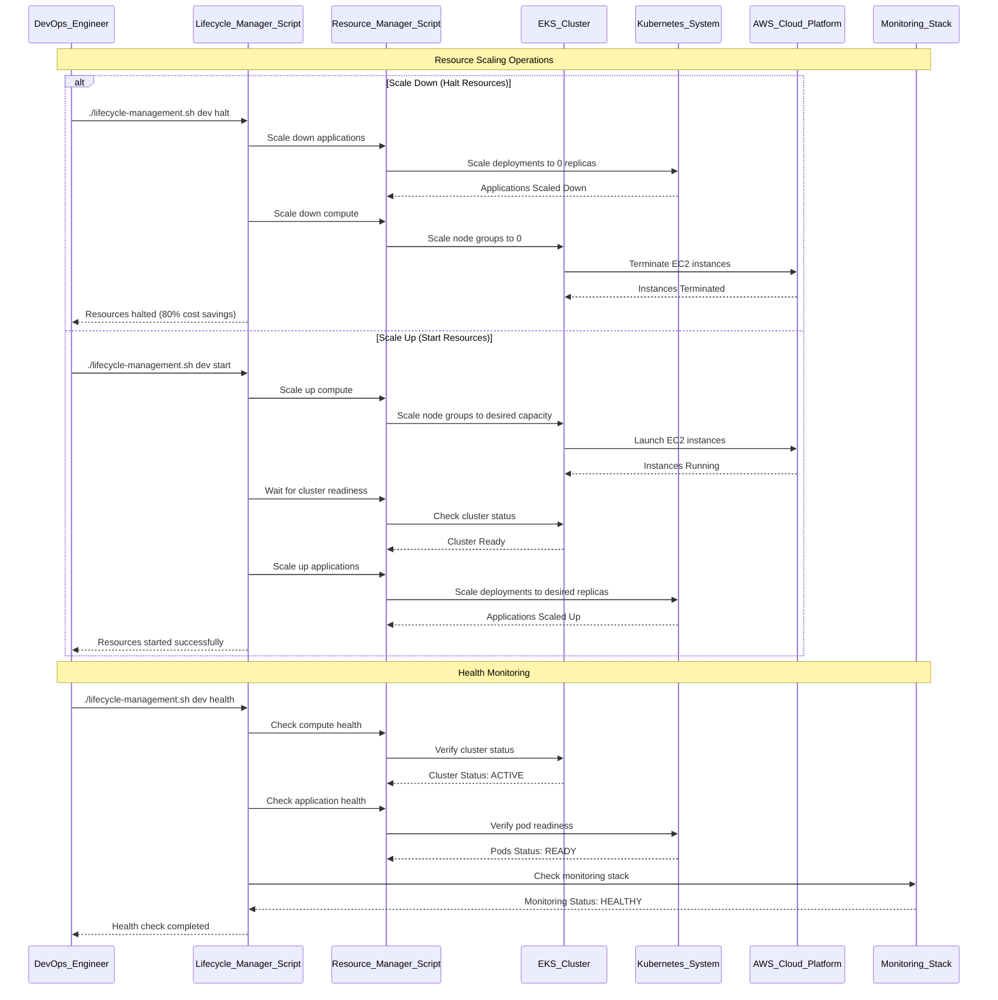
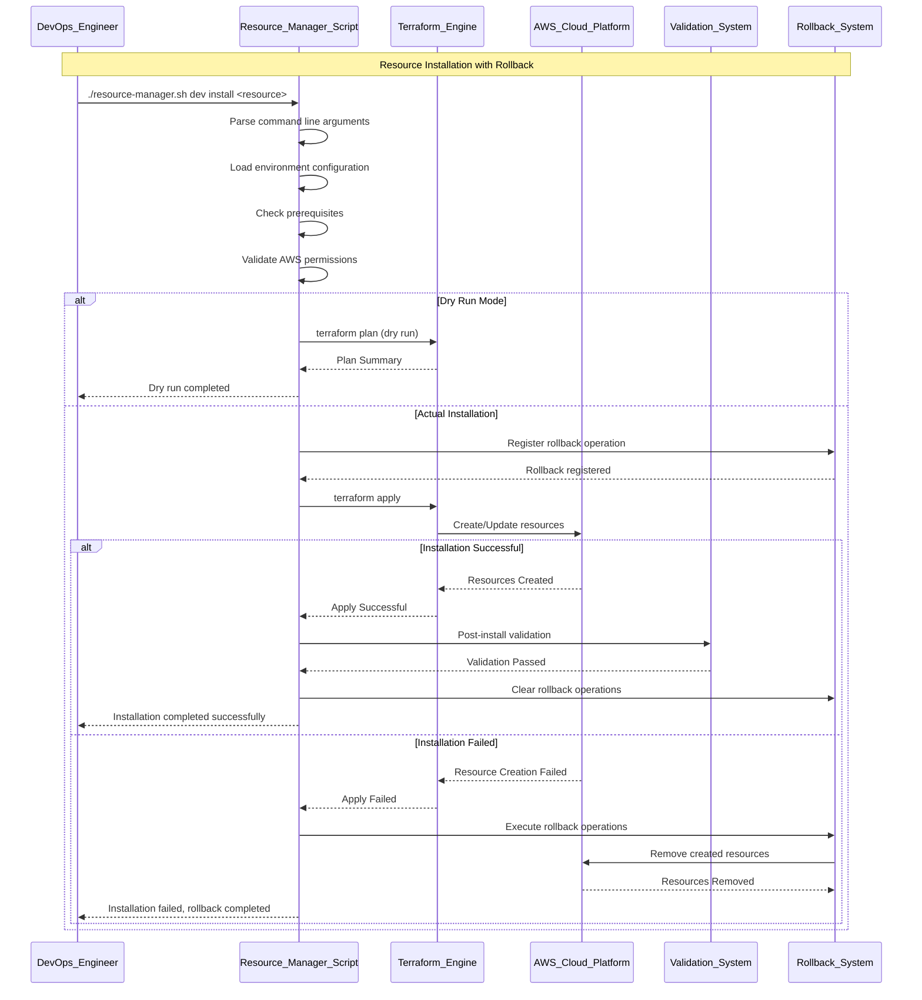
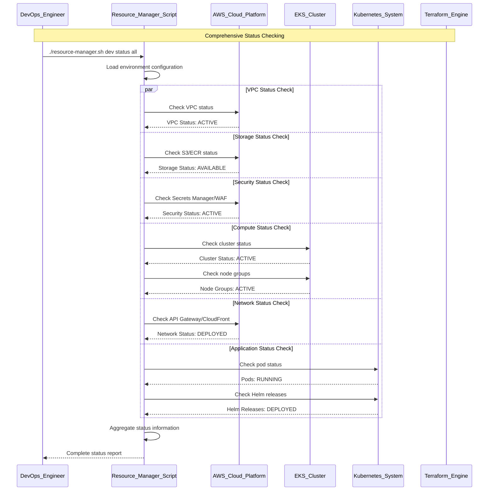
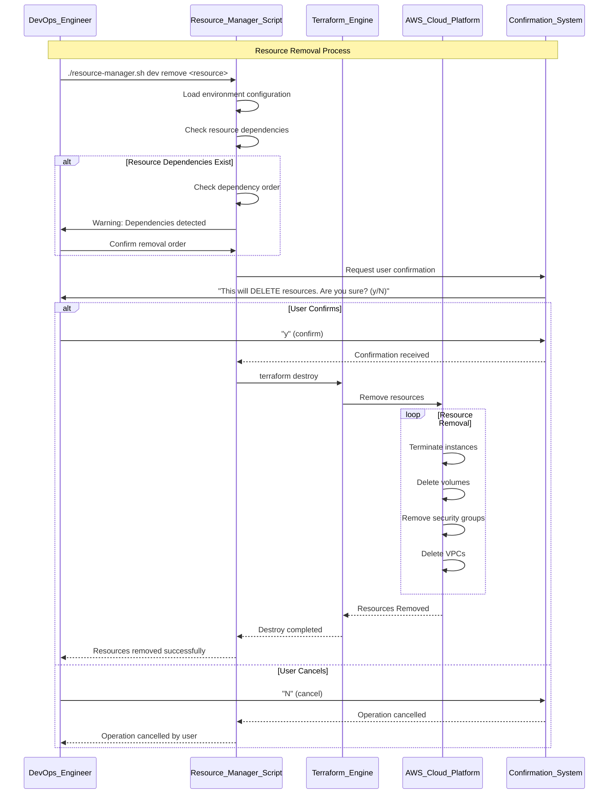
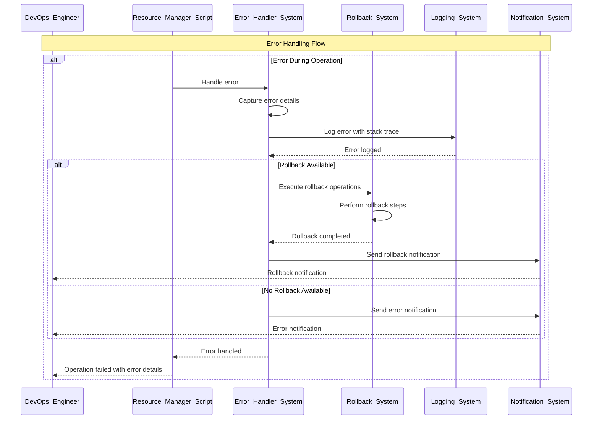

# AWS Infrastructure Scripts Execution Lifecycle Sequence Diagram

## Overview
This sequence diagram illustrates the complete execution lifecycle of AWS infrastructure scripts, showing the phased deployment approach, resource management operations, and lifecycle management flows. The diagram covers the incremental deployment strategy, resource scaling, monitoring, and cleanup operations.

## Complete Infrastructure Deployment Lifecycle



## Resource Lifecycle Management Operations



## Resource Management Operations



## Status and Monitoring Operations



## Resource Removal and Cleanup



## Error Handling and Recovery



## Infrastructure Scripts Architecture Summary

### **Script Components:**
- **Resource Manager Scripts**: `resource-manager.sh` and `resource-manager.ps1`
- **Lifecycle Manager**: `lifecycle-management.sh`
- **Resource Monitor**: `resource-monitor.ps1`
- **Test Scenarios**: `test-scenarios.sh`
- **Shared Libraries**: `lib/common-functions.sh` and `lib/aws-utils.sh`

### **Deployment Phases:**
1. **Foundation (VPC & Networking)**: Internet VPC, Private VPC, Transit Gateway
2. **Storage & Registry**: S3 buckets, ECR repositories, VPC endpoints
3. **Security**: Secrets Manager, WAF, IAM roles
4. **Compute (EKS)**: EKS cluster, node groups, addons
5. **Network Services**: API Gateway, CloudFront, SSL certificates
6. **Applications**: Istio, monitoring stack, chess application

### **Key Operations:**
- **Install**: Phased resource creation with Terraform
- **Start/Halt**: Resource scaling for cost optimization
- **Status**: Comprehensive health checking
- **Health**: Detailed resource validation
- **Remove**: Clean resource cleanup with confirmation

### **Error Handling Features:**
- **Automatic Rollback**: On installation failures
- **Comprehensive Logging**: With stack traces and context
- **Progress Tracking**: For long-running operations
- **Timeout Protection**: For hanging operations
- **User Confirmation**: For destructive operations

### **Monitoring & Validation:**
- **Real-time Status**: AWS resource states
- **Health Checks**: Resource availability and performance
- **Metrics Collection**: Performance and usage data
- **Alert Notifications**: For critical issues

## File Storage Location

This sequence diagram is stored at:
```
CHESS/docs/AWS_INFRA_Sequence_Diagram.md
```

## Related Documentation

For more detailed information about AWS infrastructure:
- **Deployment Guide**: `infra/scripts/deployment-order.md`
- **Resource Management**: `infra/scripts/resource-manager.sh`
- **Lifecycle Management**: `infra/scripts/lifecycle-management.sh`
- **Configuration**: `infra/scripts/config/` directory
- **Shared Libraries**: `infra/scripts/lib/` directory
- **Terraform Configuration**: `infra/terraform/` directory
