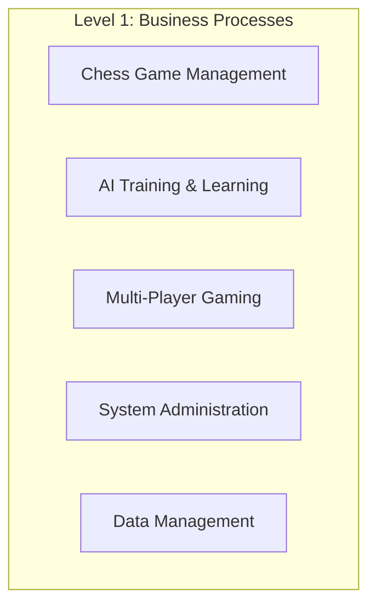
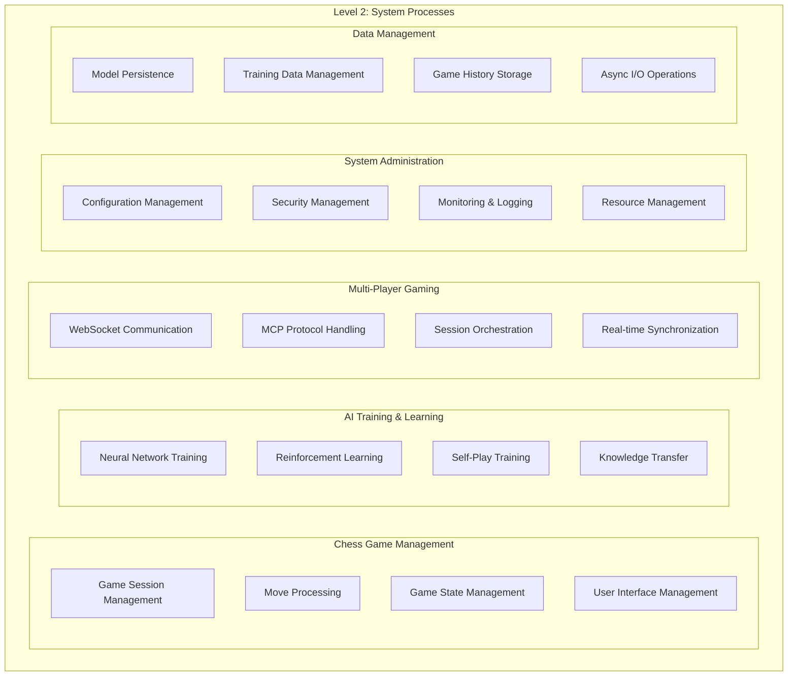
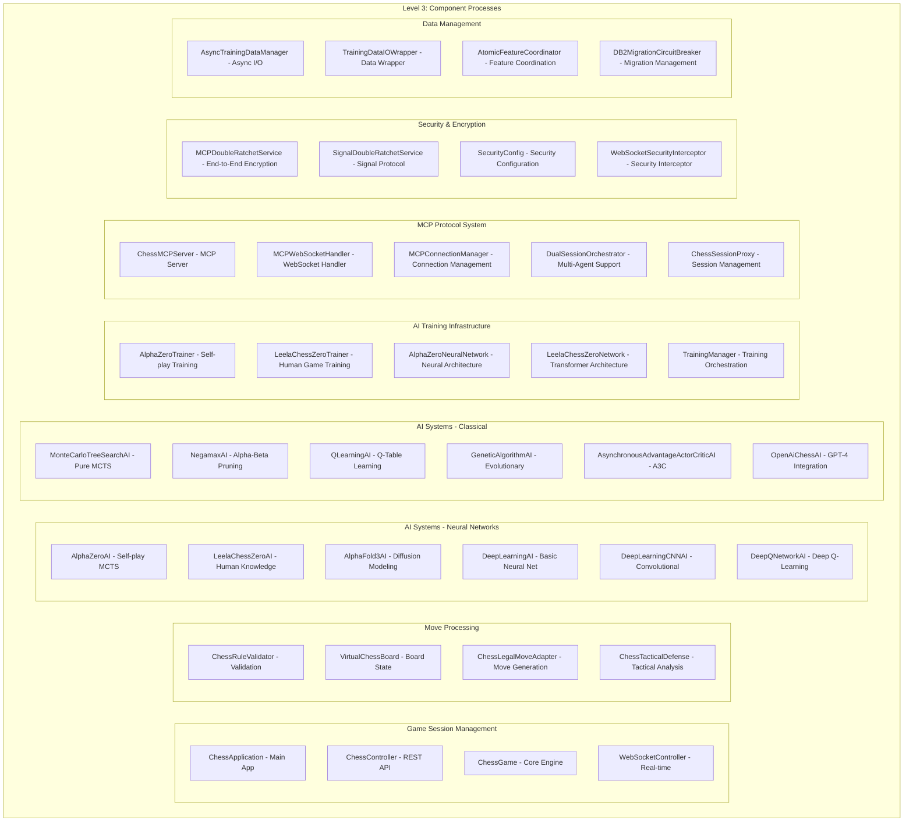
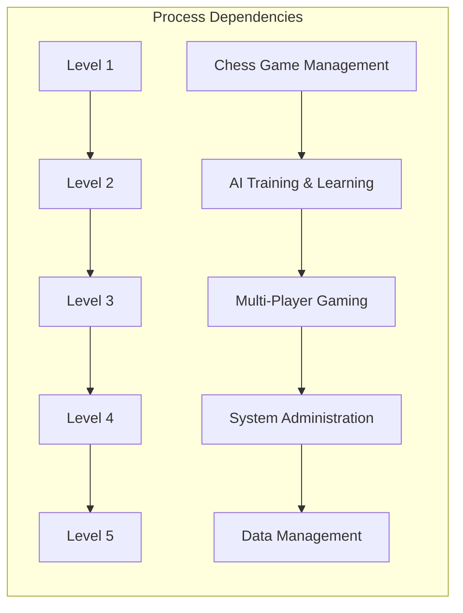

# Chess Application Process Decomposition

## Overview

This document provides a comprehensive 5-level hierarchical decomposition of the Chess application processes, showing the complete system architecture from high-level business processes down to detailed implementation components.

## Level 1: Business Process Level



## Level 2: System Process Level



## Level 3: Component Process Level



## Level 4: Method Process Level

```mermaid
graph TB
    subgraph "Level 4: Method Processes"
        subgraph "ChessGame Core Methods"
            MP1[makeMove() - Move Execution]
            MP2[validateMove() - Move Validation]
            MP3[isCheck() - Check Detection]
            MP4[isCheckmate() - Checkmate Detection]
            MP5[getLegalMoves() - Legal Move Generation]
            MP6[undoMove() - Move Undo]
            MP7[getGameState() - State Retrieval]
            MP8[resetGame() - Game Reset]
        end
        
        subgraph "AI Decision Making"
            MP9[getBestMove() - Move Selection]
            MP10[evaluatePosition() - Position Evaluation]
            MP11[search() - Search Algorithm]
            MP12[select() - MCTS Selection]
            MP13[expand() - MCTS Expansion]
            MP14[simulate() - MCTS Simulation]
            MP15[backpropagate() - MCTS Backpropagation]
        end
        
        subgraph "Neural Network Operations"
            MP16[forwardPass() - Forward Propagation]
            MP17[backwardPass() - Backward Propagation]
            MP18[updateWeights() - Weight Updates]
            MP19[loadModel() - Model Loading]
            MP20[saveModel() - Model Saving]
            MP21[preprocessInput() - Input Preprocessing]
            MP22[postprocessOutput() - Output Postprocessing]
        end
        
        subgraph "Training Processes"
            MP23[generateTrainingData() - Data Generation]
            MP24[trainModel() - Model Training]
            MP25[validateModel() - Model Validation]
            MP26[optimizeHyperparameters() - Hyperparameter Tuning]
            MP27[scheduleTraining() - Training Scheduling]
            MP28[monitorTraining() - Training Monitoring]
        end
        
        subgraph "MCP Protocol Methods"
            MP29[handleInitialize() - MCP Initialization]
            MP30[handleListTools() - Tool Listing]
            MP31[handleCallTool() - Tool Execution]
            MP32[handleListResources() - Resource Listing]
            MP33[handleNotification() - Notification Handling]
            MP34[processJsonRpc() - JSON-RPC Processing]
        end
        
        subgraph "WebSocket Communication"
            MP35[handleConnection() - Connection Handling]
            MP36[handleMessage() - Message Processing]
            MP37[handleDisconnection() - Disconnection Handling]
            MP38[broadcastMessage() - Message Broadcasting]
            MP39[authenticateUser() - User Authentication]
            MP40[authorizeAction() - Action Authorization]
        end
        
        subgraph "Security Operations"
            MP41[encryptMessage() - Message Encryption]
            MP42[decryptMessage() - Message Decryption]
            MP43[generateKeyPair() - Key Generation]
            MP44[exchangeKeys() - Key Exchange]
            MP45[validateSignature() - Signature Validation]
            MP46[rotateKeys() - Key Rotation]
        end
        
        subgraph "Data Persistence"
            MP47[saveGameState() - Game State Saving]
            MP48[loadGameState() - Game State Loading]
            MP49[saveTrainingData() - Training Data Saving]
            MP50[loadTrainingData() - Training Data Loading]
            MP51[backupData() - Data Backup]
            MP52[restoreData() - Data Restore]
        end
    end
```

## Level 5: Implementation Process Level

```mermaid
graph TB
    subgraph "Level 5: Implementation Processes"
        subgraph "Move Validation Implementation"
            IP1[validatePieceMovement() - Piece Movement Rules]
            IP2[validateCastling() - Castling Rules]
            IP3[validateEnPassant() - En Passant Rules]
            IP4[validatePromotion() - Pawn Promotion Rules]
            IP5[checkPathObstruction() - Path Clearance Check]
            IP6[validateKingSafety() - King Safety Check]
            IP7[checkSpecialMoves() - Special Move Validation]
            IP8[validateGameRules() - General Game Rules]
        end
        
        subgraph "AI Search Implementation"
            IP9[alphaBetaSearch() - Alpha-Beta Algorithm]
            IP10[monteCarloSearch() - Monte Carlo Search]
            IP11[neuralNetworkInference() - Neural Network Inference]
            IP12[positionEvaluation() - Position Evaluation Function]
            IP13[moveOrdering() - Move Ordering Heuristics]
            IP14[transpositionTableLookup() - Transposition Table]
            IP15[quiescenceSearch() - Quiescence Search]
            IP16[iterativeDeepening() - Iterative Deepening]
        end
        
        subgraph "Neural Network Implementation"
            IP17[convolutionForward() - Convolutional Forward Pass]
            IP18[fullyConnectedForward() - Dense Layer Forward]
            IP19[activationFunction() - Activation Functions]
            IP20[lossCalculation() - Loss Function Calculation]
            IP21[gradientComputation() - Gradient Computation]
            IP22[weightUpdate() - Weight Update Rules]
            IP23[dropoutRegularization() - Dropout Implementation]
            IP24[batchNormalization() - Batch Normalization]
        end
        
        subgraph "MCTS Implementation"
            IP25[selectionPolicy() - Selection Policy]
            IP26[expansionPolicy() - Expansion Policy]
            IP27[simulationPolicy() - Simulation Policy]
            IP28[backpropagationPolicy() - Backpropagation Policy]
            IP29[treeTraversal() - Tree Traversal Algorithm]
            IP30[nodeCreation() - Node Creation Logic]
            IP31[valueUpdate() - Value Update Mechanism]
            IP32[policyUpdate() - Policy Update Mechanism]
        end
        
        subgraph "Data Processing Implementation"
            IP33[boardToTensor() - Board State Conversion]
            IP34[tensorToBoard() - Tensor to Board Conversion]
            IP35[featureExtraction() - Feature Extraction]
            IP36[dataAugmentation() - Data Augmentation]
            IP37[normalization() - Data Normalization]
            IP38[serialization() - Data Serialization]
            IP39[deserialization() - Data Deserialization]
            IP40[compression() - Data Compression]
        end
        
        subgraph "Async I/O Implementation"
            IP41[asyncFileRead() - Asynchronous File Reading]
            IP42[asyncFileWrite() - Asynchronous File Writing]
            IP43[asyncNetworkRead() - Asynchronous Network Reading]
            IP44[asyncNetworkWrite() - Asynchronous Network Writing]
            IP45[completionHandler() - Completion Handler]
            IP46[errorHandler() - Error Handler]
            IP47[timeoutHandler() - Timeout Handler]
            IP48[retryLogic() - Retry Logic]
        end
        
        subgraph "Security Implementation"
            IP49[doubleRatchetEncrypt() - Double Ratchet Encryption]
            IP50[doubleRatchetDecrypt() - Double Ratchet Decryption]
            IP51[keyDerivation() - Key Derivation Function]
            IP52[messageAuthentication() - Message Authentication]
            IP53[forwardSecrecy() - Forward Secrecy Implementation]
            IP54[postCompromiseSecurity() - Post-Compromise Security]
            IP55[ratchetStep() - Ratchet Step Implementation]
            IP56[chainKeyUpdate() - Chain Key Update]
        end
        
        subgraph "Database Operations Implementation"
            IP57[sqlQueryExecution() - SQL Query Execution]
            IP58[transactionManagement() - Transaction Management]
            IP59[connectionPooling() - Connection Pool Management]
            IP60[queryOptimization() - Query Optimization]
            IP61[indexManagement() - Index Management]
            IP62[backupOperations() - Backup Operations]
            IP63[restoreOperations() - Restore Operations]
            IP64[migrationOperations() - Migration Operations]
        end
    end
```

## Process Flow Relationships

```mermaid
graph TB
    subgraph "Process Flow Relationships"
        subgraph "Game Flow"
            GF1[User Input] --> GF2[Move Validation]
            GF2 --> GF3[Move Execution]
            GF3 --> GF4[State Update]
            GF4 --> GF5[AI Response]
            GF5 --> GF6[Response Validation]
            GF6 --> GF7[Response Execution]
            GF7 --> GF8[Game State Broadcast]
        end
        
        subgraph "AI Training Flow"
            ATF1[Game Generation] --> ATF2[Data Collection]
            ATF2 --> ATF3[Data Preprocessing]
            ATF3 --> ATF4[Model Training]
            ATF4 --> ATF5[Model Validation]
            ATF5 --> ATF6[Model Deployment]
            ATF6 --> ATF7[Performance Monitoring]
        end
        
        subgraph "MCP Protocol Flow"
            MCPF1[Client Connection] --> MCPF2[Protocol Initialization]
            MCPF2 --> MCPF3[Tool Discovery]
            MCPF3 --> MCPF4[Resource Discovery]
            MCPF4 --> MCPF5[Tool Execution]
            MCPF5 --> MCPF6[Response Generation]
            MCPF6 --> MCPF7[Client Notification]
        end
        
        subgraph "Security Flow"
            SF1[Key Exchange] --> SF2[Session Establishment]
            SF2 --> SF3[Message Encryption]
            SF3 --> SF4[Secure Transmission]
            SF4 --> SF5[Message Decryption]
            SF5 --> SF6[Authentication Verification]
        end
    end
```



## Key Process Characteristics

### Level 1 - Business Processes
- **Scope**: Complete business functionality
- **Duration**: Long-term (hours to days)
- **Stakeholders**: End users, administrators
- **Success Criteria**: Business objectives met

### Level 2 - System Processes
- **Scope**: Major system components
- **Duration**: Medium-term (minutes to hours)
- **Stakeholders**: System architects, developers
- **Success Criteria**: System requirements met

### Level 3 - Component Processes
- **Scope**: Individual system components
- **Duration**: Short-term (seconds to minutes)
- **Stakeholders**: Component developers
- **Success Criteria**: Component specifications met

### Level 4 - Method Processes
- **Scope**: Individual methods/functions
- **Duration**: Very short-term (milliseconds to seconds)
- **Stakeholders**: Method developers
- **Success Criteria**: Method contracts fulfilled

### Level 5 - Implementation Processes
- **Scope**: Low-level implementation details
- **Duration**: Microsecond to millisecond
- **Stakeholders**: Implementation developers
- **Success Criteria**: Algorithm correctness and performance

## Process Dependencies



## Performance Characteristics

| Level | Typical Duration | Concurrency | Resource Usage | Error Handling |
|-------|------------------|-------------|----------------|----------------|
| 1 | Hours-Days | Low | High | Business-level |
| 2 | Minutes-Hours | Medium | Medium-High | System-level |
| 3 | Seconds-Minutes | High | Medium | Component-level |
| 4 | Milliseconds-Seconds | Very High | Low-Medium | Method-level |
| 5 | Microseconds-Milliseconds | Maximum | Low | Implementation-level |

## Conclusion

This 5-level process decomposition provides a comprehensive view of the Chess application architecture, from high-level business processes down to detailed implementation components. Each level serves a specific purpose in the overall system design and provides clear boundaries for development, testing, and maintenance activities.

The hierarchical structure allows for:
- **Clear separation of concerns** at each level
- **Modular development** and testing
- **Scalable architecture** that can grow with requirements
- **Maintainable codebase** with well-defined interfaces
- **Performance optimization** at appropriate levels
