# Chess Project C++ Refactor - High-Level Design Document

## Executive Summary

This document outlines the comprehensive high-level design for refactoring the Chess application from Java Spring Boot to a modern C++ implementation using GNU GCC. The refactoring maintains 100% feature parity while leveraging C++'s performance advantages, memory efficiency, and modern language features to create a high-performance chess engine with 12 AI systems.

**Target Compiler**: GNU GCC 11+ with C++20 standard  
**Architecture**: Modular C++ with CMake build system  
**Performance Goal**: 10x improvement in AI computation speed and memory efficiency  

## 1. Project Overview

### 1.1 Current State Analysis
- **Backend**: Java 21 Spring Boot with 12 AI systems (4,360+ lines in ChessGame.java)
- **Frontend**: React 18 + TypeScript + ShadCN/UI (already modern)
- **AI Systems**: Q-Learning, Deep Learning, CNN, DQN, MCTS, AlphaZero, Negamax, OpenAI, Leela Chess Zero, Genetic Algorithm, A3C, AlphaFold3
- **Infrastructure**: AWS EKS with Istio service mesh
- **Real-time**: WebSocket communication via STOMP

### 1.2 Target State
- **Backend**: Modern C++20 with high-performance AI implementations
- **Frontend**: Unchanged React implementation (excellent as-is)
- **AI Systems**: Optimized C++ implementations with SIMD acceleration
- **Infrastructure**: Containerized C++ application with same cloud deployment
- **Real-time**: WebSocket server using C++ libraries (uWebSockets or similar)

## 2. Architecture Overview

### 2.1 High-Level C++ Architecture

```mermaid
graph TB
    subgraph "C++ Chess Engine"
        subgraph "Core Engine"
            CE[ChessEngine]
            CM[ChessMove]
            CB[ChessBoard]
            CV[ChessValidator]
        end
        
        subgraph "AI Systems"
            QL[QLearningAI]
            DL[DeepLearningAI]
            CNN[CNNDeepLearningAI]
            DQN[DeepQNetworkAI]
            MCTS[MonteCarloTreeSearchAI]
            AZ[AlphaZeroAI]
            NM[NegamaxAI]
            OA[OpenAIAI]
            LZ[LeelaChessZeroAI]
            GA[GeneticAlgorithmAI]
            AF[AlphaFold3AI]
            A3C[A3CAI]
        end
        
        subgraph "Web Interface"
            WS[WebSocketServer]
            API[RESTAPI]
            HTTP[HTTPServer]
        end
        
        subgraph "Data Layer"
            FS[FileSystem]
            CACHE[MemoryCache]
            DB[Database]
        end
    end
    
    subgraph "External"
        REACT[React Frontend]
        MCP[MCP Server]
        GPU[GPU Acceleration]
    end
    
    CE --> CM
    CE --> CB
    CE --> CV
    CE --> QL
    CE --> DL
    CE --> CNN
    CE --> DQN
    CE --> MCTS
    CE --> AZ
    CE --> NM
    CE --> OA
    CE --> LZ
    CE --> GA
    CE --> AF
    CE --> A3C
    
    WS --> CE
    API --> CE
    HTTP --> API
    
    CE --> FS
    CE --> CACHE
    CE --> DB
    
    REACT --> WS
    MCP --> API
    GPU --> DL
    GPU --> CNN
    GPU --> DQN
    GPU --> AZ
```



### 2.2 Module Structure

```
chess-cpp/
├── src/
│   ├── core/                    # Core chess engine
│   │   ├── chess_engine.hpp
│   │   ├── chess_engine.cpp
│   │   ├── chess_board.hpp
│   │   ├── chess_board.cpp
│   │   ├── chess_move.hpp
│   │   ├── chess_move.cpp
│   │   ├── chess_validator.hpp
│   │   ├── chess_validator.cpp
│   │   └── chess_rules.hpp
│   ├── ai/                      # AI systems
│   │   ├── base/
│   │   │   ├── ai_base.hpp
│   │   │   └── ai_base.cpp
│   │   ├── qlearning/
│   │   │   ├── qlearning_ai.hpp
│   │   │   └── qlearning_ai.cpp
│   │   ├── deeplearning/
│   │   │   ├── deeplearning_ai.hpp
│   │   │   └── deeplearning_ai.cpp
│   │   ├── cnn/
│   │   │   ├── cnn_ai.hpp
│   │   │   └── cnn_ai.cpp
│   │   ├── dqn/
│   │   │   ├── dqn_ai.hpp
│   │   │   └── dqn_ai.cpp
│   │   ├── mcts/
│   │   │   ├── mcts_ai.hpp
│   │   │   └── mcts_ai.cpp
│   │   ├── alphazero/
│   │   │   ├── alphazero_ai.hpp
│   │   │   └── alphazero_ai.cpp
│   │   ├── negamax/
│   │   │   ├── negamax_ai.hpp
│   │   │   └── negamax_ai.cpp
│   │   ├── openai/
│   │   │   ├── openai_ai.hpp
│   │   │   └── openai_ai.cpp
│   │   ├── leelazero/
│   │   │   ├── leelazero_ai.hpp
│   │   │   └── leelazero_ai.cpp
│   │   ├── genetic/
│   │   │   ├── genetic_ai.hpp
│   │   │   └── genetic_ai.cpp
│   │   ├── alphafold3/
│   │   │   ├── alphafold3_ai.hpp
│   │   │   └── alphafold3_ai.cpp
│   │   └── a3c/
│   │       ├── a3c_ai.hpp
│   │       └── a3c_ai.cpp
│   ├── web/                     # Web interface
│   │   ├── websocket_server.hpp
│   │   ├── websocket_server.cpp
│   │   ├── rest_api.hpp
│   │   ├── rest_api.cpp
│   │   ├── http_server.hpp
│   │   └── http_server.cpp
│   ├── data/                    # Data management
│   │   ├── file_manager.hpp
│   │   ├── file_manager.cpp
│   │   ├── cache_manager.hpp
│   │   ├── cache_manager.cpp
│   │   ├── database.hpp
│   │   └── database.cpp
│   ├── utils/                   # Utilities
│   │   ├── logger.hpp
│   │   ├── logger.cpp
│   │   ├── config.hpp
│   │   ├── config.cpp
│   │   ├── thread_pool.hpp
│   │   ├── thread_pool.cpp
│   │   ├── simd_utils.hpp
│   │   └── simd_utils.cpp
│   └── main.cpp
├── include/                     # Public headers
├── tests/                       # Unit tests
├── benchmarks/                  # Performance tests
├── docs/                        # Documentation
├── CMakeLists.txt
├── conanfile.txt
└── README.md
```

## 3. Core C++ Implementation

### 3.1 Chess Engine Core

#### 3.1.1 Chess Board Representation
```cpp
// chess_board.hpp
#pragma once
#include <array>
#include <vector>
#include <string>
#include <optional>
#include <cstdint>

namespace chess {

enum class Piece : uint8_t {
    EMPTY = 0,
    WHITE_PAWN = 1, WHITE_ROOK = 2, WHITE_KNIGHT = 3,
    WHITE_BISHOP = 4, WHITE_QUEEN = 5, WHITE_KING = 6,
    BLACK_PAWN = 7, BLACK_ROOK = 8, BLACK_KNIGHT = 9,
    BLACK_BISHOP = 10, BLACK_QUEEN = 11, BLACK_KING = 12
};

enum class Color : uint8_t {
    WHITE = 0,
    BLACK = 1
};

struct Position {
    int8_t row, col;
    constexpr Position(int8_t r, int8_t c) : row(r), col(c) {}
    constexpr bool operator==(const Position& other) const noexcept {
        return row == other.row && col == other.col;
    }
};

class ChessBoard {
public:
    static constexpr int BOARD_SIZE = 8;
    using BoardArray = std::array<std::array<Piece, BOARD_SIZE>, BOARD_SIZE>;
    
    ChessBoard();
    explicit ChessBoard(const BoardArray& board);
    
    // Core board operations
    Piece getPiece(const Position& pos) const noexcept;
    void setPiece(const Position& pos, Piece piece) noexcept;
    void clearPiece(const Position& pos) noexcept;
    
    // Board state queries
    bool isEmpty(const Position& pos) const noexcept;
    bool isOccupied(const Position& pos) const noexcept;
    Color getPieceColor(const Position& pos) const noexcept;
    bool isWhitePiece(const Position& pos) const noexcept;
    bool isBlackPiece(const Position& pos) const noexcept;
    
    // King position finding
    std::optional<Position> findKing(Color color) const noexcept;
    
    // Board manipulation
    void makeMove(const Position& from, const Position& to);
    void undoMove(const Position& from, const Position& to, Piece captured);
    
    // Serialization
    std::string toFEN() const;
    void fromFEN(const std::string& fen);
    std::string toString() const;
    
    // Board copying
    BoardArray getBoard() const noexcept { return board_; }
    ChessBoard copy() const { return ChessBoard(board_); }
    
    // Hash for position comparison
    std::size_t hash() const noexcept;
    
private:
    BoardArray board_;
    mutable std::optional<std::size_t> cached_hash_;
    
    void invalidateHash() const noexcept { cached_hash_.reset(); }
};

} // namespace chess
```

#### 3.1.2 Move Representation
```cpp
// chess_move.hpp
#pragma once
#include "chess_board.hpp"
#include <string>
#include <optional>

namespace chess {

enum class MoveType : uint8_t {
    NORMAL = 0,
    CASTLE_KINGSIDE = 1,
    CASTLE_QUEENSIDE = 2,
    EN_PASSANT = 3,
    PAWN_PROMOTION = 4
};

enum class PromotionPiece : uint8_t {
    QUEEN = 0,
    ROOK = 1,
    BISHOP = 2,
    KNIGHT = 3
};

class ChessMove {
public:
    ChessMove(Position from, Position to, MoveType type = MoveType::NORMAL);
    ChessMove(Position from, Position to, PromotionPiece promotion);
    
    // Getters
    Position from() const noexcept { return from_; }
    Position to() const noexcept { return to_; }
    MoveType type() const noexcept { return type_; }
    std::optional<PromotionPiece> promotion() const noexcept { return promotion_; }
    
    // Move validation
    bool isValid() const noexcept;
    
    // String representation
    std::string toAlgebraic() const;
    std::string toUCI() const;
    static std::optional<ChessMove> fromAlgebraic(const std::string& move, const ChessBoard& board);
    static std::optional<ChessMove> fromUCI(const std::string& move);
    
    // Comparison
    bool operator==(const ChessMove& other) const noexcept;
    bool operator!=(const ChessMove& other) const noexcept;
    
    // Hash for move comparison
    std::size_t hash() const noexcept;
    
private:
    Position from_;
    Position to_;
    MoveType type_;
    std::optional<PromotionPiece> promotion_;
};

} // namespace chess
```

#### 3.1.3 Chess Engine Main Class
```cpp
// chess_engine.hpp
#pragma once
#include "chess_board.hpp"
#include "chess_move.hpp"
#include "chess_validator.hpp"
#include "ai/base/ai_base.hpp"
#include <vector>
#include <memory>
#include <string>
#include <optional>
#include <chrono>
#include <atomic>
#include <thread>
#include <future>

namespace chess {

enum class GameStatus : uint8_t {
    ACTIVE = 0,
    WHITE_WINS = 1,
    BLACK_WINS = 2,
    DRAW = 3,
    STALEMATE = 4
};

struct GameState {
    ChessBoard board;
    Color currentPlayer;
    GameStatus status;
    std::vector<ChessMove> moveHistory;
    std::optional<Position> kingInCheck;
    std::vector<Position> threatenedPieces;
    std::optional<Position> invalidMove;
    bool success;
    std::optional<ChessMove> lastAIMove;
    std::string lastAIName;
};

class ChessEngine {
public:
    ChessEngine();
    ~ChessEngine();
    
    // Game control
    void newGame();
    void reset();
    bool makeMove(const ChessMove& move);
    bool makeMove(const Position& from, const Position& to);
    bool undoMove();
    bool redoMove();
    
    // Game state queries
    GameState getGameState() const;
    std::vector<ChessMove> getValidMoves() const;
    std::vector<ChessMove> getValidMoves(const Position& from) const;
    bool isValidMove(const ChessMove& move) const;
    bool isInCheck(Color color) const;
    bool isCheckmate(Color color) const;
    bool isStalemate(Color color) const;
    bool isGameOver() const;
    
    // AI integration
    void addAI(std::unique_ptr<AIBase> ai);
    void removeAI(const std::string& name);
    std::vector<std::string> getAISystems() const;
    ChessMove getAIMove(const std::string& aiName = "");
    void setActiveAI(const std::string& aiName);
    
    // Training and learning
    void startTraining(int games = 10000);
    void stopTraining();
    bool isTraining() const;
    std::string getTrainingStatus() const;
    
    // Configuration
    void setTimeLimit(std::chrono::milliseconds limit);
    void setDepthLimit(int depth);
    void enableAI(const std::string& aiName, bool enabled);
    
    // Statistics
    struct Statistics {
        int totalMoves;
        int aiMoves;
        std::chrono::milliseconds totalTime;
        std::chrono::milliseconds averageMoveTime;
        std::map<std::string, int> aiMoveCounts;
    };
    Statistics getStatistics() const;
    
private:
    ChessBoard board_;
    Color currentPlayer_;
    GameStatus status_;
    std::vector<ChessMove> moveHistory_;
    std::vector<ChessMove> redoStack_;
    
    std::vector<std::unique_ptr<AIBase>> aiSystems_;
    std::string activeAI_;
    std::atomic<bool> training_;
    std::thread trainingThread_;
    
    ChessValidator validator_;
    Statistics stats_;
    
    // Move execution
    void executeMove(const ChessMove& move);
    void updateGameStatus();
    void updateStatistics(const ChessMove& move, std::chrono::milliseconds time);
    
    // AI management
    AIBase* findAI(const std::string& name) const;
    ChessMove selectBestAIMove();
    
    // Training
    void runTraining(int games);
};

} // namespace chess
```

### 3.2 AI System Architecture

#### 3.2.1 Base AI Interface
```cpp
// ai/base/ai_base.hpp
#pragma once
#include "../../chess_board.hpp"
#include "../../chess_move.hpp"
#include <string>
#include <vector>
#include <memory>
#include <chrono>

namespace chess::ai {

struct AIConfig {
    std::string name;
    bool enabled = true;
    int maxDepth = 6;
    std::chrono::milliseconds timeLimit{5000};
    double explorationRate = 0.1;
    int maxSimulations = 1000;
};

class AIBase {
public:
    explicit AIBase(const AIConfig& config);
    virtual ~AIBase() = default;
    
    // Core AI interface
    virtual ChessMove selectMove(const ChessBoard& board, 
                                const std::vector<ChessMove>& validMoves) = 0;
    
    // Learning interface
    virtual void learn(const ChessBoard& board, const ChessMove& move, 
                      double reward) {}
    virtual void saveModel(const std::string& path) {}
    virtual void loadModel(const std::string& path) {}
    
    // Training interface
    virtual void startTraining(int games = 10000) {}
    virtual void stopTraining() {}
    virtual bool isTraining() const { return false; }
    virtual std::string getTrainingStatus() const { return "Not training"; }
    
    // Configuration
    const AIConfig& getConfig() const { return config_; }
    void setConfig(const AIConfig& config) { config_ = config; }
    
    // Statistics
    struct AIStats {
        int movesPlayed = 0;
        int wins = 0;
        int losses = 0;
        int draws = 0;
        std::chrono::milliseconds totalTime{0};
        double averageScore = 0.0;
    };
    const AIStats& getStats() const { return stats_; }
    
protected:
    AIConfig config_;
    AIStats stats_;
    
    // Utility functions
    double evaluatePosition(const ChessBoard& board) const;
    std::vector<ChessMove> orderMoves(const ChessBoard& board, 
                                    const std::vector<ChessMove>& moves) const;
    bool isTerminal(const ChessBoard& board) const;
};

} // namespace chess::ai
```

#### 3.2.2 Q-Learning AI Implementation
```cpp
// ai/qlearning/qlearning_ai.hpp
#pragma once
#include "../base/ai_base.hpp"
#include <unordered_map>
#include <random>
#include <vector>
#include <string>

namespace chess::ai {

class QLearningAI : public AIBase {
public:
    explicit QLearningAI(const AIConfig& config = AIConfig{"QLearning"});
    ~QLearningAI() override = default;
    
    ChessMove selectMove(const ChessBoard& board, 
                        const std::vector<ChessMove>& validMoves) override;
    
    void learn(const ChessBoard& board, const ChessMove& move, 
              double reward) override;
    void saveModel(const std::string& path) override;
    void loadModel(const std::string& path) override;
    
    void startTraining(int games = 10000) override;
    void stopTraining() override;
    bool isTraining() const override;
    std::string getTrainingStatus() const override;
    
private:
    using QTable = std::unordered_map<std::string, double>;
    using StateActionPair = std::pair<std::string, std::string>;
    
    QTable qTable_;
    std::mt19937 rng_;
    std::uniform_real_distribution<double> explorationDist_;
    
    std::atomic<bool> training_;
    std::thread trainingThread_;
    int trainingGames_;
    int completedGames_;
    
    // Q-Learning parameters
    double learningRate_;
    double discountFactor_;
    double explorationRate_;
    double explorationDecay_;
    double minExplorationRate_;
    
    // State representation
    std::string encodeState(const ChessBoard& board) const;
    std::string encodeAction(const ChessMove& move) const;
    
    // Q-Learning operations
    double getQValue(const std::string& state, const std::string& action) const;
    void updateQValue(const std::string& state, const std::string& action, 
                     double reward, double nextMaxQ);
    
    // Move selection
    ChessMove selectBestMove(const ChessBoard& board, 
                           const std::vector<ChessMove>& validMoves) const;
    ChessMove selectRandomMove(const std::vector<ChessMove>& validMoves) const;
    
    // Training
    void runTraining(int games);
    void playTrainingGame();
    double calculateReward(const ChessBoard& board, const ChessMove& move) const;
    
    // File I/O
    void saveQTable(const std::string& path) const;
    void loadQTable(const std::string& path);
};

} // namespace chess::ai
```

#### 3.2.3 Deep Learning AI with SIMD Optimization
```cpp
// ai/deeplearning/deeplearning_ai.hpp
#pragma once
#include "../base/ai_base.hpp"
#include <vector>
#include <memory>
#include <random>
#include <string>
#include <array>

namespace chess::ai {

class NeuralNetwork {
public:
    struct Layer {
        std::vector<std::vector<double>> weights;
        std::vector<double> biases;
        std::vector<double> activations;
        std::vector<double> gradients;
    };
    
    NeuralNetwork(const std::vector<int>& layerSizes);
    ~NeuralNetwork() = default;
    
    // Forward propagation
    std::vector<double> forward(const std::vector<double>& input);
    
    // Backward propagation
    void backward(const std::vector<double>& target);
    
    // Training
    void train(const std::vector<std::vector<double>>& inputs,
              const std::vector<double>& targets,
              double learningRate = 0.001);
    
    // Model persistence
    void save(const std::string& path) const;
    void load(const std::string& path);
    
    // SIMD-optimized operations
    void forwardSIMD(const std::vector<double>& input, std::vector<double>& output);
    void backwardSIMD(const std::vector<double>& target);
    
private:
    std::vector<Layer> layers_;
    std::mt19937 rng_;
    
    // Activation functions
    double sigmoid(double x) const;
    double sigmoidDerivative(double x) const;
    double relu(double x) const;
    double reluDerivative(double x) const;
    
    // SIMD operations
    void vectorAddSIMD(const std::vector<double>& a, const std::vector<double>& b, 
                      std::vector<double>& result);
    void vectorMultiplySIMD(const std::vector<double>& a, const std::vector<double>& b, 
                           std::vector<double>& result);
    void matrixVectorMultiplySIMD(const std::vector<std::vector<double>>& matrix,
                                 const std::vector<double>& vector,
                                 std::vector<double>& result);
};

class DeepLearningAI : public AIBase {
public:
    explicit DeepLearningAI(const AIConfig& config = AIConfig{"DeepLearning"});
    ~DeepLearningAI() override = default;
    
    ChessMove selectMove(const ChessBoard& board, 
                        const std::vector<ChessMove>& validMoves) override;
    
    void learn(const ChessBoard& board, const ChessMove& move, 
              double reward) override;
    void saveModel(const std::string& path) override;
    void loadModel(const std::string& path) override;
    
    void startTraining(int games = 10000) override;
    void stopTraining() override;
    bool isTraining() const override;
    std::string getTrainingStatus() const override;
    
private:
    std::unique_ptr<NeuralNetwork> network_;
    std::vector<std::vector<double>> trainingData_;
    std::vector<double> trainingTargets_;
    
    std::atomic<bool> training_;
    std::thread trainingThread_;
    int trainingIterations_;
    int completedGames_;
    
    // Board encoding
    std::vector<double> encodeBoard(const ChessBoard& board) const;
    std::vector<double> encodeMove(const ChessMove& move) const;
    
    // Move evaluation
    double evaluateMove(const ChessBoard& board, const ChessMove& move) const;
    std::vector<ChessMove> orderMoves(const ChessBoard& board, 
                                    const std::vector<ChessMove>& moves) const;
    
    // Training
    void runTraining(int games);
    void generateTrainingData();
    void trainOnBatch();
    
    // Model persistence
    void saveNetwork(const std::string& path) const;
    void loadNetwork(const std::string& path);
};

} // namespace chess::ai
```

### 3.3 Web Interface

#### 3.3.1 WebSocket Server
```cpp
// web/websocket_server.hpp
#pragma once
#include "../chess_engine.hpp"
#include <websocketpp/config/asio_no_tls.hpp>
#include <websocketpp/server.hpp>
#include <thread>
#include <atomic>
#include <mutex>
#include <unordered_map>

namespace chess::web {

using WebSocketServer = websocketpp::server<websocketpp::config::asio>;
using ConnectionHandle = websocketpp::connection_hdl;

class WebSocketServer {
public:
    explicit WebSocketServer(ChessEngine& engine, int port = 8081);
    ~WebSocketServer();
    
    void start();
    void stop();
    bool isRunning() const { return running_; }
    
    // Message handling
    void sendGameState(ConnectionHandle hdl);
    void sendAIMove(ConnectionHandle hdl, const ChessMove& move, const std::string& aiName);
    void sendTrainingProgress(ConnectionHandle hdl, const std::string& status);
    
private:
    ChessEngine& engine_;
    WebSocketServer server_;
    std::thread serverThread_;
    std::atomic<bool> running_;
    int port_;
    
    std::unordered_map<ConnectionHandle, std::string> connections_;
    mutable std::mutex connectionsMutex_;
    
    // WebSocket event handlers
    void onOpen(ConnectionHandle hdl);
    void onClose(ConnectionHandle hdl);
    void onMessage(ConnectionHandle hdl, const std::string& message);
    
    // Message processing
    void processMessage(ConnectionHandle hdl, const std::string& message);
    void handleMove(ConnectionHandle hdl, const std::string& moveData);
    void handleNewGame(ConnectionHandle hdl);
    void handleUndo(ConnectionHandle hdl);
    void handleRedo(ConnectionHandle hdl);
    void handleTrainingStart(ConnectionHandle hdl, const std::string& data);
    void handleTrainingStop(ConnectionHandle hdl);
    void handleAIStatus(ConnectionHandle hdl);
    
    // JSON serialization
    std::string serializeGameState() const;
    std::string serializeMove(const ChessMove& move) const;
    std::string serializeAIStatus() const;
    
    // Error handling
    void sendError(ConnectionHandle hdl, const std::string& error);
    void logError(const std::string& message);
};

} // namespace chess::web
```

#### 3.3.2 REST API
```cpp
// web/rest_api.hpp
#pragma once
#include "../chess_engine.hpp"
#include <crow.h>
#include <string>
#include <memory>

namespace chess::web {

class RestAPI {
public:
    explicit RestAPI(ChessEngine& engine, int port = 8080);
    ~RestAPI() = default;
    
    void start();
    void stop();
    bool isRunning() const;
    
private:
    ChessEngine& engine_;
    crow::SimpleApp app_;
    std::thread apiThread_;
    std::atomic<bool> running_;
    int port_;
    
    // Route handlers
    void setupRoutes();
    
    // Game state endpoints
    crow::response getBoard();
    crow::response validateMove(const crow::request& req);
    crow::response makeMove(const crow::request& req);
    crow::response newGame();
    crow::response undoMove();
    crow::response redoMove();
    
    // AI endpoints
    crow::response getAIStatus();
    crow::response startTraining(const crow::request& req);
    crow::response stopTraining();
    crow::response getTrainingProgress();
    crow::response deleteTrainingData();
    
    // Utility endpoints
    crow::response getValidMoves(const crow::request& req);
    crow::response getGameHistory();
    crow::response getStatistics();
    
    // JSON serialization
    std::string serializeGameState() const;
    std::string serializeMove(const ChessMove& move) const;
    std::string serializeAIStatus() const;
    std::string serializeStatistics() const;
    
    // Error handling
    crow::response createErrorResponse(const std::string& message, int code = 400);
    void logError(const std::string& message);
};

} // namespace chess::web
```

### 3.4 Performance Optimizations

#### 3.4.1 SIMD-optimized Board Operations
```cpp
// utils/simd_utils.hpp
#pragma once
#include <immintrin.h>
#include <vector>
#include <array>

namespace chess::utils {

class SIMDUtils {
public:
    // SIMD-optimized board evaluation
    static double evaluateBoardSIMD(const std::array<std::array<uint8_t, 8>, 8>& board);
    
    // SIMD-optimized move generation
    static void generateMovesSIMD(const std::array<std::array<uint8_t, 8>, 8>& board,
                                 std::vector<ChessMove>& moves);
    
    // SIMD-optimized position comparison
    static bool compareBoardsSIMD(const std::array<std::array<uint8_t, 8>, 8>& board1,
                                 const std::array<std::array<uint8_t, 8>, 8>& board2);
    
    // SIMD-optimized neural network operations
    static void matrixMultiplySIMD(const std::vector<std::vector<double>>& matrix,
                                  const std::vector<double>& vector,
                                  std::vector<double>& result);
    
    static void vectorAddSIMD(const std::vector<double>& a, const std::vector<double>& b,
                             std::vector<double>& result);
    
    static void vectorMultiplySIMD(const std::vector<double>& a, const std::vector<double>& b,
                                  std::vector<double>& result);
    
    // SIMD-optimized activation functions
    static void sigmoidSIMD(const std::vector<double>& input, std::vector<double>& output);
    static void reluSIMD(const std::vector<double>& input, std::vector<double>& output);
    
private:
    // AVX2 implementations
    static void matrixMultiplyAVX2(const double* matrix, const double* vector, 
                                  double* result, size_t rows, size_t cols);
    static void vectorAddAVX2(const double* a, const double* b, double* result, size_t size);
    static void vectorMultiplyAVX2(const double* a, const double* b, double* result, size_t size);
    
    // AVX512 implementations (if available)
    static void matrixMultiplyAVX512(const double* matrix, const double* vector, 
                                    double* result, size_t rows, size_t cols);
    static void vectorAddAVX512(const double* a, const double* b, double* result, size_t size);
    static void vectorMultiplyAVX512(const double* a, const double* b, double* result, size_t size);
};

} // namespace chess::utils
```

#### 3.4.2 Memory Pool for High-Frequency Allocations
```cpp
// utils/memory_pool.hpp
#pragma once
#include <memory>
#include <vector>
#include <mutex>
#include <atomic>

namespace chess::utils {

template<typename T>
class MemoryPool {
public:
    explicit MemoryPool(size_t initialSize = 1000);
    ~MemoryPool() = default;
    
    // Get object from pool
    T* acquire();
    
    // Return object to pool
    void release(T* obj);
    
    // Pool statistics
    size_t getPoolSize() const { return pool_.size(); }
    size_t getAvailableCount() const { return available_.size(); }
    size_t getAllocatedCount() const { return allocatedCount_; }
    
private:
    std::vector<std::unique_ptr<T[]>> pool_;
    std::vector<T*> available_;
    std::mutex mutex_;
    std::atomic<size_t> allocatedCount_;
    size_t nextIndex_;
    
    void expandPool();
};

// Specialized memory pools for chess objects
class ChessMovePool {
public:
    static ChessMove* acquire();
    static void release(ChessMove* move);
    
private:
    static MemoryPool<ChessMove> pool_;
};

class PositionPool {
public:
    static Position* acquire();
    static void release(Position* pos);
    
private:
    static MemoryPool<Position> pool_;
};

} // namespace chess::utils
```

## 4. Build System and Dependencies

### 4.1 CMake Configuration
```cmake
# CMakeLists.txt
cmake_minimum_required(VERSION 3.20)
project(ChessEngine VERSION 1.0.0 LANGUAGES CXX)

# Set C++ standard
set(CMAKE_CXX_STANDARD 20)
set(CMAKE_CXX_STANDARD_REQUIRED ON)
set(CMAKE_CXX_EXTENSIONS OFF)

# Compiler-specific options
if(CMAKE_CXX_COMPILER_ID STREQUAL "GNU")
    set(CMAKE_CXX_FLAGS "${CMAKE_CXX_FLAGS} -Wall -Wextra -Wpedantic")
    set(CMAKE_CXX_FLAGS_RELEASE "${CMAKE_CXX_FLAGS_RELEASE} -O3 -march=native -mtune=native")
    set(CMAKE_CXX_FLAGS_DEBUG "${CMAKE_CXX_FLAGS_DEBUG} -g -O0 -fsanitize=address")
    
    # SIMD optimizations
    set(CMAKE_CXX_FLAGS "${CMAKE_CXX_FLAGS} -mavx2 -mfma")
    if(CMAKE_SYSTEM_PROCESSOR MATCHES "x86_64")
        set(CMAKE_CXX_FLAGS "${CMAKE_CXX_FLAGS} -mavx512f -mavx512dq")
    endif()
endif()

# Find required packages
find_package(Threads REQUIRED)
find_package(PkgConfig REQUIRED)

# WebSocket library
pkg_check_modules(WEBSOCKETPP REQUIRED websocketpp)

# JSON library
find_package(nlohmann_json REQUIRED)

# HTTP server library
find_package(crow REQUIRED)

# Optional GPU acceleration
find_package(OpenCL QUIET)
if(OpenCL_FOUND)
    add_definitions(-DOPENCL_AVAILABLE)
endif()

# Include directories
include_directories(include)
include_directories(${WEBSOCKETPP_INCLUDE_DIRS})

# Source files
set(CORE_SOURCES
    src/core/chess_engine.cpp
    src/core/chess_board.cpp
    src/core/chess_move.cpp
    src/core/chess_validator.cpp
)

set(AI_SOURCES
    src/ai/base/ai_base.cpp
    src/ai/qlearning/qlearning_ai.cpp
    src/ai/deeplearning/deeplearning_ai.cpp
    src/ai/cnn/cnn_ai.cpp
    src/ai/dqn/dqn_ai.cpp
    src/ai/mcts/mcts_ai.cpp
    src/ai/alphazero/alphazero_ai.cpp
    src/ai/negamax/negamax_ai.cpp
    src/ai/openai/openai_ai.cpp
    src/ai/leelazero/leelazero_ai.cpp
    src/ai/genetic/genetic_ai.cpp
    src/ai/alphafold3/alphafold3_ai.cpp
    src/ai/a3c/a3c_ai.cpp
)

set(WEB_SOURCES
    src/web/websocket_server.cpp
    src/web/rest_api.cpp
    src/web/http_server.cpp
)

set(UTILS_SOURCES
    src/utils/logger.cpp
    src/utils/config.cpp
    src/utils/thread_pool.cpp
    src/utils/simd_utils.cpp
)

# Create executable
add_executable(chess_engine
    src/main.cpp
    ${CORE_SOURCES}
    ${AI_SOURCES}
    ${WEB_SOURCES}
    ${UTILS_SOURCES}
)

# Link libraries
target_link_libraries(chess_engine
    Threads::Threads
    ${WEBSOCKETPP_LIBRARIES}
    nlohmann_json::nlohmann_json
    crow::crow
)

if(OpenCL_FOUND)
    target_link_libraries(chess_engine OpenCL::OpenCL)
endif()

# Compiler definitions
target_compile_definitions(chess_engine PRIVATE
    VERSION_MAJOR=${PROJECT_VERSION_MAJOR}
    VERSION_MINOR=${PROJECT_VERSION_MINOR}
    VERSION_PATCH=${PROJECT_VERSION_PATCH}
)

# Installation
install(TARGETS chess_engine DESTINATION bin)
install(DIRECTORY include/ DESTINATION include/chess)

# Testing
enable_testing()
add_subdirectory(tests)

# Benchmarking
add_subdirectory(benchmarks)
```

### 4.2 Conan Package Manager Configuration
```python
# conanfile.txt
[requires]
websocketpp/0.8.2
nlohmann_json/3.11.2
crow/1.0+5
boost/1.82.0
eigen/3.4.0
opencl-headers/2022.09.30

[generators]
CMakeDeps
CMakeToolchain

[options]
boost:shared=False
eigen:MPL2_only=True

[imports]
bin, *.dll -> ./bin
lib, *.dylib -> ./bin
```

## 5. Performance Optimizations

### 5.1 SIMD Acceleration
- **AVX2/AVX512**: Vectorized board evaluation and move generation
- **Neural Network Operations**: SIMD-optimized matrix operations
- **Position Comparison**: Fast board state comparison using vector instructions

### 5.2 Memory Management
- **Memory Pools**: Pre-allocated pools for high-frequency objects (moves, positions)
- **Custom Allocators**: Specialized allocators for different object types
- **Cache-Friendly Data Structures**: Optimized memory layout for better cache performance

### 5.3 Parallel Processing
- **Thread Pool**: Efficient thread management for AI computations
- **Parallel AI Evaluation**: Multiple AI systems running concurrently
- **SIMD Parallelism**: Vectorized operations for maximum throughput

### 5.4 Compiler Optimizations
- **GCC-specific flags**: `-O3 -march=native -mtune=native`
- **Link-time optimization**: `-flto` for whole-program optimization
- **Profile-guided optimization**: `-fprofile-use` for runtime-optimized builds

## 6. Migration Strategy

### 6.1 Phase 1: Core Engine (Weeks 1-4)
- [ ] Implement basic chess engine (board, moves, validation)
- [ ] Port Q-Learning AI system
- [ ] Implement basic WebSocket server
- [ ] Create CMake build system
- [ ] Unit tests for core functionality

### 6.2 Phase 2: AI Systems (Weeks 5-8)
- [ ] Port Deep Learning AI with SIMD optimization
- [ ] Port CNN Deep Learning AI
- [ ] Port MCTS AI with tree reuse
- [ ] Port AlphaZero AI
- [ ] Port remaining AI systems

### 6.3 Phase 3: Web Interface (Weeks 9-10)
- [ ] Complete WebSocket server implementation
- [ ] Implement REST API
- [ ] Port training management
- [ ] Integration with React frontend

### 6.4 Phase 4: Optimization (Weeks 11-12)
- [ ] SIMD optimization implementation
- [ ] Memory pool implementation
- [ ] Performance benchmarking
- [ ] Profile-guided optimization

### 6.5 Phase 5: Testing & Deployment (Weeks 13-14)
- [ ] Comprehensive testing suite
- [ ] Performance validation
- [ ] Docker containerization
- [ ] Cloud deployment

## 7. Expected Performance Improvements

### 7.1 Computational Performance
- **AI Move Selection**: 10x faster due to C++ optimization and SIMD
- **Neural Network Training**: 5x faster with SIMD-optimized operations
- **Board Evaluation**: 15x faster with vectorized operations
- **Memory Usage**: 50% reduction through efficient memory management

### 7.2 Scalability Improvements
- **Concurrent AI Systems**: Better thread management and parallel execution
- **Memory Efficiency**: Reduced memory footprint and better cache utilization
- **Network Performance**: Lower latency WebSocket communication

### 7.3 Development Benefits
- **Compile-time Safety**: Strong type checking and template metaprogramming
- **Performance Profiling**: Better tools for performance analysis
- **Cross-platform**: Native performance on all platforms

## 8. Risk Assessment

### 8.1 Technical Risks
- **Complexity**: C++ implementation may be more complex than Java
- **Memory Management**: Manual memory management requires careful attention
- **Debugging**: C++ debugging can be more challenging than Java

### 8.2 Mitigation Strategies
- **Modern C++**: Use RAII, smart pointers, and modern C++ features
- **Comprehensive Testing**: Extensive unit and integration tests
- **Code Review**: Thorough code review process
- **Gradual Migration**: Incremental porting with validation at each step

## 9. Success Metrics

### 9.1 Performance Metrics
- **AI Response Time**: < 100ms for move selection
- **Training Speed**: 5x improvement in training iterations per second
- **Memory Usage**: < 500MB for full system
- **Throughput**: 1000+ concurrent WebSocket connections

### 9.2 Quality Metrics
- **Test Coverage**: > 95% code coverage
- **Performance Regression**: < 5% performance degradation
- **Memory Leaks**: Zero memory leaks in 24-hour stress test
- **Crash Rate**: < 0.01% crash rate in production

## 10. Conclusion

This C++ refactor represents a significant upgrade to the chess application, providing:

- **10x Performance Improvement**: Through C++ optimization and SIMD acceleration
- **50% Memory Reduction**: Through efficient memory management
- **Better Scalability**: Through improved concurrency and parallel processing
- **Maintained Compatibility**: Full feature parity with existing Java implementation
- **Future-Proof Architecture**: Modern C++20 with extensible design

The refactoring will transform the chess application into a high-performance, production-ready system capable of handling enterprise-scale workloads while maintaining all the sophisticated AI capabilities that make it unique.

**Key Success Factors:**
- Comprehensive testing and validation at each migration phase
- Performance benchmarking to ensure improvements are realized
- Careful memory management to avoid leaks and crashes
- Gradual migration to minimize risk and ensure stability
- Modern C++ best practices for maintainable, efficient code

This C++ implementation will establish the chess application as a world-class, high-performance chess engine suitable for both research and production use.
