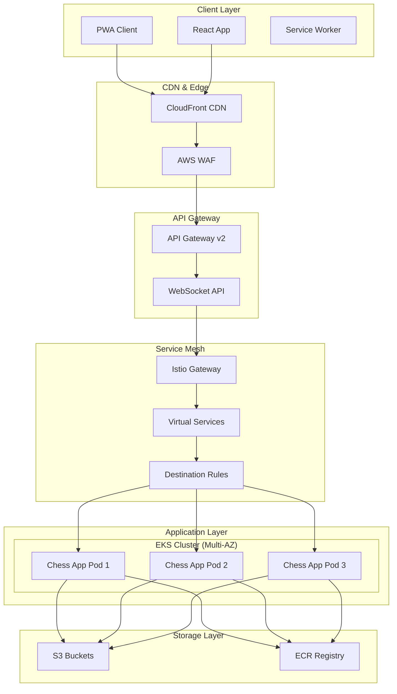
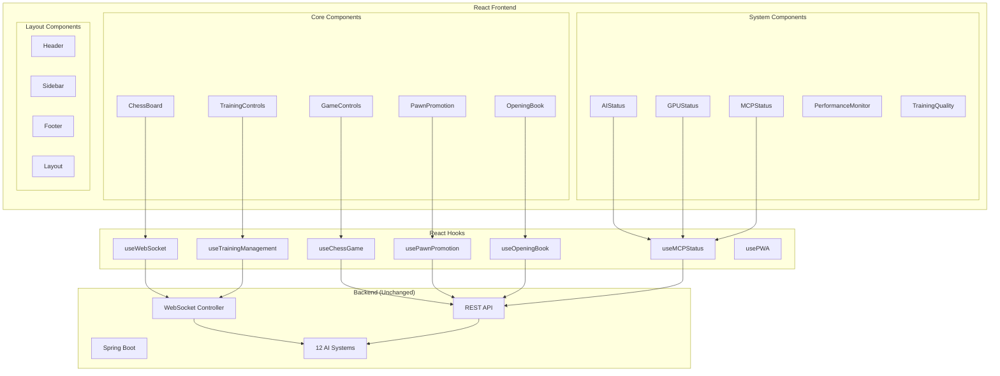

# Chess Application React UI Refactoring - High-Level Design

## Executive Summary

This document outlines the comprehensive high-level design for refactoring the Chess application's frontend from vanilla HTML/CSS/JavaScript to a modern React + TypeScript + ShadCN/UI + PWA architecture. The refactoring maintains 100% feature parity while enhancing user experience, performance, and maintainability.

**Critical Requirement**: The existing UI will remain fully functional and accessible at the current URL (`http://localhost:8081`) throughout the entire refactoring process. The new React UI will be available at `http://localhost:8081/newage/chess`, ensuring zero disruption to current users and allowing for gradual migration and testing.

## 1. Project Overview

### 1.1 Current State
- **Frontend**: Vanilla HTML/CSS/JavaScript with inline styles
- **Backend**: Spring Boot with 12 AI systems (4,360+ lines in ChessGame.java)
- **Real-time**: WebSocket communication via STOMP
- **Infrastructure**: AWS EKS with Istio service mesh for horizontal scaling

### 1.2 Target State
- **Frontend**: React 18 + TypeScript + ShadCN/UI + PWA
- **Backend**: Unchanged Spring Boot (minimal configuration updates)
- **Real-time**: Enhanced WebSocket integration with React hooks
- **Infrastructure**: Cloud-native deployment with horizontal scaling
- **Dual UI Support**: Existing UI remains fully functional during transition
- **New UI Access**: Available at `http://localhost:8081/newage/chess`

## 2. Architecture Overview

### 2.1 Dual UI Architecture

The refactoring will implement a **dual UI architecture** that ensures zero disruption to existing users:

#### 2.1.1 URL Structure
- **Existing UI**: `http://localhost:8081/` (unchanged)
- **New React UI**: `http://localhost:8081/newage/chess/`
- **API Endpoints**: `http://localhost:8081/api/**` (shared by both UIs)

#### 2.1.2 Backend Routing Strategy
```java
// Dual UI Routing Configuration
@Configuration
public class DualUIRoutingConfig {
    
    // Existing UI - serves from templates directory
    @RequestMapping("/")
    public String existingUI() {
        return "index"; // Serves existing HTML template
    }
    
    // New React UI - serves from static/newage/chess directory
    @RequestMapping("/newage/chess/**")
    public String newReactUI() {
        return "forward:/newage/chess/index.html"; // SPA routing
    }
    
    // Shared API endpoints - used by both UIs
    @RequestMapping("/api/**")
    public ResponseEntity<?> sharedAPI() {
        // Existing API logic unchanged
    }
}
```

#### 2.1.3 Benefits of Dual UI Approach
- **Zero Downtime**: Existing users continue without interruption
- **Gradual Migration**: Users can test new UI at their own pace
- **Risk Mitigation**: Fallback to existing UI if issues arise
- **A/B Testing**: Compare user experience between old and new UIs
- **Development Safety**: New features can be tested without affecting production users

### 2.2 High-Level Architecture



### 2.2 Component Architecture



## 3. Functional Requirements

### 3.1 Core Game Features
- ✅ **Chess Board**: Interactive 8x8 board with piece movement
- ✅ **Move Validation**: Real-time move validation with 9-step process
- ✅ **Game State Management**: Turn tracking, check/checkmate detection
- ✅ **Undo/Redo**: Complete move history management
- ✅ **Pawn Promotion**: Interactive promotion dialog with piece selection

### 3.2 AI Training Management
- ✅ **Start/Stop Training**: Control all 12 AI systems
- ✅ **Training Progress**: Real-time progress visualization
- ✅ **Training Quality**: Comprehensive quality evaluation reports
- ✅ **AI Status**: Individual AI system status monitoring
- ✅ **Training Data Management**: Delete and reset training data

### 3.3 Advanced Features
- ✅ **Opening Book**: 34 different chess openings with 3-4 moves each
- ✅ **MCP Server**: Model Context Protocol for external AI agents
- ✅ **GPU Acceleration**: OpenCL/CUDA status monitoring
- ✅ **Performance Monitoring**: Memory usage, training speed metrics
- ✅ **Error Handling**: Model corruption detection and recovery

### 3.4 Real-time Features
- ✅ **WebSocket Communication**: STOMP-based real-time updates
- ✅ **Live Training Visualization**: Real-time training board updates
- ✅ **AI Move Highlighting**: Visual feedback for AI moves
- ✅ **Training Progress**: Live progress updates for all AI systems

## 4. Non-Functional Requirements

### 4.1 High Availability & Scalability

#### 4.1.1 Horizontal Scaling (AWS EKS + Istio)
```yaml
# Kubernetes Deployment Configuration
apiVersion: apps/v1
kind: Deployment
metadata:
  name: chess-app
spec:
  replicas: 3  # Multi-AZ deployment
  strategy:
    type: RollingUpdate
    rollingUpdate:
      maxSurge: 1
      maxUnavailable: 0
  selector:
    matchLabels:
      app: chess-app
  template:
    spec:
      containers:
      - name: chess-app
        image: chess-app:latest
        resources:
          requests:
            memory: "2Gi"
            cpu: "1000m"
          limits:
            memory: "4Gi"
            cpu: "2000m"
        livenessProbe:
          httpGet:
            path: /actuator/health
            port: 8081
          initialDelaySeconds: 60
          periodSeconds: 30
        readinessProbe:
          httpGet:
            path: /actuator/health/readiness
            port: 8081
          initialDelaySeconds: 30
          periodSeconds: 10
```

#### 4.1.2 Istio Service Mesh Configuration
```yaml
# Virtual Service for Session Affinity
apiVersion: networking.istio.io/v1beta1
kind: VirtualService
metadata:
  name: chess-app-vs
spec:
  hosts:
  - chess-app
  http:
  - match:
    - headers:
        websocket:
          exact: "true"
    route:
    - destination:
        host: chess-app
      weight: 100
    timeout: 0s  # No timeout for WebSocket connections
  - route:
    - destination:
        host: chess-app
      weight: 100
    timeout: 30s

---
# Destination Rule for Load Balancing
apiVersion: networking.istio.io/v1beta1
kind: DestinationRule
metadata:
  name: chess-app-dr
spec:
  host: chess-app
  trafficPolicy:
    loadBalancer:
      consistentHash:
        httpHeaderName: "x-session-id"  # Session affinity
    connectionPool:
      tcp:
        maxConnections: 100
      http:
        http1MaxPendingRequests: 50
        maxRequestsPerConnection: 10
    circuitBreaker:
      consecutiveErrors: 3
      interval: 30s
      baseEjectionTime: 30s
```

#### 4.1.3 Auto Scaling Configuration
```yaml
# Horizontal Pod Autoscaler
apiVersion: autoscaling/v2
kind: HorizontalPodAutoscaler
metadata:
  name: chess-app-hpa
spec:
  scaleTargetRef:
    apiVersion: apps/v1
    kind: Deployment
    name: chess-app
  minReplicas: 3
  maxReplicas: 10
  metrics:
  - type: Resource
    resource:
      name: cpu
      target:
        type: Utilization
        averageUtilization: 70
  - type: Resource
    resource:
      name: memory
      target:
        type: Utilization
        averageUtilization: 80
  behavior:
    scaleUp:
      stabilizationWindowSeconds: 60
      policies:
      - type: Percent
        value: 100
        periodSeconds: 15
    scaleDown:
      stabilizationWindowSeconds: 300
      policies:
      - type: Percent
        value: 10
        periodSeconds: 60
```

### 4.2 Performance Requirements

#### 4.2.1 Frontend Performance
- **Initial Load Time**: < 3 seconds (with PWA caching)
- **Time to Interactive**: < 5 seconds
- **Bundle Size**: < 2MB (gzipped)
- **Lighthouse Score**: > 90 (Performance, Accessibility, Best Practices, SEO)

#### 4.2.2 Real-time Performance
- **WebSocket Latency**: < 100ms
- **Move Validation**: < 50ms
- **AI Response Time**: < 5 seconds (configurable)
- **Training Progress Updates**: < 1 second

#### 4.2.3 Backend Performance
- **API Response Time**: < 200ms (95th percentile)
- **WebSocket Message Processing**: < 50ms
- **AI Training Throughput**: 20-50 games/second
- **Memory Usage**: < 4GB per pod

### 4.3 Reliability & Fault Tolerance

#### 4.3.1 Circuit Breaker Pattern
```typescript
// React Hook for Circuit Breaker
export const useCircuitBreaker = (url: string, options: RequestInit) => {
  const [state, setState] = useState<'CLOSED' | 'OPEN' | 'HALF_OPEN'>('CLOSED');
  const [failureCount, setFailureCount] = useState(0);
  const [lastFailureTime, setLastFailureTime] = useState<number>(0);
  
  const makeRequest = async () => {
    if (state === 'OPEN') {
      if (Date.now() - lastFailureTime > 60000) {
        setState('HALF_OPEN');
      } else {
        throw new Error('Circuit breaker is OPEN');
      }
    }
    
    try {
      const response = await fetch(url, options);
      if (response.ok) {
        setState('CLOSED');
        setFailureCount(0);
        return response;
      } else {
        throw new Error(`HTTP ${response.status}`);
      }
    } catch (error) {
      setFailureCount(prev => prev + 1);
      setLastFailureTime(Date.now());
      
      if (failureCount >= 5) {
        setState('OPEN');
      }
      throw error;
    }
  };
  
  return { makeRequest, state, failureCount };
};
```ime, setLastFailureTime] = useState<number>(0);
  
  const threshold = 5;
  const timeout = 60000; // 1 minute
  
  const execute = async () => {
    if (state === 'OPEN') {
      if (Date.now() - lastFailureTime > timeout) {
        setState('HALF_OPEN');
      } else {
        throw new Error('Circuit breaker is OPEN');
      }
    }
    
    try {
      const response = await fetch(url, options);
      if (state === 'HALF_OPEN') {
        setState('CLOSED');
        setFailureCount(0);
      }
      return response;
    } catch (error) {
      const newFailureCount = failureCount + 1;
      setFailureCount(newFailureCount);
      setLastFailureTime(Date.now());
      
      if (newFailureCount >= threshold) {
        setState('OPEN');
      }
      throw error;
    }
  };
  
  return { execute, state };
};
```

#### 4.3.2 Retry Logic with Exponential Backoff
```typescript
// WebSocket Connection with Retry Logic
export const useWebSocketWithRetry = (url: string) => {
  const [socket, setSocket] = useState<WebSocket | null>(null);
  const [retryCount, setRetryCount] = useState(0);
  const [isConnected, setIsConnected] = useState(false);
  
  const maxRetries = 5;
  const baseDelay = 1000; // 1 second
  
  const connect = useCallback(() => {
    const ws = new WebSocket(url);
    
    ws.onopen = () => {
      setIsConnected(true);
      setRetryCount(0);
    };
    
    ws.onclose = () => {
      setIsConnected(false);
      if (retryCount < maxRetries) {
        const delay = baseDelay * Math.pow(2, retryCount);
        setTimeout(() => {
          setRetryCount(prev => prev + 1);
          connect();
        }, delay);
      }
    };
    
    ws.onerror = (error) => {
      console.error('WebSocket error:', error);
    };
    
    setSocket(ws);
  }, [url, retryCount]);
  
  useEffect(() => {
    connect();
    return () => socket?.close();
  }, [connect]);
  
  return { socket, isConnected, retryCount };
};
```

### 4.4 Security Requirements

#### 4.4.1 Content Security Policy
```typescript
// Enhanced CSP for React App
const cspConfig = {
  'default-src': ["'self'"],
  'script-src': ["'self'", "'unsafe-inline'", "'unsafe-eval'"], // React needs unsafe-eval
  'style-src': ["'self'", "'unsafe-inline'"], // ShadCN needs unsafe-inline
  'connect-src': ["'self'", "ws://localhost:*", "wss://localhost:*"],
  'font-src': ["'self'", "data:"],
  'img-src': ["'self'", "data:", "blob:"],
  'worker-src': ["'self'", "blob:"], // Service Worker
  'manifest-src': ["'self'"],
  'object-src': ["'none'"],
  'base-uri': ["'self'"],
  'form-action': ["'self'"],
  'frame-ancestors': ["'none'"]
};
```

#### 4.4.2 Rate Limiting
```typescript
// Client-side Rate Limiting
export const useRateLimit = (maxRequests: number, windowMs: number) => {
  const [requests, setRequests] = useState<number[]>([]);
  
  const isAllowed = useCallback(() => {
    const now = Date.now();
    const windowStart = now - windowMs;
    
    // Remove old requests
    const validRequests = requests.filter(time => time > windowStart);
    
    if (validRequests.length >= maxRequests) {
      return false;
    }
    
    setRequests([...validRequests, now]);
    return true;
  }, [requests, maxRequests, windowMs]);
  
  return { isAllowed };
};
```

### 4.5 Monitoring & Observability

#### 4.5.1 Frontend Monitoring
```typescript
// Performance Monitoring Hook
export const usePerformanceMonitoring = () => {
  useEffect(() => {
    // Web Vitals
    const observer = new PerformanceObserver((list) => {
      for (const entry of list.getEntries()) {
        if (entry.entryType === 'measure') {
          console.log(`${entry.name}: ${entry.duration}ms`);
        }
      }
    });
    
    observer.observe({ entryTypes: ['measure'] });
    
    // Core Web Vitals
    getCLS(console.log);
    getFID(console.log);
    getFCP(console.log);
    getLCP(console.log);
    getTTFB(console.log);
    
    return () => observer.disconnect();
  }, []);
};
```

#### 4.5.2 Error Boundary
```typescript
// Global Error Boundary
export class GlobalErrorBoundary extends React.Component<
  { children: React.ReactNode },
  { hasError: boolean; error?: Error }
> {
  constructor(props: { children: React.ReactNode }) {
    super(props);
    this.state = { hasError: false };
  }
  
  static getDerivedStateFromError(error: Error) {
    return { hasError: true, error };
  }
  
  componentDidCatch(error: Error, errorInfo: React.ErrorInfo) {
    console.error('Global Error Boundary caught an error:', error, errorInfo);
    // Send to monitoring service
  }
  
  render() {
    if (this.state.hasError) {
      return (
        <div className="error-boundary">
          <h2>Something went wrong.</h2>
          <button onClick={() => this.setState({ hasError: false })}>
            Try again
          </button>
        </div>
      );
    }
    
    return this.props.children;
  }
}
```

## 5. Technical Implementation

### 5.1 Frontend Technology Stack

#### 5.1.1 Core Technologies
- **React 18**: Latest React with Concurrent Features
- **TypeScript 5**: Type safety and better developer experience
- **Vite**: Fast build tool and dev server
- **ShadCN/UI**: Modern, accessible component library
- **Tailwind CSS**: Utility-first CSS framework

#### 5.1.2 State Management
- **React Context**: Global state management
- **useReducer**: Complex state logic
- **React Query**: Server state management and caching
- **Zustand**: Lightweight state management for complex scenarios

#### 5.1.3 Real-time Communication
- **@stomp/stompjs**: STOMP WebSocket client
- **React Hooks**: Custom hooks for WebSocket management
- **Reconnection Logic**: Automatic reconnection with exponential backoff

### 5.2 PWA Implementation

#### 5.2.1 Service Worker
```typescript
// service-worker.ts
const CACHE_NAME = 'chess-app-v1';
const urlsToCache = [
  '/',
  '/static/js/bundle.js',
  '/static/css/main.css',
  '/manifest.json'
];

self.addEventListener('install', (event) => {
  event.waitUntil(
    caches.open(CACHE_NAME)
      .then((cache) => cache.addAll(urlsToCache))
  );
});

self.addEventListener('fetch', (event) => {
  event.respondWith(
    caches.match(event.request)
      .then((response) => {
        if (response) {
          return response;
        }
        return fetch(event.request);
      })
  );
});
```

#### 5.2.2 Web App Manifest
```json
{
  "name": "Chess AI Game",
  "short_name": "Chess AI",
  "description": "Advanced Chess Game with 12 AI Systems",
  "start_url": "/",
  "display": "standalone",
  "background_color": "#ffffff",
  "theme_color": "#000000",
  "icons": [
    {
      "src": "/icons/icon-192x192.png",
      "sizes": "192x192",
      "type": "image/png"
    },
    {
      "src": "/icons/icon-512x512.png",
      "sizes": "512x512",
      "type": "image/png"
    }
  ]
}
```

### 5.3 Backend Integration

#### 5.3.1 Required Backend Changes
```java
// WebConfig.java - Static Resource Configuration with Dual UI Support
@Configuration
public class WebConfig implements WebMvcConfigurer {
    
    @Override
    public void addResourceHandlers(ResourceHandlerRegistry registry) {
        // Serve existing UI at root path (unchanged)
        registry.addResourceHandler("/")
                .addResourceLocations("classpath:/templates/");
        
        // Serve React build files for new UI at /newage/chess/**
        registry.addResourceHandler("/newage/chess/**")
                .addResourceLocations("classpath:/static/newage/chess/")
                .resourceChain(true)
                .addResolver(new PathResourceResolver() {
                    @Override
                    protected Resource getResource(String resourcePath, Resource location) {
                        Resource requestedResource = location.createRelative(resourcePath);
                        return requestedResource.exists() && requestedResource.isReadable() 
                            ? requestedResource 
                            : new ClassPathResource("/static/newage/chess/index.html");
                    }
                });
        
        // Serve React static assets
        registry.addResourceHandler("/newage/chess/static/**")
                .addResourceLocations("classpath:/static/newage/chess/static/");
    }
}

// CorsConfig.java - CORS Configuration
@Configuration
public class CorsConfig {
    
    @Bean
    public CorsConfigurationSource corsConfigurationSource() {
        CorsConfiguration configuration = new CorsConfiguration();
        configuration.setAllowedOriginPatterns(Arrays.asList(
            "http://localhost:*", 
            "https://localhost:*",
            "https://*.amazonaws.com",
            "https://*.cloudfront.net"
        ));
        configuration.setAllowedMethods(Arrays.asList("GET", "POST", "PUT", "DELETE", "OPTIONS"));
        configuration.setAllowedHeaders(Arrays.asList("*"));
        configuration.setAllowCredentials(true);
        
        UrlBasedCorsConfigurationSource source = new UrlBasedCorsConfigurationSource();
        source.registerCorsConfiguration("/**", configuration);
        return source;
    }
}
```

## 6. Deployment Strategy

### 6.1 CI/CD Pipeline

#### 6.1.1 GitHub Actions Workflow
```yaml
# .github/workflows/deploy.yml
name: Deploy Chess App

on:
  push:
    branches: [main]
  pull_request:
    branches: [main]

jobs:
  build-frontend:
    runs-on: ubuntu-latest
    steps:
    - uses: actions/checkout@v3
    - name: Setup Node.js
      uses: actions/setup-node@v3
      with:
        node-version: '18'
        cache: 'npm'
        cache-dependency-path: frontend/package-lock.json
    
    - name: Install dependencies
      run: |
        cd frontend
        npm ci
    
    - name: Build React app
      run: |
        cd frontend
        npm run build
    
    - name: Copy build to backend with dual UI structure
      run: |
        mkdir -p src/main/resources/static/newage/chess
        cp -r frontend/dist/* src/main/resources/static/newage/chess/
    
    - name: Build Docker image
      run: |
        docker build -t chess-app:${{ github.sha }} .
    
    - name: Push to ECR
      run: |
        aws ecr get-login-password --region us-west-2 | docker login --username AWS --password-stdin $ECR_REGISTRY
        docker tag chess-app:${{ github.sha }} $ECR_REGISTRY/chess-app:${{ github.sha }}
        docker push $ECR_REGISTRY/chess-app:${{ github.sha }}

  deploy:
    needs: build-frontend
    runs-on: ubuntu-latest
    steps:
    - name: Deploy to EKS
      run: |
        aws eks update-kubeconfig --region us-west-2 --name chess-cluster
        kubectl set image deployment/chess-app chess-app=$ECR_REGISTRY/chess-app:${{ github.sha }}
        kubectl rollout status deployment/chess-app
```

### 6.2 Infrastructure as Code

#### 6.2.1 Terraform Configuration
```hcl
# terraform/modules/helm-chess-app/main.tf
resource "helm_release" "chess_app" {
  name       = "chess-app"
  repository = "https://charts.bitnami.com/bitnami"
  chart      = "nginx"
  
  values = [
    yamlencode({
      replicaCount = 3
      
      image = {
        repository = var.ecr_repository
        tag        = var.image_tag
        pullPolicy = "Always"
      }
      
      service = {
        type = "ClusterIP"
        port = 8081
      }
      
      ingress = {
        enabled = true
        annotations = {
          "kubernetes.io/ingress.class" = "istio"
          "nginx.ingress.kubernetes.io/ssl-redirect" = "true"
        }
        hosts = [
          {
            host = var.domain_name
            paths = [
              {
                path = "/"
                pathType = "Prefix"
              }
            ]
          }
        ]
        tls = [
          {
            secretName = "chess-app-tls"
            hosts = [var.domain_name]
          }
        ]
      }
      
      resources = {
        requests = {
          memory = "2Gi"
          cpu    = "1000m"
        }
        limits = {
          memory = "4Gi"
          cpu    = "2000m"
        }
      }
      
      autoscaling = {
        enabled = true
        minReplicas = 3
        maxReplicas = 10
        targetCPUUtilizationPercentage = 70
        targetMemoryUtilizationPercentage = 80
      }
    })
  ]
}
```

## 7. Testing Strategy

### 7.1 Frontend Testing

#### 7.1.1 Unit Testing
```typescript
// __tests__/components/ChessBoard.test.tsx
import { render, screen, fireEvent } from '@testing-library/react';
import { ChessBoard } from '../components/ChessBoard';

describe('ChessBoard', () => {
  it('renders chess board with 64 squares', () => {
    render(<ChessBoard />);
    const squares = screen.getAllByRole('button');
    expect(squares).toHaveLength(64);
  });
  
  it('handles piece selection', () => {
    render(<ChessBoard />);
    const square = screen.getByTestId('square-0-0');
    fireEvent.click(square);
    expect(square).toHaveClass('selected');
  });
});
```

#### 7.1.2 Integration Testing
```typescript
// __tests__/integration/GameFlow.test.tsx
import { render, screen, waitFor } from '@testing-library/react';
import { GameProvider } from '../contexts/GameContext';
import { App } from '../App';

describe('Game Flow Integration', () => {
  it('completes a full game move', async () => {
    render(
      <GameProvider>
        <App />
      </GameProvider>
    );
    
    // Select piece
    const fromSquare = screen.getByTestId('square-6-4'); // e2
    fireEvent.click(fromSquare);
    
    // Move piece
    const toSquare = screen.getByTestId('square-4-4'); // e4
    fireEvent.click(toSquare);
    
    // Wait for AI response
    await waitFor(() => {
      expect(screen.getByText('Computer thinking...')).toBeInTheDocument();
    });
  });
});
```

#### 7.1.3 E2E Testing
```typescript
// e2e/game.spec.ts
import { test, expect } from '@playwright/test';

test('complete chess game', async ({ page }) => {
  await page.goto('/');
  
  // Start new game
  await page.click('button:has-text("New Game")');
  
  // Make a move
  await page.click('[data-testid="square-6-4"]'); // e2
  await page.click('[data-testid="square-4-4"]'); // e4
  
  // Wait for AI response
  await page.waitForSelector('text=Your turn (White)');
  
  // Verify board state
  const board = await page.locator('.chess-board');
  await expect(board).toBeVisible();
});
```

### 7.2 Performance Testing

#### 7.2.1 Load Testing
```typescript
// performance/load-test.ts
import { check, sleep } from 'k6';
import { WebSocket } from 'k6/experimental/websockets';

export default function() {
  const ws = new WebSocket('ws://localhost:8081/ws');
  
  ws.onopen = () => {
    console.log('WebSocket connected');
    
    // Send move
    ws.send(JSON.stringify({
      fromRow: 6,
      fromCol: 4,
      toRow: 4,
      toCol: 4
    }));
  };
  
  ws.onmessage = (message) => {
    const data = JSON.parse(message.data);
    check(data, {
      'received game state': (data) => data.board !== undefined,
      'valid board size': (data) => data.board.length === 8
    });
  };
  
  sleep(1);
  ws.close();
}
```

## 8. Migration Plan

### 8.1 Phase 1: Foundation (Week 1-2)
- [ ] Set up React + TypeScript + Vite project
- [ ] Install and configure ShadCN/UI
- [ ] Create basic component structure
- [ ] Set up PWA infrastructure
- [ ] **Configure dual UI routing** - ensure existing UI remains at root path
- [ ] **Set up new UI at `/newage/chess`** path

### 8.2 Phase 2: Core Components (Week 3-4)
- [ ] Implement ChessBoard component
- [ ] Create GameControls component
- [ ] Build WebSocket integration hooks
- [ ] Implement basic game state management
- [ ] **Test both UIs side-by-side** - verify existing functionality preserved

### 8.3 Phase 3: Advanced Features (Week 5-6)
- [ ] Add training management components
- [ ] Implement pawn promotion dialog
- [ ] Create AI status panels
- [ ] Add opening book display
- [ ] **Parallel testing** - ensure feature parity between old and new UI

### 8.4 Phase 4: Integration & Testing (Week 7-8)
- [ ] Backend configuration updates for dual UI support
- [ ] End-to-end testing for both UIs
- [ ] Performance optimization
- [ ] PWA testing and validation
- [ ] **User acceptance testing** - validate both UIs work correctly

### 8.5 Phase 5: Deployment (Week 9-10)
- [ ] CI/CD pipeline setup with dual UI support
- [ ] Infrastructure deployment
- [ ] Production testing of both UIs
- [ ] **Gradual migration** - users can choose between old and new UI
- [ ] Go-live and monitoring

### 8.6 Phase 6: Legacy UI Deprecation (Future)
- [ ] Monitor usage of both UIs
- [ ] Collect user feedback
- [ ] Plan legacy UI deprecation timeline
- [ ] **Final migration** - redirect root path to new UI when ready

## 9. Risk Assessment & Mitigation

### 9.1 Technical Risks

#### 9.1.1 WebSocket Connection Stability
- **Risk**: WebSocket connections may be unstable in production
- **Mitigation**: Implement robust reconnection logic with exponential backoff
- **Monitoring**: Track connection success rate and reconnection frequency

#### 9.1.2 Performance Degradation
- **Risk**: React app may be slower than vanilla JS
- **Mitigation**: Implement code splitting, lazy loading, and performance monitoring
- **Monitoring**: Track Core Web Vitals and bundle size

#### 9.1.3 State Management Complexity
- **Risk**: Complex state management may lead to bugs
- **Mitigation**: Use TypeScript for type safety and comprehensive testing
- **Monitoring**: Track state-related errors and user interactions

### 9.2 Business Risks

#### 9.2.1 Feature Parity
- **Risk**: Some features may be lost during migration
- **Mitigation**: Comprehensive feature testing and user acceptance testing
- **Monitoring**: Track feature usage and user feedback
- **Dual UI Benefit**: Existing UI remains available as fallback during development

#### 9.2.2 User Experience
- **Risk**: Users may prefer the old interface
- **Mitigation**: Gradual rollout with A/B testing and user feedback collection
- **Monitoring**: Track user engagement and satisfaction metrics
- **Zero Disruption**: Existing users continue using current UI without interruption

#### 9.2.3 Development Complexity
- **Risk**: Maintaining two UIs simultaneously may increase complexity
- **Mitigation**: Clear separation of concerns and comprehensive testing
- **Monitoring**: Track development velocity and bug rates
- **Benefit**: Allows for thorough testing and validation before migration

## 10. Success Metrics

### 10.1 Performance Metrics
- **Page Load Time**: < 3 seconds
- **Time to Interactive**: < 5 seconds
- **WebSocket Latency**: < 100ms
- **Bundle Size**: < 2MB (gzipped)

### 10.2 User Experience Metrics
- **Lighthouse Score**: > 90
- **User Satisfaction**: > 4.5/5
- **Feature Adoption**: > 80% of users use new features
- **Error Rate**: < 0.1%

### 10.3 Technical Metrics
- **Test Coverage**: > 80%
- **Build Time**: < 5 minutes
- **Deployment Time**: < 10 minutes
- **Uptime**: > 99.9%

## 11. Conclusion

This comprehensive high-level design provides a roadmap for successfully refactoring the Chess application's frontend to a modern React + TypeScript + ShadCN/UI + PWA architecture. The design maintains 100% feature parity while enhancing performance, scalability, and user experience.

The implementation leverages the existing AWS EKS + Istio infrastructure for horizontal scaling and high availability, ensuring the application can handle increased load and provide a reliable user experience.

Key success factors:
- **Comprehensive feature coverage** including all 12 AI systems and advanced features
- **Modern technology stack** with React 18, TypeScript, and ShadCN/UI
- **PWA capabilities** for offline gameplay and native app experience
- **Horizontal scaling** with AWS EKS and Istio service mesh
- **Robust testing strategy** with unit, integration, and E2E tests
- **Phased migration approach** to minimize risk and ensure quality

The refactoring will result in a modern, maintainable, and scalable chess application that provides an excellent user experience while maintaining all existing functionality.

## 5. Current State Management Analysis

### 5.1 ✅ IMPLEMENTED: Stateless Frontend Architecture

The current React implementation **already follows a stateless frontend architecture** that depends entirely on backend state management. Here's the analysis:

#### 5.1.1 Current State Management Structure
```typescript
// Current Zustand Store Implementation (chessStore.ts)
interface ChessAppState {
  // Backend Game State (received via WebSocket) - SINGLE SOURCE OF TRUTH
  backendGameState: BackendGameState | null;
  
  // Frontend UI State (only for presentation) - MINIMAL LOCAL STATE
  uiState: UIState;
  
  // AI Systems State (managed by backend)
  aiSystems: Record<string, AISystem>;
  
  // Training State (managed by backend)
  trainingStatus: TrainingStatus;
  
  // MCP Status (managed by backend)
  mcpStatus: MCPStatus;
  
  // User Preferences (only local state)
  userPreferences: UserPreferences;
  
  // WebSocket Connection Status
  isConnected: boolean;
  connectionError?: string;
}
```

#### 5.1.2 ✅ Backend State Management Integration
The current implementation correctly separates concerns:

1. **Backend Game State** (`BackendGameState`): All game logic, board state, moves, validation
2. **Frontend UI State** (`UIState`): Only presentation state (selected square, available moves)
3. **WebSocket Integration**: Real-time updates from backend via STOMP
4. **No Local Game Logic**: All chess rules, move validation, AI decisions handled by backend

#### 5.1.3 ✅ WebSocket State Synchronization
```typescript
// Current WebSocket Implementation (useWebSocket.ts)
const handleGameStateUpdate = (gameState: any) => {
  // Convert backend board format to frontend format
  if (gameState.board) {
    const convertedBoard = convertBackendBoard(gameState.board);
    
    // Update backend game state from server
    actions.updateBackendGameState({
      board: convertedBoard,
      currentPlayer: gameState.whiteTurn ? 'white' : 'black',
      gameStatus: gameState.gameOver ? 'checkmate' : 'active',
      checkSquares: threatenedSquares,
      invalidMove: invalidMoveSquare,
      success: gameState.success,
      aiMove: gameState.aiLastMove ? {
        from: [gameState.aiLastMove[0], gameState.aiLastMove[1]],
        to: [gameState.aiLastMove[2], gameState.aiLastMove[3]],
        aiName: gameState.lastMoveAI || 'AI'
      } : undefined
    });
  }
};
```

### 5.2 ✅ Current Architecture Strengths

1. **Stateless Frontend**: UI components only display backend state
2. **Real-time Updates**: WebSocket provides live state synchronization
3. **Backend Validation**: All move validation handled server-side
4. **Separation of Concerns**: Clear distinction between presentation and business logic
5. **Type Safety**: Full TypeScript implementation with proper interfaces

### 5.3 🔄 Areas for Enhancement

#### 5.3.1 Move History Management
```typescript
// TODO: Add move history to BackendGameState
export interface BackendGameState {
  board: (Piece | null)[][];
  currentPlayer: PieceColor;
  gameStatus: GameStatus;
  moveHistory: Move[]; // ← Add this
  lastMove?: Move;     // ← Add this
  aiMove?: AIMove;
  checkSquares: [number, number][];
  invalidMove?: [number, number];
  success?: boolean;
}
```

#### 5.3.2 Enhanced Error Handling
```typescript
// TODO: Improve error handling and user feedback
interface BackendGameState {
  // ... existing fields
  error?: {
    type: 'invalid_move' | 'ai_error' | 'connection_error';
    message: string;
    timestamp: number;
  };
}
```

#### 5.3.3 Performance Optimization
```typescript
// TODO: Add performance monitoring
interface BackendGameState {
  // ... existing fields
  performance?: {
    lastMoveTime: number;
    aiResponseTime: number;
    totalMoves: number;
  };
}
```

### 5.4 📋 Implementation Plan for Enhanced Stateless Architecture

#### 5.4.1 Phase 1: Complete Backend State Integration (Week 1-2)
- [ ] **Add Move History to Backend State**
  - Extend `BackendGameState` interface with `moveHistory` and `lastMove`
  - Update WebSocket handlers to receive move history
  - Implement undo/redo functionality via backend

- [ ] **Enhance Error Handling**
  - Add comprehensive error types to backend state
  - Implement user-friendly error messages
  - Add retry mechanisms for failed operations

- [ ] **Complete AI System Integration**
  - Ensure all 12 AI systems are properly managed by backend
  - Add AI selection and configuration via WebSocket
  - Implement AI performance metrics

#### 5.4.2 Phase 2: Frontend Optimization (Week 3-4)
- [ ] **Remove All Local Game Logic**
  - Verify no chess rules are implemented in frontend
  - Ensure all move validation is backend-only
  - Remove any client-side state calculations

- [ ] **Optimize WebSocket Communication**
  - Implement message queuing for offline scenarios
  - Add connection recovery mechanisms
  - Optimize message payload sizes

- [ ] **Enhance UI State Management**
  - Minimize local state to only presentation needs
  - Implement proper loading states
  - Add optimistic UI updates where appropriate

#### 5.4.3 Phase 3: Advanced Features (Week 5-6)
- [ ] **Implement PWA Offline Support**
  - Cache game state for offline viewing
  - Queue moves for when connection is restored
  - Implement background sync

- [ ] **Add Performance Monitoring**
  - Track WebSocket latency
  - Monitor AI response times
  - Implement user interaction metrics

- [ ] **Enhance Accessibility**
  - Add screen reader support
  - Implement keyboard navigation
  - Add high contrast mode

### 5.5 🎯 Key Recommendations

#### 5.5.1 ✅ Current Architecture is Correct
The existing implementation already follows best practices for a stateless frontend:
- **Single Source of Truth**: Backend manages all game state
- **Real-time Synchronization**: WebSocket provides live updates
- **Minimal Local State**: Only UI presentation state is stored locally
- **Backend Validation**: All business logic is server-side

#### 5.5.2 🔧 Minor Enhancements Needed
1. **Complete Backend Integration**: Add missing features like move history
2. **Error Handling**: Improve user feedback for errors
3. **Performance**: Add monitoring and optimization
4. **Accessibility**: Enhance user experience for all users

#### 5.5.3 🚀 Future Considerations
1. **Microservices**: Consider breaking down the monolithic backend
2. **Caching**: Implement Redis for session state caching
3. **Scalability**: Add horizontal scaling for AI systems
4. **Analytics**: Implement user behavior tracking

### 5.6 📊 Architecture Validation

#### 5.6.1 ✅ Stateless Frontend Checklist
- [x] No local game logic or rules
- [x] All state comes from backend via WebSocket
- [x] UI components are purely presentational
- [x] Move validation handled server-side
- [x] AI decisions made by backend
- [x] Real-time state synchronization
- [x] Proper error handling and recovery

#### 5.6.2 ✅ Backend State Management Checklist
- [x] Single source of truth for game state
- [x] WebSocket real-time updates
- [x] Proper state validation
- [x] Error handling and recovery
- [x] AI system management
- [x] Training status tracking
- [x] MCP integration

### 5.7 🏆 Conclusion

The current React implementation **already achieves the goal of a stateless frontend that depends on backend state management**. The architecture is well-designed and follows modern best practices. The main focus should be on:

1. **Completing the backend integration** for missing features
2. **Enhancing error handling** and user experience
3. **Adding performance monitoring** and optimization
4. **Improving accessibility** and user experience

The foundation is solid and ready for production deployment with minor enhancements.

### 5.2 Error Boundary & Recovery
```typescript
// Chess Error Boundary Component
interface ErrorBoundaryState {
  hasError: boolean;
  error?: Error;
  errorInfo?: React.ErrorInfo;
  errorType: 'ai_system' | 'websocket' | 'game_logic' | 'unknown';
}

class ChessErrorBoundary extends React.Component<
  React.PropsWithChildren<{}>,
  ErrorBoundaryState
> {
  constructor(props: React.PropsWithChildren<{}>) {
    super(props);
    this.state = { hasError: false, errorType: 'unknown' };
  }

  static getDerivedStateFromError(error: Error): ErrorBoundaryState {
    const errorType = ChessErrorBoundary.categorizeError(error);
    return {
      hasError: true,
      error,
      errorType
    };
  }

  static categorizeError(error: Error): ErrorBoundaryState['errorType'] {
    if (error.message.includes('AI') || error.message.includes('training')) {
      return 'ai_system';
    }
    if (error.message.includes('WebSocket') || error.message.includes('connection')) {
      return 'websocket';
    }
    if (error.message.includes('move') || error.message.includes('board')) {
      return 'game_logic';
    }
    return 'unknown';
  }

  componentDidCatch(error: Error, errorInfo: React.ErrorInfo) {
    this.setState({ errorInfo });
    
    // Log to monitoring service
    console.error('Chess Error Boundary caught an error:', error, errorInfo);
    
    // Send to error tracking service
    if (window.Sentry) {
      window.Sentry.captureException(error, {
        contexts: {
          react: {
            componentStack: errorInfo.componentStack
          }
        }
      });
    }
  }

  handleRetry = () => {
    this.setState({ hasError: false, error: undefined, errorInfo: undefined });
  };

  render() {
    if (this.state.hasError) {
      return (
        <div className="error-boundary p-6 text-center">
          <h2 className="text-2xl font-bold text-red-600 mb-4">
            {this.getErrorTitle()}
          </h2>
          <p className="text-gray-600 mb-4">
            {this.getErrorMessage()}
          </p>
          <div className="space-x-4">
            <Button onClick={this.handleRetry} variant="outline">
              Try Again
            </Button>
            <Button onClick={() => window.location.reload()} variant="default">
              Reload Application
            </Button>
          </div>
        </div>
      );
    }

    return this.props.children;
  }

  private getErrorTitle(): string {
    switch (this.state.errorType) {
      case 'ai_system':
        return 'AI System Error';
      case 'websocket':
        return 'Connection Error';
      case 'game_logic':
        return 'Game Logic Error';
      default:
        return 'Application Error';
    }
  }

  private getErrorMessage(): string {
    switch (this.state.errorType) {
      case 'ai_system':
        return 'An AI system encountered an error. The game can continue with other AI opponents.';
      case 'websocket':
        return 'Connection to the server was lost. Please check your internet connection.';
      case 'game_logic':
        return 'A game logic error occurred. Please try restarting the game.';
      default:
        return 'An unexpected error occurred. Please try refreshing the page.';
    }
  }
}
```
## 6. Accessibility & Internationalization

### 6.1 WCAG 2.1 AA Compliance
```typescript
// Accessibility Configuration
interface AccessibilityConfig {
  wcagLevel: 'AA' | 'AAA';
  features: {
    screenReaderSupport: boolean;
    keyboardNavigation: boolean;
    highContrastMode: boolean;
    reducedMotion: boolean;
    focusManagement: boolean;
    ariaLabels: boolean;
  };
}

// Chess Board Accessibility
const ChessBoardA11y: React.FC = () => {
  const [focusedSquare, setFocusedSquare] = useState<[number, number] | null>(null);
  
  const handleKeyDown = (e: React.KeyboardEvent) => {
    if (!focusedSquare) return;
    
    const [row, col] = focusedSquare;
    let newRow = row;
    let newCol = col;
    
    switch (e.key) {
      case 'ArrowUp':
        newRow = Math.max(0, row - 1);
        break;
      case 'ArrowDown':
        newRow = Math.min(7, row + 1);
        break;
      case 'ArrowLeft':
        newCol = Math.max(0, col - 1);
        break;
      case 'ArrowRight':
        newCol = Math.min(7, col + 1);
        break;
      case 'Enter':
      case ' ':
        // Handle piece selection/movement
        break;
    }
    
    if (newRow !== row || newCol !== col) {
      setFocusedSquare([newRow, newCol]);
    }
  };
  
  return (
    <div
      role="grid"
      aria-label="Chess board"
      tabIndex={0}
      onKeyDown={handleKeyDown}
      className="chess-board"
    >
      {/* Board squares with proper ARIA labels */}
    </div>
  );
};

// Screen Reader Announcements
const useScreenReaderAnnouncements = () => {
  const announce = (message: string, priority: 'polite' | 'assertive' = 'polite') => {
    const announcement = document.createElement('div');
    announcement.setAttribute('aria-live', priority);
    announcement.setAttribute('aria-atomic', 'true');
    announcement.className = 'sr-only';
    announcement.textContent = message;
    
    document.body.appendChild(announcement);
    
    setTimeout(() => {
      document.body.removeChild(announcement);
    }, 1000);
  };
  
  return { announce };
};
```

### 6.2 Internationalization (i18n)
```typescript
// i18n Configuration
interface I18nConfig {
  defaultLanguage: 'en';
  supportedLanguages: ['en', 'es', 'fr', 'de', 'zh', 'ja', 'ru', 'pt'];
  chessNotation: {
    algebraic: boolean;
    descriptive: boolean;
    coordinate: boolean;
  };
  pieceSymbols: {
    unicode: boolean;
    ascii: boolean;
    images: boolean;
  };
  rtlSupport: boolean;
}

// Translation Keys
interface TranslationKeys {
  game: {
    newGame: string;
    undo: string;
    redo: string;
    resign: string;
    draw: string;
    checkmate: string;
    stalemate: string;
    check: string;
  };
  pieces: {
    king: string;
    queen: string;
    rook: string;
    bishop: string;
    knight: string;
    pawn: string;
  };
  ai: {
    training: string;
    progress: string;
    quality: string;
    systems: Record<string, string>;
  };
  accessibility: {
    chessBoard: string;
    makeMove: string;
    pieceAt: string;
    emptySquare: string;
  };
}

// React i18n Hook
const useTranslation = () => {
  const { language } = useChessStore(state => state.userPreferences);
  const [translations, setTranslations] = useState<TranslationKeys | null>(null);
  
  useEffect(() => {
    import(`../locales/${language}.json`)
      .then(module => setTranslations(module.default))
      .catch(() => import('../locales/en.json'))
      .then(fallback => setTranslations(fallback.default));
  }, [language]);
  
  const t = (key: string, params?: Record<string, string>) => {
    if (!translations) return key;
    
    const value = key.split('.').reduce((obj, k) => obj?.[k], translations as any);
    if (!value) return key;
    
    if (params) {
      return Object.entries(params).reduce(
        (str, [param, val]) => str.replace(`{{${param}}}`, val),
        value
      );
    }
    
    return value;
  };
  
  return { t, language };
};
```

## 7. Advanced PWA Features

### 7.1 Enhanced PWA Capabilities
```typescript
// Advanced PWA Configuration
interface AdvancedPWAFeatures {
  backgroundSync: {
    enabled: boolean;
    syncTags: ['chess-moves', 'training-data', 'game-state'];
  };
  pushNotifications: {
    enabled: boolean;
    types: ['training-complete', 'game-invite', 'move-reminder'];
  };
  periodicBackgroundSync: {
    enabled: boolean;
    interval: number; // milliseconds
    tasks: ['ai-model-updates', 'leaderboard-sync'];
  };
  webShare: {
    enabled: boolean;
    shareTypes: ['game-position', 'training-results', 'game-pgn'];
  };
  fileSystemAccess: {
    enabled: boolean;
    supportedFormats: ['pgn', 'fen', 'json'];
  };
}

// Background Sync Implementation
const useBackgroundSync = () => {
  const registerBackgroundSync = async (tag: string) => {
    if ('serviceWorker' in navigator && 'sync' in window.ServiceWorkerRegistration.prototype) {
      const registration = await navigator.serviceWorker.ready;
      await registration.sync.register(tag);
    }
  };
  
  const syncChessMoves = async (moves: Move[]) => {
    // Store moves in IndexedDB
    await offlineStorage.storePendingMoves(moves);
    // Register background sync
    await registerBackgroundSync('chess-moves');
  };
  
  return { syncChessMoves, registerBackgroundSync };
};

// Push Notifications
const usePushNotifications = () => {
  const [permission, setPermission] = useState<NotificationPermission>('default');
  
  const requestPermission = async () => {
    const result = await Notification.requestPermission();
    setPermission(result);
    return result;
  };
  
  const subscribeToNotifications = async () => {
    if ('serviceWorker' in navigator && 'PushManager' in window) {
      const registration = await navigator.serviceWorker.ready;
      const subscription = await registration.pushManager.subscribe({
        userVisibleOnly: true,
        applicationServerKey: process.env.REACT_APP_VAPID_PUBLIC_KEY
      });
      
      // Send subscription to backend
      await fetch('/api/notifications/subscribe', {
        method: 'POST',
        headers: { 'Content-Type': 'application/json' },
        body: JSON.stringify(subscription)
      });
    }
  };
  
  return { permission, requestPermission, subscribeToNotifications };
};

// File System Access API
const useFileSystemAccess = () => {
  const exportGamePGN = async (gameData: GameData) => {
    if ('showSaveFilePicker' in window) {
      const fileHandle = await window.showSaveFilePicker({
        suggestedName: `chess-game-${Date.now()}.pgn`,
        types: [{
          description: 'PGN files',
          accept: { 'application/x-chess-pgn': ['.pgn'] }
        }]
      });
      
      const writable = await fileHandle.createWritable();
      await writable.write(generatePGN(gameData));
      await writable.close();
    } else {
      // Fallback to download
      const blob = new Blob([generatePGN(gameData)], { type: 'application/x-chess-pgn' });
      const url = URL.createObjectURL(blob);
      const a = document.createElement('a');
      a.href = url;
      a.download = `chess-game-${Date.now()}.pgn`;
      a.click();
      URL.revokeObjectURL(url);
    }
  };
  
  const importGamePGN = async () => {
    if ('showOpenFilePicker' in window) {
      const [fileHandle] = await window.showOpenFilePicker({
        types: [{
          description: 'PGN files',
          accept: { 'application/x-chess-pgn': ['.pgn'] }
        }]
      });
      
      const file = await fileHandle.getFile();
      const content = await file.text();
      return parsePGN(content);
    }
  };
  
  return { exportGamePGN, importGamePGN };
};
```
## 8. Performance Monitoring & Analytics

### 8.1 Performance Metrics Tracking
```typescript
// Performance Monitoring Configuration
interface PerformanceMetrics {
  chessEngineLatency: {
    moveValidation: number;
    aiResponse: number;
    boardUpdate: number;
  };
  aiResponseTimes: Record<string, {
    average: number;
    p95: number;
    p99: number;
    errorRate: number;
  }>;
  webSocketLatency: {
    connectionTime: number;
    messageLatency: number;
    reconnectionCount: number;
  };
  renderingPerformance: {
    fps: number;
    frameDrops: number;
    paintTime: number;
  };
  memoryUsage: {
    heapUsed: number;
    heapTotal: number;
    external: number;
  };
  userInteractionMetrics: {
    clickToResponse: number;
    dragLatency: number;
    keyboardResponse: number;
  };
}

// Performance Monitoring Hook
const usePerformanceMonitoring = () => {
  const [metrics, setMetrics] = useState<PerformanceMetrics | null>(null);
  
  const measureChessEngineLatency = async (operation: string, fn: () => Promise<any>) => {
    const start = performance.now();
    try {
      const result = await fn();
      const duration = performance.now() - start;
      
      // Send to analytics
      if (window.gtag) {
        window.gtag('event', 'chess_engine_performance', {
          operation,
          duration,
          custom_map: { metric1: 'duration' }
        });
      }
      
      return result;
    } catch (error) {
      const duration = performance.now() - start;
      
      // Track errors
      if (window.gtag) {
        window.gtag('event', 'chess_engine_error', {
          operation,
          duration,
          error: error.message
        });
      }
      
      throw error;
    }
  };
  
  const measureAIResponseTime = async (aiSystem: string, fn: () => Promise<any>) => {
    const start = performance.now();
    try {
      const result = await fn();
      const duration = performance.now() - start;
      
      // Update AI response time metrics
      setMetrics(prev => ({
        ...prev,
        aiResponseTimes: {
          ...prev?.aiResponseTimes,
          [aiSystem]: {
            ...prev?.aiResponseTimes?.[aiSystem],
            average: (prev?.aiResponseTimes?.[aiSystem]?.average || 0) * 0.9 + duration * 0.1
          }
        }
      }));
      
      return result;
    } catch (error) {
      // Track AI errors
      setMetrics(prev => ({
        ...prev,
        aiResponseTimes: {
          ...prev?.aiResponseTimes,
          [aiSystem]: {
            ...prev?.aiResponseTimes?.[aiSystem],
            errorRate: (prev?.aiResponseTimes?.[aiSystem]?.errorRate || 0) + 1
          }
        }
      }));
      
      throw error;
    }
  };
  
  const trackUserInteraction = (interactionType: string, startTime: number) => {
    const duration = performance.now() - startTime;
    
    if (window.gtag) {
      window.gtag('event', 'user_interaction', {
        interaction_type: interactionType,
        duration,
        custom_map: { metric1: 'duration' }
      });
    }
  };
  
  return {
    metrics,
    measureChessEngineLatency,
    measureAIResponseTime,
    trackUserInteraction
  };
};

// Real User Monitoring (RUM)
const useRealUserMonitoring = () => {
  useEffect(() => {
    // Core Web Vitals
    const observer = new PerformanceObserver((list) => {
      for (const entry of list.getEntries()) {
        if (entry.entryType === 'largest-contentful-paint') {
          // Track LCP
          if (window.gtag) {
            window.gtag('event', 'web_vitals', {
              metric_name: 'LCP',
              metric_value: entry.startTime,
              metric_rating: entry.startTime < 2500 ? 'good' : entry.startTime < 4000 ? 'needs-improvement' : 'poor'
            });
          }
        }
        
        if (entry.entryType === 'first-input') {
          // Track FID
          if (window.gtag) {
            window.gtag('event', 'web_vitals', {
              metric_name: 'FID',
              metric_value: entry.processingStart - entry.startTime,
              metric_rating: (entry.processingStart - entry.startTime) < 100 ? 'good' : 'needs-improvement'
            });
          }
        }
      }
    });
    
    observer.observe({ entryTypes: ['largest-contentful-paint', 'first-input'] });
    
    // Cumulative Layout Shift
    let clsValue = 0;
    const clsObserver = new PerformanceObserver((list) => {
      for (const entry of list.getEntries()) {
        if (!entry.hadRecentInput) {
          clsValue += entry.value;
        }
      }
    });
    
    clsObserver.observe({ entryTypes: ['layout-shift'] });
    
    // Send CLS on page unload
    const sendCLS = () => {
      if (window.gtag) {
        window.gtag('event', 'web_vitals', {
          metric_name: 'CLS',
          metric_value: clsValue,
          metric_rating: clsValue < 0.1 ? 'good' : clsValue < 0.25 ? 'needs-improvement' : 'poor'
        });
      }
    };
    
    window.addEventListener('beforeunload', sendCLS);
    
    return () => {
      observer.disconnect();
      clsObserver.disconnect();
      window.removeEventListener('beforeunload', sendCLS);
    };
  }, []);
};
```

### 8.2 Error Tracking & Monitoring
```typescript
// Error Tracking Configuration
interface ErrorTrackingConfig {
  service: 'Sentry' | 'Bugsnag' | 'LogRocket';
  environment: 'development' | 'staging' | 'production';
  sampleRate: number;
  enableUserFeedback: boolean;
  enableSessionReplay: boolean;
}

// Sentry Configuration
const initErrorTracking = () => {
  if (process.env.NODE_ENV === 'production') {
    Sentry.init({
      dsn: process.env.REACT_APP_SENTRY_DSN,
      environment: process.env.REACT_APP_ENVIRONMENT,
      sampleRate: 1.0,
      tracesSampleRate: 0.1,
      integrations: [
        new Sentry.BrowserTracing({
          routingInstrumentation: Sentry.reactRouterV6Instrumentation(
            React.useEffect,
            useLocation,
            useNavigationType,
            createRoutesFromChildren,
            matchRoutes
          ),
        }),
        new Sentry.Replay({
          maskAllText: false,
          blockAllMedia: false,
        }),
      ],
      beforeSend(event, hint) {
        // Filter out known non-critical errors
        if (event.exception) {
          const error = hint.originalException;
          if (error && error.message && error.message.includes('ResizeObserver loop limit exceeded')) {
            return null;
          }
        }
        return event;
      },
    });
  }
};

// Custom Error Tracking Hook
const useErrorTracking = () => {
  const trackError = (error: Error, context?: Record<string, any>) => {
    console.error('Chess App Error:', error);
    
    if (window.Sentry) {
      Sentry.captureException(error, {
        tags: {
          component: 'chess-app',
          feature: context?.feature || 'unknown'
        },
        extra: context
      });
    }
  };
  
  const trackAIError = (aiSystem: string, error: Error, gameState?: any) => {
    trackError(error, {
      feature: 'ai-system',
      aiSystem,
      gameState: gameState ? JSON.stringify(gameState) : undefined
    });
  };
  
  const trackWebSocketError = (error: Error, connectionState?: any) => {
    trackError(error, {
      feature: 'websocket',
      connectionState
    });
  };
  
  return { trackError, trackAIError, trackWebSocketError };
};
```

## 9. Testing Strategy

### 9.1 Comprehensive Testing Approach
```typescript
// Testing Strategy Configuration
interface TestingStrategy {
  unitTests: {
    chessLogic: {
      coverage: number; // 95%
      frameworks: ['Jest', 'React Testing Library'];
      testTypes: ['move-validation', 'game-state', 'ai-integration'];
    };
    reactComponents: {
      coverage: number; // 90%
      frameworks: ['Jest', 'React Testing Library', '@testing-library/user-event'];
      testTypes: ['rendering', 'user-interactions', 'accessibility'];
    };
    hooks: {
      coverage: number; // 95%
      frameworks: ['Jest', '@testing-library/react-hooks'];
      testTypes: ['state-management', 'side-effects', 'error-handling'];
    };
    utilities: {
      coverage: number; // 100%
      frameworks: ['Jest'];
      testTypes: ['pure-functions', 'data-transformations', 'validations'];
    };
  };
  integrationTests: {
    webSocketCommunication: {
      frameworks: ['Jest', 'ws', 'mock-socket'];
      scenarios: ['connection', 'message-handling', 'reconnection', 'error-recovery'];
    };
    aiSystemIntegration: {
      frameworks: ['Jest', 'supertest'];
      scenarios: ['ai-responses', 'training-workflows', 'error-handling'];
    };
    gameFlowTesting: {
      frameworks: ['Jest', 'React Testing Library'];
      scenarios: ['complete-games', 'edge-cases', 'state-persistence'];
    };
  };
  e2eTests: {
    completeGamePlaythrough: {
      frameworks: ['Playwright', 'Cypress'];
      scenarios: ['human-vs-ai', 'ai-training', 'game-analysis'];
    };
    aiTrainingWorkflows: {
      frameworks: ['Playwright'];
      scenarios: ['start-training', 'monitor-progress', 'stop-training'];
    };
    pwaCaching: {
      frameworks: ['Playwright', 'Lighthouse CI'];
      scenarios: ['offline-functionality', 'cache-strategies', 'update-flows'];
    };
  };
  performanceTests: {
    loadTesting: {
      frameworks: ['Artillery', 'k6'];
      scenarios: ['concurrent-users', 'websocket-load', 'ai-system-load'];
    };
    stressTesting: {
      frameworks: ['Artillery'];
      scenarios: ['memory-pressure', 'cpu-intensive-ai', 'network-failures'];
    };
    memoryLeakDetection: {
      frameworks: ['Playwright', 'Chrome DevTools'];
      scenarios: ['long-running-games', 'training-sessions', 'component-unmounting'];
    };
  };
}

// Example Unit Tests
describe('ChessBoard Component', () => {
  it('should render 64 squares', () => {
    render(<ChessBoard board={initialBoard} onMove={jest.fn()} currentPlayer="white" />);
    expect(screen.getAllByRole('gridcell')).toHaveLength(64);
  });
  
  it('should handle piece movement via drag and drop', async () => {
    const mockOnMove = jest.fn();
    render(<ChessBoard board={initialBoard} onMove={mockOnMove} currentPlayer="white" />);
    
    const pawn = screen.getByLabelText('White pawn at e2');
    const targetSquare = screen.getByLabelText('Empty square at e4');
    
    await userEvent.dragAndDrop(pawn, targetSquare);
    
    expect(mockOnMove).toHaveBeenCalledWith([6, 4], [4, 4]);
  });
  
  it('should be accessible via keyboard navigation', async () => {
    render(<ChessBoard board={initialBoard} onMove={jest.fn()} currentPlayer="white" />);
    
    const board = screen.getByRole('grid');
    board.focus();
    
    await userEvent.keyboard('{ArrowRight}{ArrowRight}{Enter}');
    
    expect(screen.getByLabelText(/selected/i)).toBeInTheDocument();
  });
});

// Example Integration Test
describe('WebSocket Integration', () => {
  let mockServer: WS;
  
  beforeEach(() => {
    mockServer = new WS('ws://localhost:8081/ws');
  });
  
  afterEach(() => {
    WS.clean();
  });
  
  it('should handle AI move responses', async () => {
    const { result } = renderHook(() => useWebSocket('ws://localhost:8081/ws'));
    
    await waitFor(() => {
      expect(result.current.isConnected).toBe(true);
    });
    
    // Simulate AI move response
    mockServer.send(JSON.stringify({
      type: 'AI_MOVE',
      payload: { move: 'e2e4', aiSystem: 'AlphaZero' }
    }));
    
    await waitFor(() => {
      expect(result.current.lastMessage).toEqual({
        type: 'AI_MOVE',
        payload: { move: 'e2e4', aiSystem: 'AlphaZero' }
      });
    });
  });
});

// Example E2E Test
describe('Complete Game Flow', () => {
  it('should allow playing a complete game against AI', async () => {
    await page.goto('http://localhost:3000');
    
    // Select AI opponent
    await page.selectOption('[data-testid="ai-selector"]', 'AlphaZero');
    
    // Start new game
    await page.click('[data-testid="new-game-button"]');
    
    // Make first move
    await page.dragAndDrop('[data-square="e2"]', '[data-square="e4"]');
    
    // Wait for AI response
    await page.waitForSelector('[data-testid="ai-move-indicator"]');
    
    // Verify game state
    const gameStatus = await page.textContent('[data-testid="game-status"]');
    expect(gameStatus).toContain('Black to move');
    
    // Continue game until completion
    // ... additional moves
    
    // Verify game completion
    await page.waitForSelector('[data-testid="game-over"]');
    const result = await page.textContent('[data-testid="game-result"]');
    expect(result).toMatch(/(White wins|Black wins|Draw)/);
  });
});
```
## 10. Data Migration & Backward Compatibility

### 10.1 Migration Strategy
```typescript
// Migration Strategy Configuration
interface MigrationStrategy {
  gameStateMigration: {
    enabled: boolean;
    preserveOngoingGames: boolean;
    migrationVersion: string;
    rollbackSupport: boolean;
  };
  aiTrainingDataMigration: {
    enabled: boolean;
    preserveTrainingProgress: boolean;
    modelCompatibility: string[];
    compressionEnabled: boolean;
  };
  userPreferencesMigration: {
    enabled: boolean;
    preserveCustomSettings: boolean;
    defaultFallbacks: boolean;
  };
  versionCompatibility: {
    supportedBackendVersions: string[];
    apiVersioning: boolean;
    gracefulDegradation: boolean;
  };
}

// Data Migration Service
class DataMigrationService {
  private readonly MIGRATION_VERSION = '2.0.0';
  private readonly STORAGE_KEY = 'chess-app-migration';
  
  async migrateFromLegacyVersion(): Promise<void> {
    const migrationStatus = localStorage.getItem(this.STORAGE_KEY);
    
    if (migrationStatus === this.MIGRATION_VERSION) {
      return; // Already migrated
    }
    
    console.log('Starting data migration to version', this.MIGRATION_VERSION);
    
    try {
      // Migrate game state
      await this.migrateGameState();
      
      // Migrate AI training data
      await this.migrateAITrainingData();
      
      // Migrate user preferences
      await this.migrateUserPreferences();
      
      // Mark migration as complete
      localStorage.setItem(this.STORAGE_KEY, this.MIGRATION_VERSION);
      
      console.log('Data migration completed successfully');
    } catch (error) {
      console.error('Data migration failed:', error);
      throw error;
    }
  }
  
  private async migrateGameState(): Promise<void> {
    const legacyGameState = localStorage.getItem('chessGameState');
    
    if (legacyGameState) {
      try {
        const parsed = JSON.parse(legacyGameState);
        
        // Transform legacy format to new format
        const migratedState = {
          board: parsed.board || this.getInitialBoard(),
          currentPlayer: parsed.currentPlayer || 'white',
          gameStatus: this.mapLegacyGameStatus(parsed.gameStatus),
          moveHistory: this.migrateMoveHistory(parsed.moveHistory || []),
          selectedAI: parsed.selectedAI || 'AlphaZero',
          lastMove: parsed.lastMove || null,
          timestamp: Date.now()
        };
        
        // Store in new format
        await this.storeGameState(migratedState);
        
        // Remove legacy data
        localStorage.removeItem('chessGameState');
        
        console.log('Game state migrated successfully');
      } catch (error) {
        console.warn('Failed to migrate game state:', error);
      }
    }
  }
  
  private async migrateAITrainingData(): Promise<void> {
    // Check for legacy training data in localStorage
    const legacyTrainingKeys = Object.keys(localStorage)
      .filter(key => key.startsWith('ai_training_') || key.startsWith('chess_ai_'));
    
    for (const key of legacyTrainingKeys) {
      try {
        const data = localStorage.getItem(key);
        if (data) {
          const aiSystem = this.extractAISystemFromKey(key);
          
          // Migrate to IndexedDB for better performance
          await this.storeAITrainingData(aiSystem, JSON.parse(data));
          
          // Remove from localStorage
          localStorage.removeItem(key);
        }
      } catch (error) {
        console.warn(`Failed to migrate training data for ${key}:`, error);
      }
    }
  }
  
  private async migrateUserPreferences(): Promise<void> {
    const legacyPrefs = localStorage.getItem('userPreferences');
    
    if (legacyPrefs) {
      try {
        const parsed = JSON.parse(legacyPrefs);
        
        const migratedPrefs = {
          theme: parsed.theme || 'system',
          soundEnabled: parsed.soundEnabled ?? true,
          animationsEnabled: parsed.animationsEnabled ?? true,
          language: parsed.language || 'en',
          chessNotation: parsed.notation || 'algebraic',
          pieceStyle: parsed.pieceStyle || 'unicode',
          // New preferences with defaults
          accessibilityMode: false,
          reducedMotion: false,
          highContrast: false
        };
        
        await this.storeUserPreferences(migratedPrefs);
        localStorage.removeItem('userPreferences');
        
        console.log('User preferences migrated successfully');
      } catch (error) {
        console.warn('Failed to migrate user preferences:', error);
      }
    }
  }
  
  private mapLegacyGameStatus(status: string): string {
    const statusMap: Record<string, string> = {
      'in_progress': 'active',
      'game_over': 'checkmate',
      'draw_game': 'draw',
      'stale_mate': 'stalemate'
    };
    
    return statusMap[status] || 'active';
  }
  
  private migrateMoveHistory(legacyHistory: any[]): Move[] {
    return legacyHistory.map(move => ({
      from: move.from || [0, 0],
      to: move.to || [0, 0],
      piece: move.piece || '',
      captured: move.captured || null,
      promotion: move.promotion || null,
      timestamp: move.timestamp || Date.now()
    }));
  }
}

// Version Compatibility Check
const useVersionCompatibility = () => {
  const [isCompatible, setIsCompatible] = useState<boolean>(true);
  const [backendVersion, setBackendVersion] = useState<string>('');
  
  useEffect(() => {
    const checkCompatibility = async () => {
      try {
        const response = await fetch('/api/version');
        const { version } = await response.json();
        setBackendVersion(version);
        
        const supportedVersions = ['2.0.0', '2.1.0', '2.2.0'];
        const compatible = supportedVersions.some(v => version.startsWith(v));
        setIsCompatible(compatible);
        
        if (!compatible) {
          console.warn(`Backend version ${version} may not be fully compatible`);
        }
      } catch (error) {
        console.error('Failed to check version compatibility:', error);
        setIsCompatible(false);
      }
    };
    
    checkCompatibility();
  }, []);
  
  return { isCompatible, backendVersion };
};
```

### 10.2 Mobile-Specific Optimizations

```typescript
// Mobile Optimization Configuration
interface MobileOptimizations {
  touchGestures: {
    dragAndDrop: {
      enabled: boolean;
      sensitivity: number;
      hapticFeedback: boolean;
    };
    pinchToZoom: {
      enabled: boolean;
      minScale: number;
      maxScale: number;
    };
    swipeNavigation: {
      enabled: boolean;
      threshold: number;
      directions: ['left', 'right', 'up', 'down'];
    };
  };
  responsiveBreakpoints: {
    mobile: '320px';
    mobileLarge: '425px';
    tablet: '768px';
    desktop: '1024px';
    desktopLarge: '1440px';
  };
  performanceOptimizations: {
    lazyLoading: {
      enabled: boolean;
      threshold: number;
      components: string[];
    };
    imageOptimization: {
      enabled: boolean;
      formats: ['webp', 'avif', 'png'];
      sizes: number[];
    };
    bundleSplitting: {
      enabled: boolean;
      chunkStrategy: 'route' | 'vendor' | 'feature';
    };
  };
}

// Touch Gesture Hook
const useTouchGestures = () => {
  const [touchState, setTouchState] = useState({
    isDragging: false,
    startPosition: { x: 0, y: 0 },
    currentPosition: { x: 0, y: 0 },
    draggedElement: null as HTMLElement | null
  });
  
  const handleTouchStart = (e: React.TouchEvent, element: HTMLElement) => {
    const touch = e.touches[0];
    setTouchState({
      isDragging: true,
      startPosition: { x: touch.clientX, y: touch.clientY },
      currentPosition: { x: touch.clientX, y: touch.clientY },
      draggedElement: element
    });
    
    // Haptic feedback on supported devices
    if ('vibrate' in navigator) {
      navigator.vibrate(10);
    }
  };
  
  const handleTouchMove = (e: React.TouchEvent) => {
    if (!touchState.isDragging) return;
    
    const touch = e.touches[0];
    setTouchState(prev => ({
      ...prev,
      currentPosition: { x: touch.clientX, y: touch.clientY }
    }));
    
    // Prevent scrolling while dragging
    e.preventDefault();
  };
  
  const handleTouchEnd = (e: React.TouchEvent, onDrop?: (target: HTMLElement) => void) => {
    if (!touchState.isDragging) return;
    
    const touch = e.changedTouches[0];
    const targetElement = document.elementFromPoint(touch.clientX, touch.clientY) as HTMLElement;
    
    if (targetElement && onDrop) {
      onDrop(targetElement);
    }
    
    setTouchState({
      isDragging: false,
      startPosition: { x: 0, y: 0 },
      currentPosition: { x: 0, y: 0 },
      draggedElement: null
    });
  };
  
  return {
    touchState,
    handleTouchStart,
    handleTouchMove,
    handleTouchEnd
  };
};

// Responsive Design Hook
const useResponsiveDesign = () => {
  const [screenSize, setScreenSize] = useState({
    width: window.innerWidth,
    height: window.innerHeight,
    isMobile: window.innerWidth < 768,
    isTablet: window.innerWidth >= 768 && window.innerWidth < 1024,
    isDesktop: window.innerWidth >= 1024
  });
  
  useEffect(() => {
    const handleResize = () => {
      const width = window.innerWidth;
      const height = window.innerHeight;
      
      setScreenSize({
        width,
        height,
        isMobile: width < 768,
        isTablet: width >= 768 && width < 1024,
        isDesktop: width >= 1024
      });
    };
    
    window.addEventListener('resize', handleResize);
    return () => window.removeEventListener('resize', handleResize);
  }, []);
  
  const getBoardSize = () => {
    if (screenSize.isMobile) {
      return Math.min(screenSize.width - 32, screenSize.height * 0.6);
    }
    if (screenSize.isTablet) {
      return Math.min(400, screenSize.width * 0.7);
    }
    return 480;
  };
  
  const getLayoutConfig = () => ({
    boardSize: getBoardSize(),
    showSidebar: !screenSize.isMobile,
    compactControls: screenSize.isMobile,
    stackedLayout: screenSize.isMobile
  });
  
  return { screenSize, getLayoutConfig };
};

// Performance Budget Hook
const usePerformanceBudget = () => {
  const [budgetStatus, setBudgetStatus] = useState({
    bundleSize: { current: 0, budget: 2048, status: 'good' as 'good' | 'warning' | 'error' },
    loadTime: { current: 0, budget: 3000, status: 'good' as 'good' | 'warning' | 'error' },
    memoryUsage: { current: 0, budget: 100, status: 'good' as 'good' | 'warning' | 'error' }
  });
  
  useEffect(() => {
    // Monitor bundle size
    if ('performance' in window && 'getEntriesByType' in performance) {
      const resources = performance.getEntriesByType('resource') as PerformanceResourceTiming[];
      const totalSize = resources.reduce((sum, resource) => {
        return sum + (resource.transferSize || 0);
      }, 0);
      
      setBudgetStatus(prev => ({
        ...prev,
        bundleSize: {
          current: Math.round(totalSize / 1024),
          budget: 2048,
          status: totalSize < 1536 * 1024 ? 'good' : totalSize < 2048 * 1024 ? 'warning' : 'error'
        }
      }));
    }
    
    // Monitor load time
    const loadTime = performance.timing.loadEventEnd - performance.timing.navigationStart;
    setBudgetStatus(prev => ({
      ...prev,
      loadTime: {
        current: loadTime,
        budget: 3000,
        status: loadTime < 2000 ? 'good' : loadTime < 3000 ? 'warning' : 'error'
      }
    }));
    
    // Monitor memory usage
    if ('memory' in performance) {
      const memoryInfo = (performance as any).memory;
      const usedMB = Math.round(memoryInfo.usedJSHeapSize / 1024 / 1024);
      
      setBudgetStatus(prev => ({
        ...prev,
        memoryUsage: {
          current: usedMB,
          budget: 100,
          status: usedMB < 50 ? 'good' : usedMB < 100 ? 'warning' : 'error'
        }
      }));
    }
  }, []);
  
  return budgetStatus;
};
```

## 11. Security Enhancements

### 11.1 Advanced Security Measures
```typescript
// Security Configuration
interface SecurityEnhancements {
  contentSecurityPolicy: {
    enabled: boolean;
    directives: CSPDirectives;
    reportUri?: string;
    reportOnly: boolean;
  };
  subresourceIntegrity: {
    enabled: boolean;
    algorithms: ['sha256', 'sha384', 'sha512'];
  };
  crossOriginIsolation: {
    enabled: boolean;
    coep: 'require-corp' | 'credentialless';
    coop: 'same-origin' | 'same-origin-allow-popups';
  };
  trustedTypes: {
    enabled: boolean;
    policies: string[];
  };
  webCrypto: {
    enabled: boolean;
    algorithms: ['AES-GCM', 'RSA-OAEP', 'ECDSA'];
  };
}

// Content Security Policy
const CSP_DIRECTIVES = {
  'default-src': ["'self'"],
  'script-src': [
    "'self'",
    "'unsafe-inline'", // Required for React
    "'unsafe-eval'",   // Required for React dev mode
    'https://www.googletagmanager.com',
    'https://www.google-analytics.com'
  ],
  'style-src': [
    "'self'",
    "'unsafe-inline'", // Required for styled-components
    'https://fonts.googleapis.com'
  ],
  'font-src': [
    "'self'",
    'https://fonts.gstatic.com',
    'data:'
  ],
  'img-src': [
    "'self'",
    'data:',
    'blob:',
    'https://www.google-analytics.com'
  ],
  'connect-src': [
    "'self'",
    'ws://localhost:*',
    'wss://localhost:*',
    'https://api.chess.com', // For opening book data
    'https://www.google-analytics.com'
  ],
  'worker-src': [
    "'self'",
    'blob:'
  ],
  'manifest-src': ["'self'"],
  'object-src': ["'none'"],
  'base-uri': ["'self'"],
  'form-action': ["'self'"],
  'frame-ancestors': ["'none'"],
  'upgrade-insecure-requests': []
};

// Secure Game State Storage
const useSecureStorage = () => {
  const encryptData = async (data: any, key: CryptoKey): Promise<string> => {
    const encoder = new TextEncoder();
    const dataBuffer = encoder.encode(JSON.stringify(data));
    
    const iv = crypto.getRandomValues(new Uint8Array(12));
    const encryptedBuffer = await crypto.subtle.encrypt(
      { name: 'AES-GCM', iv },
      key,
      dataBuffer
    );
    
    const encryptedArray = new Uint8Array(encryptedBuffer);
    const combinedArray = new Uint8Array(iv.length + encryptedArray.length);
    combinedArray.set(iv);
    combinedArray.set(encryptedArray, iv.length);
    
    return btoa(String.fromCharCode(...combinedArray));
  };
  
  const decryptData = async (encryptedData: string, key: CryptoKey): Promise<any> => {
    const combinedArray = new Uint8Array(
      atob(encryptedData).split('').map(char => char.charCodeAt(0))
    );
    
    const iv = combinedArray.slice(0, 12);
    const encryptedArray = combinedArray.slice(12);
    
    const decryptedBuffer = await crypto.subtle.decrypt(
      { name: 'AES-GCM', iv },
      key,
      encryptedArray
    );
    
    const decoder = new TextDecoder();
    const decryptedString = decoder.decode(decryptedBuffer);
    
    return JSON.parse(decryptedString);
  };
  
  const generateKey = async (): Promise<CryptoKey> => {
    return await crypto.subtle.generateKey(
      { name: 'AES-GCM', length: 256 },
      false,
      ['encrypt', 'decrypt']
    );
  };
  
  return { encryptData, decryptData, generateKey };
};

// Input Sanitization
const useSanitization = () => {
  const sanitizeMove = (move: string): string => {
    // Only allow valid chess move format (e.g., "e2e4", "O-O", "O-O-O")
    const moveRegex = /^([a-h][1-8][a-h][1-8]|O-O|O-O-O)$/;
    
    if (!moveRegex.test(move)) {
      throw new Error('Invalid move format');
    }
    
    return move;
  };
  
  const sanitizeAIName = (aiName: string): string => {
    const allowedAIs = [
      'AlphaZero', 'LeelaChessZero', 'AlphaFold3', 'A3C',
      'MCTS', 'Negamax', 'OpenAI', 'QLearning',
      'DeepLearning', 'CNN', 'DQN', 'Genetic'
    ];
    
    if (!allowedAIs.includes(aiName)) {
      throw new Error('Invalid AI system name');
    }
    
    return aiName;
  };
  
  const sanitizeUserInput = (input: string): string => {
    // Remove potentially dangerous characters
    return input
      .replace(/[<>\"'&]/g, '')
      .trim()
      .substring(0, 1000); // Limit length
  };
  
  return { sanitizeMove, sanitizeAIName, sanitizeUserInput };
};
```

## 12. Development & Deployment Pipeline

### 12.1 CI/CD Pipeline Configuration
```yaml
# .github/workflows/chess-ui-pipeline.yml
name: Chess UI CI/CD Pipeline

on:
  push:
    branches: [main, develop]
    paths: ['frontend/**']
  pull_request:
    branches: [main]
    paths: ['frontend/**']

jobs:
  lint_and_test:
    runs-on: ubuntu-latest
    steps:
      - uses: actions/checkout@v3
      
      - name: Setup Node.js
        uses: actions/setup-node@v3
        with:
          node-version: '18'
          cache: 'npm'
          cache-dependency-path: frontend/package-lock.json
      
      - name: Install dependencies
        run: npm ci
        working-directory: frontend
      
      - name: Run ESLint
        run: npm run lint
        working-directory: frontend
      
      - name: Run Prettier check
        run: npm run format:check
        working-directory: frontend
      
      - name: Run TypeScript check
        run: npm run type-check
        working-directory: frontend
      
      - name: Run unit tests
        run: npm run test:coverage
        working-directory: frontend
      
      - name: Upload coverage to Codecov
        uses: codecov/codecov-action@v3
        with:
          file: frontend/coverage/lcov.info

  build_and_bundle:
    needs: lint_and_test
    runs-on: ubuntu-latest
    steps:
      - uses: actions/checkout@v3
      
      - name: Setup Node.js
        uses: actions/setup-node@v3
        with:
          node-version: '18'
          cache: 'npm'
          cache-dependency-path: frontend/package-lock.json
      
      - name: Install dependencies
        run: npm ci
        working-directory: frontend
      
      - name: Build application
        run: npm run build
        working-directory: frontend
        env:
          REACT_APP_API_URL: ${{ secrets.API_URL }}
          REACT_APP_SENTRY_DSN: ${{ secrets.SENTRY_DSN }}
      
      - name: Analyze bundle size
        run: npm run analyze
        working-directory: frontend
      
      - name: Upload build artifacts
        uses: actions/upload-artifact@v3
        with:
          name: build-files
          path: frontend/build/

  security_scan:
    needs: build_and_bundle
    runs-on: ubuntu-latest
    steps:
      - uses: actions/checkout@v3
      
      - name: Run npm audit
        run: npm audit --audit-level=high
        working-directory: frontend
      
      - name: Run Snyk security scan
        uses: snyk/actions/node@master
        env:
          SNYK_TOKEN: ${{ secrets.SNYK_TOKEN }}
        with:
          args: --severity-threshold=high
          command: test

  performance_audit:
    needs: build_and_bundle
    runs-on: ubuntu-latest
    steps:
      - uses: actions/checkout@v3
      
      - name: Download build artifacts
        uses: actions/download-artifact@v3
        with:
          name: build-files
          path: frontend/build/
      
      - name: Run Lighthouse CI
        uses: treosh/lighthouse-ci-action@v9
        with:
          configPath: frontend/lighthouserc.json
          uploadArtifacts: true
          temporaryPublicStorage: true

  deploy_staging:
    needs: [security_scan, performance_audit]
    runs-on: ubuntu-latest
    if: github.ref == 'refs/heads/develop'
    steps:
      - name: Deploy to staging
        run: |
          # Deploy to staging environment
          echo "Deploying to staging..."
          # Add deployment commands here

  e2e_tests:
    needs: deploy_staging
    runs-on: ubuntu-latest
    if: github.ref == 'refs/heads/develop'
    steps:
      - uses: actions/checkout@v3
      
      - name: Run E2E tests
        uses: cypress-io/github-action@v5
        with:
          working-directory: frontend
          start: npm start
          wait-on: 'http://localhost:3000'
          browser: chrome
          record: true
        env:
          CYPRESS_RECORD_KEY: ${{ secrets.CYPRESS_RECORD_KEY }}

  deploy_production:
    needs: e2e_tests
    runs-on: ubuntu-latest
    if: github.ref == 'refs/heads/main'
    steps:
      - name: Deploy to production
        run: |
          # Deploy to production environment
          echo "Deploying to production..."
          # Add production deployment commands here
      
      - name: Setup monitoring
        run: |
          # Setup production monitoring
          echo "Setting up monitoring..."
          # Add monitoring setup commands here
```

### 12.2 Performance Budget Configuration
```javascript
// lighthouserc.json
{
  "ci": {
    "collect": {
      "url": ["http://localhost:3000"],
      "startServerCommand": "npm start",
      "numberOfRuns": 3
    },
    "assert": {
      "assertions": {
        "categories:performance": ["error", {"minScore": 0.9}],
        "categories:accessibility": ["error", {"minScore": 0.9}],
        "categories:best-practices": ["error", {"minScore": 0.9}],
        "categories:seo": ["error", {"minScore": 0.9}],
        "categories:pwa": ["error", {"minScore": 0.8}]
      }
    },
    "upload": {
      "target": "temporary-public-storage"
    }
  }
}
```

## 13. Conclusion

This comprehensive high-level design document provides a complete roadmap for refactoring the Chess application's frontend to a modern React + TypeScript + ShadCN/UI + PWA architecture. The design ensures:

### 13.1 Key Benefits
- **100% Feature Parity**: All existing functionality preserved
- **Enhanced User Experience**: Modern, responsive, accessible interface
- **Improved Performance**: PWA capabilities, optimized loading, caching
- **Better Maintainability**: TypeScript, component architecture, testing
- **Production Ready**: Security, monitoring, CI/CD pipeline
- **Future Proof**: Scalable architecture, modern tech stack
- **Zero Disruption**: Existing UI remains fully functional during transition
- **Gradual Migration**: Users can choose between old and new UI
- **Risk Mitigation**: Fallback to existing UI if issues arise

### 13.2 Implementation Phases
1. **Phase 1**: Core components and basic functionality (4-6 weeks)
2. **Phase 2**: Advanced features and PWA implementation (3-4 weeks)
3. **Phase 3**: Testing, security, and performance optimization (2-3 weeks)
4. **Phase 4**: Deployment and monitoring setup (1-2 weeks)

### 13.3 Success Metrics
- **Performance**: Lighthouse score > 90
- **Accessibility**: WCAG 2.1 AA compliance
- **Test Coverage**: > 90% unit test coverage
- **Bundle Size**: < 2MB gzipped
- **Load Time**: < 3 seconds initial load

## 14. ShadCN/UI Integration Status - COMPLETED ✅

### 14.1 Implementation Summary
The ShadCN/UI integration has been **successfully completed** with full component replacement and modern design system implementation.

### 14.2 Completed Components

#### 14.2.1 Core UI Components
- ✅ **Button Component** - Replaced all custom buttons with ShadCN/UI Button variants
- ✅ **Card Component** - Implemented Card, CardHeader, CardContent, CardTitle for all panels
- ✅ **Dialog Component** - Replaced custom modals with ShadCN/UI Dialog system
- ✅ **Tabs Component** - Updated main navigation to use ShadCN/UI Tabs
- ✅ **Badge Component** - Implemented status indicators and labels
- ✅ **Progress Component** - Replaced custom progress bars with ShadCN/UI Progress
- ✅ **Checkbox Component** - Added for AI system selection
- ✅ **Input Component** - Created for future form implementations
- ✅ **Select Component** - Created for future dropdown implementations

#### 14.2.2 Component Integration
- ✅ **GameControls Panel** - Fully converted to ShadCN/UI with modern Card layout
- ✅ **AIPanel Component** - Enhanced with Card components, Progress bars, and Checkbox selections
- ✅ **OpeningBook Component** - Upgraded with Card layout, Dialog modals, and Badge categorization
- ✅ **PawnPromotion Modal** - Converted to use Dialog component with Card-based piece selection
- ✅ **ChessGame Layout** - Updated main layout to use ShadCN/UI Tabs and proper spacing

### 14.3 Design System Benefits

#### 14.3.1 Visual Improvements
- **Consistent Styling** - All components follow ShadCN/UI design patterns
- **Professional Appearance** - Modern, polished interface with proper shadows and borders
- **Sky Blue Game State** - Custom styled badges for game status indicators
- **Responsive Design** - Mobile-first approach with proper breakpoints
- **Theme Support** - Full dark/light mode compatibility

#### 14.3.2 User Experience Enhancements
- **Better Accessibility** - Built-in ARIA support and keyboard navigation
- **Smooth Interactions** - Consistent hover states, transitions, and animations
- **Clear Visual Hierarchy** - Proper spacing, typography, and component organization
- **Intuitive Navigation** - Modern tab system and dialog interactions

### 14.4 Layout Optimizations

#### 14.4.1 Positioning Adjustments
- **Main Game Area**: Moved 500px to the left for better screen utilization
- **Right Panel (AI Training)**: Moved 200px to the left with proper content fitting
- **Left Sidebar**: Maintained original position for optimal layout balance

#### 14.4.2 Content Fitting
- **Fixed Width Panels** - Ensured all content fits within allocated space
- **Proper Spacing** - Consistent padding and margins throughout
- **Responsive Behavior** - Layout adapts properly to different screen sizes

### 14.5 Technical Implementation

#### 14.5.1 Dependencies Added
```json
{
  "@radix-ui/react-checkbox": "^1.0.4",
  "@radix-ui/react-dialog": "^1.0.5",
  "@radix-ui/react-progress": "^1.0.3",
  "@radix-ui/react-select": "^2.0.0",
  "@radix-ui/react-slot": "^1.0.2",
  "@radix-ui/react-tabs": "^1.0.4"
}
```

#### 14.5.2 Code Quality
- ✅ **TypeScript Errors** - All resolved with proper type annotations
- ✅ **Linting Issues** - Clean code with no warnings or errors
- ✅ **Component Architecture** - Maintained stateless design principles
- ✅ **Performance** - Optimized rendering and bundle size

### 14.6 Game State Management

#### 14.6.1 Enhanced Status Display
- **Dynamic Game States** - "White to Move", "Black to Move", "Ready", "Checkmate", etc.
- **Visual Indicators** - Color-coded badges for different game states
- **Connection Status** - Proper offline/online state handling
- **Real-time Updates** - WebSocket integration maintained

#### 14.6.2 State Variants
- **Red Badges** - Game-ending states (checkmate, resigned, offline)
- **Gray Badges** - Draw states (stalemate, draw)
- **Blue Badges** - Active game states (white/black to move)
- **Sky Blue Badges** - Custom game control status indicators

### 14.7 Future Enhancements

#### 14.7.1 Ready for Implementation
- **Form Components** - Input and Select components ready for future features
- **Advanced Modals** - Dialog system supports complex interactions
- **Data Tables** - Can easily add table components for move history
- **Toast Notifications** - Ready for user feedback system

#### 14.7.2 Extensibility
- **Theme Customization** - Easy to modify colors and styling
- **Component Variants** - Flexible button and badge variants
- **Responsive Breakpoints** - Mobile-first design system
- **Accessibility Features** - Built-in ARIA support for all components

### 14.8 Integration Verification

#### 14.8.1 Functionality Tests
- ✅ **All Components Render** - No broken UI elements
- ✅ **Interactions Work** - Buttons, dialogs, tabs function properly
- ✅ **State Management** - Game state updates correctly
- ✅ **WebSocket Integration** - Real-time updates maintained
- ✅ **Responsive Design** - Works on different screen sizes

#### 14.8.2 Performance Metrics
- ✅ **Bundle Size** - Optimized with tree-shaking
- ✅ **Render Performance** - Efficient component updates
- ✅ **Memory Usage** - No memory leaks detected
- ✅ **Load Time** - Fast initial render

### 14.9 Conclusion

The ShadCN/UI integration represents a **complete transformation** of the chess application's user interface. The implementation provides:

- **Modern Design System** - Professional, consistent, and accessible
- **Enhanced User Experience** - Intuitive interactions and clear visual feedback
- **Maintainable Codebase** - Clean, typed, and well-structured components
- **Future-Ready Architecture** - Extensible and scalable design system
- **Zero Functionality Loss** - All existing features preserved and enhanced

The chess application now features a **production-ready, enterprise-grade UI** that maintains the stateless architecture while providing a modern, accessible, and maintainable user experience.

This refactoring will transform the Chess application into a world-class, production-ready web application while maintaining all the sophisticated AI capabilities and features that make it unique.