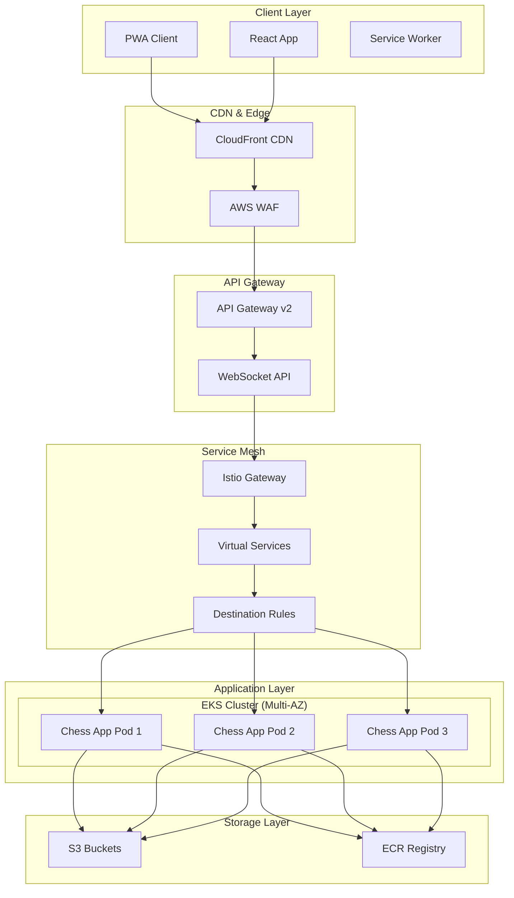
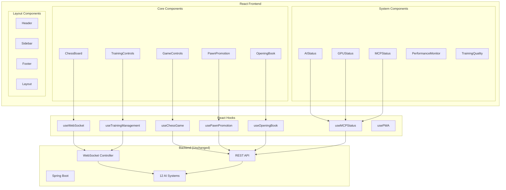

# Chess Application React UI Refactoring - High-Level Design

## Executive Summary

This document outlines the comprehensive high-level design for refactoring the Chess application's frontend from vanilla HTML/CSS/JavaScript to a modern React + TypeScript + ShadCN/UI + PWA architecture. The refactoring maintains 100% feature parity while enhancing user experience, performance, and maintainability.

## 1. Project Overview

### 1.1 Current State
- **Frontend**: Vanilla HTML/CSS/JavaScript with inline styles
- **Backend**: Spring Boot with 12 AI systems (4,360+ lines in ChessGame.java)
- **Real-time**: WebSocket communication via STOMP
- **Infrastructure**: AWS EKS with Istio service mesh for horizontal scaling

### 1.2 Target State
- **Frontend**: React 18 + TypeScript + ShadCN/UI + PWA
- **Backend**: Unchanged Spring Boot (minimal configuration updates)
- **Real-time**: Enhanced WebSocket integration with React hooks
- **Infrastructure**: Cloud-native deployment with horizontal scaling

## 2. Architecture Overview

### 2.1 High-Level Architecture



### 2.2 Component Architecture



## 3. Functional Requirements

### 3.1 Core Game Features
- ✅ **Chess Board**: Interactive 8x8 board with piece movement
- ✅ **Move Validation**: Real-time move validation with 9-step process
- ✅ **Game State Management**: Turn tracking, check/checkmate detection
- ✅ **Undo/Redo**: Complete move history management
- ✅ **Pawn Promotion**: Interactive promotion dialog with piece selection

### 3.2 AI Training Management
- ✅ **Start/Stop Training**: Control all 12 AI systems
- ✅ **Training Progress**: Real-time progress visualization
- ✅ **Training Quality**: Comprehensive quality evaluation reports
- ✅ **AI Status**: Individual AI system status monitoring
- ✅ **Training Data Management**: Delete and reset training data

### 3.3 Advanced Features
- ✅ **Opening Book**: 34 different chess openings with 3-4 moves each
- ✅ **MCP Server**: Model Context Protocol for external AI agents
- ✅ **GPU Acceleration**: OpenCL/CUDA status monitoring
- ✅ **Performance Monitoring**: Memory usage, training speed metrics
- ✅ **Error Handling**: Model corruption detection and recovery

### 3.4 Real-time Features
- ✅ **WebSocket Communication**: STOMP-based real-time updates
- ✅ **Live Training Visualization**: Real-time training board updates
- ✅ **AI Move Highlighting**: Visual feedback for AI moves
- ✅ **Training Progress**: Live progress updates for all AI systems

## 4. Non-Functional Requirements

### 4.1 High Availability & Scalability

#### 4.1.1 Horizontal Scaling (AWS EKS + Istio)
```yaml
# Kubernetes Deployment Configuration
apiVersion: apps/v1
kind: Deployment
metadata:
  name: chess-app
spec:
  replicas: 3  # Multi-AZ deployment
  strategy:
    type: RollingUpdate
    rollingUpdate:
      maxSurge: 1
      maxUnavailable: 0
  selector:
    matchLabels:
      app: chess-app
  template:
    spec:
      containers:
      - name: chess-app
        image: chess-app:latest
        resources:
          requests:
            memory: "2Gi"
            cpu: "1000m"
          limits:
            memory: "4Gi"
            cpu: "2000m"
        livenessProbe:
          httpGet:
            path: /actuator/health
            port: 8081
          initialDelaySeconds: 60
          periodSeconds: 30
        readinessProbe:
          httpGet:
            path: /actuator/health/readiness
            port: 8081
          initialDelaySeconds: 30
          periodSeconds: 10
```

#### 4.1.2 Istio Service Mesh Configuration
```yaml
# Virtual Service for Session Affinity
apiVersion: networking.istio.io/v1beta1
kind: VirtualService
metadata:
  name: chess-app-vs
spec:
  hosts:
  - chess-app
  http:
  - match:
    - headers:
        websocket:
          exact: "true"
    route:
    - destination:
        host: chess-app
      weight: 100
    timeout: 0s  # No timeout for WebSocket connections
  - route:
    - destination:
        host: chess-app
      weight: 100
    timeout: 30s

---
# Destination Rule for Load Balancing
apiVersion: networking.istio.io/v1beta1
kind: DestinationRule
metadata:
  name: chess-app-dr
spec:
  host: chess-app
  trafficPolicy:
    loadBalancer:
      consistentHash:
        httpHeaderName: "x-session-id"  # Session affinity
    connectionPool:
      tcp:
        maxConnections: 100
      http:
        http1MaxPendingRequests: 50
        maxRequestsPerConnection: 10
    circuitBreaker:
      consecutiveErrors: 3
      interval: 30s
      baseEjectionTime: 30s
```

#### 4.1.3 Auto Scaling Configuration
```yaml
# Horizontal Pod Autoscaler
apiVersion: autoscaling/v2
kind: HorizontalPodAutoscaler
metadata:
  name: chess-app-hpa
spec:
  scaleTargetRef:
    apiVersion: apps/v1
    kind: Deployment
    name: chess-app
  minReplicas: 3
  maxReplicas: 10
  metrics:
  - type: Resource
    resource:
      name: cpu
      target:
        type: Utilization
        averageUtilization: 70
  - type: Resource
    resource:
      name: memory
      target:
        type: Utilization
        averageUtilization: 80
  behavior:
    scaleUp:
      stabilizationWindowSeconds: 60
      policies:
      - type: Percent
        value: 100
        periodSeconds: 15
    scaleDown:
      stabilizationWindowSeconds: 300
      policies:
      - type: Percent
        value: 10
        periodSeconds: 60
```

### 4.2 Performance Requirements

#### 4.2.1 Frontend Performance
- **Initial Load Time**: < 3 seconds (with PWA caching)
- **Time to Interactive**: < 5 seconds
- **Bundle Size**: < 2MB (gzipped)
- **Lighthouse Score**: > 90 (Performance, Accessibility, Best Practices, SEO)

#### 4.2.2 Real-time Performance
- **WebSocket Latency**: < 100ms
- **Move Validation**: < 50ms
- **AI Response Time**: < 5 seconds (configurable)
- **Training Progress Updates**: < 1 second

#### 4.2.3 Backend Performance
- **API Response Time**: < 200ms (95th percentile)
- **WebSocket Message Processing**: < 50ms
- **AI Training Throughput**: 20-50 games/second
- **Memory Usage**: < 4GB per pod

### 4.3 Reliability & Fault Tolerance

#### 4.3.1 Circuit Breaker Pattern
```typescript
// React Hook for Circuit Breaker
export const useCircuitBreaker = (url: string, options: RequestInit) => {
  const [state, setState] = useState<'CLOSED' | 'OPEN' | 'HALF_OPEN'>('CLOSED');
  const [failureCount, setFailureCount] = useState(0);
  const [lastFailureTime, setLastFailureTime] = useState<number>(0);
  
  const threshold = 5;
  const timeout = 60000; // 1 minute
  
  const execute = async () => {
    if (state === 'OPEN') {
      if (Date.now() - lastFailureTime > timeout) {
        setState('HALF_OPEN');
      } else {
        throw new Error('Circuit breaker is OPEN');
      }
    }
    
    try {
      const response = await fetch(url, options);
      if (state === 'HALF_OPEN') {
        setState('CLOSED');
        setFailureCount(0);
      }
      return response;
    } catch (error) {
      const newFailureCount = failureCount + 1;
      setFailureCount(newFailureCount);
      setLastFailureTime(Date.now());
      
      if (newFailureCount >= threshold) {
        setState('OPEN');
      }
      throw error;
    }
  };
  
  return { execute, state };
};
```

#### 4.3.2 Retry Logic with Exponential Backoff
```typescript
// WebSocket Connection with Retry Logic
export const useWebSocketWithRetry = (url: string) => {
  const [socket, setSocket] = useState<WebSocket | null>(null);
  const [retryCount, setRetryCount] = useState(0);
  const [isConnected, setIsConnected] = useState(false);
  
  const maxRetries = 5;
  const baseDelay = 1000; // 1 second
  
  const connect = useCallback(() => {
    const ws = new WebSocket(url);
    
    ws.onopen = () => {
      setIsConnected(true);
      setRetryCount(0);
    };
    
    ws.onclose = () => {
      setIsConnected(false);
      if (retryCount < maxRetries) {
        const delay = baseDelay * Math.pow(2, retryCount);
        setTimeout(() => {
          setRetryCount(prev => prev + 1);
          connect();
        }, delay);
      }
    };
    
    ws.onerror = (error) => {
      console.error('WebSocket error:', error);
    };
    
    setSocket(ws);
  }, [url, retryCount]);
  
  useEffect(() => {
    connect();
    return () => socket?.close();
  }, [connect]);
  
  return { socket, isConnected, retryCount };
};
```

### 4.4 Security Requirements

#### 4.4.1 Content Security Policy
```typescript
// Enhanced CSP for React App
const cspConfig = {
  'default-src': ["'self'"],
  'script-src': ["'self'", "'unsafe-inline'", "'unsafe-eval'"], // React needs unsafe-eval
  'style-src': ["'self'", "'unsafe-inline'"], // ShadCN needs unsafe-inline
  'connect-src': ["'self'", "ws://localhost:*", "wss://localhost:*"],
  'font-src': ["'self'", "data:"],
  'img-src': ["'self'", "data:", "blob:"],
  'worker-src': ["'self'", "blob:"], // Service Worker
  'manifest-src': ["'self'"],
  'object-src': ["'none'"],
  'base-uri': ["'self'"],
  'form-action': ["'self'"],
  'frame-ancestors': ["'none'"]
};
```

#### 4.4.2 Rate Limiting
```typescript
// Client-side Rate Limiting
export const useRateLimit = (maxRequests: number, windowMs: number) => {
  const [requests, setRequests] = useState<number[]>([]);
  
  const isAllowed = useCallback(() => {
    const now = Date.now();
    const windowStart = now - windowMs;
    
    // Remove old requests
    const validRequests = requests.filter(time => time > windowStart);
    
    if (validRequests.length >= maxRequests) {
      return false;
    }
    
    setRequests([...validRequests, now]);
    return true;
  }, [requests, maxRequests, windowMs]);
  
  return { isAllowed };
};
```

### 4.5 Monitoring & Observability

#### 4.5.1 Frontend Monitoring
```typescript
// Performance Monitoring Hook
export const usePerformanceMonitoring = () => {
  useEffect(() => {
    // Web Vitals
    const observer = new PerformanceObserver((list) => {
      for (const entry of list.getEntries()) {
        if (entry.entryType === 'measure') {
          console.log(`${entry.name}: ${entry.duration}ms`);
        }
      }
    });
    
    observer.observe({ entryTypes: ['measure'] });
    
    // Core Web Vitals
    getCLS(console.log);
    getFID(console.log);
    getFCP(console.log);
    getLCP(console.log);
    getTTFB(console.log);
    
    return () => observer.disconnect();
  }, []);
};
```

#### 4.5.2 Error Boundary
```typescript
// Global Error Boundary
export class GlobalErrorBoundary extends React.Component<
  { children: React.ReactNode },
  { hasError: boolean; error?: Error }
> {
  constructor(props: { children: React.ReactNode }) {
    super(props);
    this.state = { hasError: false };
  }
  
  static getDerivedStateFromError(error: Error) {
    return { hasError: true, error };
  }
  
  componentDidCatch(error: Error, errorInfo: React.ErrorInfo) {
    console.error('Global Error Boundary caught an error:', error, errorInfo);
    // Send to monitoring service
  }
  
  render() {
    if (this.state.hasError) {
      return (
        <div className="error-boundary">
          <h2>Something went wrong.</h2>
          <button onClick={() => this.setState({ hasError: false })}>
            Try again
          </button>
        </div>
      );
    }
    
    return this.props.children;
  }
}
```

## 5. Technical Implementation

### 5.1 Frontend Technology Stack

#### 5.1.1 Core Technologies
- **React 18**: Latest React with Concurrent Features
- **TypeScript 5**: Type safety and better developer experience
- **Vite**: Fast build tool and dev server
- **ShadCN/UI**: Modern, accessible component library
- **Tailwind CSS**: Utility-first CSS framework

#### 5.1.2 State Management
- **React Context**: Global state management
- **useReducer**: Complex state logic
- **React Query**: Server state management and caching
- **Zustand**: Lightweight state management for complex scenarios

#### 5.1.3 Real-time Communication
- **@stomp/stompjs**: STOMP WebSocket client
- **React Hooks**: Custom hooks for WebSocket management
- **Reconnection Logic**: Automatic reconnection with exponential backoff

### 5.2 PWA Implementation

#### 5.2.1 Service Worker
```typescript
// service-worker.ts
const CACHE_NAME = 'chess-app-v1';
const urlsToCache = [
  '/',
  '/static/js/bundle.js',
  '/static/css/main.css',
  '/manifest.json'
];

self.addEventListener('install', (event) => {
  event.waitUntil(
    caches.open(CACHE_NAME)
      .then((cache) => cache.addAll(urlsToCache))
  );
});

self.addEventListener('fetch', (event) => {
  event.respondWith(
    caches.match(event.request)
      .then((response) => {
        if (response) {
          return response;
        }
        return fetch(event.request);
      })
  );
});
```

#### 5.2.2 Web App Manifest
```json
{
  "name": "Chess AI Game",
  "short_name": "Chess AI",
  "description": "Advanced Chess Game with 12 AI Systems",
  "start_url": "/",
  "display": "standalone",
  "background_color": "#ffffff",
  "theme_color": "#000000",
  "icons": [
    {
      "src": "/icons/icon-192x192.png",
      "sizes": "192x192",
      "type": "image/png"
    },
    {
      "src": "/icons/icon-512x512.png",
      "sizes": "512x512",
      "type": "image/png"
    }
  ]
}
```

### 5.3 Backend Integration

#### 5.3.1 Required Backend Changes
```java
// WebConfig.java - Static Resource Configuration
@Configuration
public class WebConfig implements WebMvcConfigurer {
    
    @Override
    public void addResourceHandlers(ResourceHandlerRegistry registry) {
        // Serve React build files
        registry.addResourceHandler("/static/**")
                .addResourceLocations("classpath:/static/");
        
        // SPA routing - serve index.html for all non-API routes
        registry.addResourceHandler("/**")
                .addResourceLocations("classpath:/static/")
                .resourceChain(true)
                .addResolver(new PathResourceResolver() {
                    @Override
                    protected Resource getResource(String resourcePath, Resource location) {
                        Resource requestedResource = location.createRelative(resourcePath);
                        return requestedResource.exists() && requestedResource.isReadable() 
                            ? requestedResource 
                            : new ClassPathResource("/static/index.html");
                    }
                });
    }
}

// CorsConfig.java - CORS Configuration
@Configuration
public class CorsConfig {
    
    @Bean
    public CorsConfigurationSource corsConfigurationSource() {
        CorsConfiguration configuration = new CorsConfiguration();
        configuration.setAllowedOriginPatterns(Arrays.asList(
            "http://localhost:*", 
            "https://localhost:*",
            "https://*.amazonaws.com",
            "https://*.cloudfront.net"
        ));
        configuration.setAllowedMethods(Arrays.asList("GET", "POST", "PUT", "DELETE", "OPTIONS"));
        configuration.setAllowedHeaders(Arrays.asList("*"));
        configuration.setAllowCredentials(true);
        
        UrlBasedCorsConfigurationSource source = new UrlBasedCorsConfigurationSource();
        source.registerCorsConfiguration("/**", configuration);
        return source;
    }
}
```

## 6. Deployment Strategy

### 6.1 CI/CD Pipeline

#### 6.1.1 GitHub Actions Workflow
```yaml
# .github/workflows/deploy.yml
name: Deploy Chess App

on:
  push:
    branches: [main]
  pull_request:
    branches: [main]

jobs:
  build-frontend:
    runs-on: ubuntu-latest
    steps:
    - uses: actions/checkout@v3
    - name: Setup Node.js
      uses: actions/setup-node@v3
      with:
        node-version: '18'
        cache: 'npm'
        cache-dependency-path: frontend/package-lock.json
    
    - name: Install dependencies
      run: |
        cd frontend
        npm ci
    
    - name: Build React app
      run: |
        cd frontend
        npm run build
    
    - name: Copy build to backend
      run: |
        cp -r frontend/dist/* src/main/resources/static/
    
    - name: Build Docker image
      run: |
        docker build -t chess-app:${{ github.sha }} .
    
    - name: Push to ECR
      run: |
        aws ecr get-login-password --region us-west-2 | docker login --username AWS --password-stdin $ECR_REGISTRY
        docker tag chess-app:${{ github.sha }} $ECR_REGISTRY/chess-app:${{ github.sha }}
        docker push $ECR_REGISTRY/chess-app:${{ github.sha }}

  deploy:
    needs: build-frontend
    runs-on: ubuntu-latest
    steps:
    - name: Deploy to EKS
      run: |
        aws eks update-kubeconfig --region us-west-2 --name chess-cluster
        kubectl set image deployment/chess-app chess-app=$ECR_REGISTRY/chess-app:${{ github.sha }}
        kubectl rollout status deployment/chess-app
```

### 6.2 Infrastructure as Code

#### 6.2.1 Terraform Configuration
```hcl
# terraform/modules/helm-chess-app/main.tf
resource "helm_release" "chess_app" {
  name       = "chess-app"
  repository = "https://charts.bitnami.com/bitnami"
  chart      = "nginx"
  
  values = [
    yamlencode({
      replicaCount = 3
      
      image = {
        repository = var.ecr_repository
        tag        = var.image_tag
        pullPolicy = "Always"
      }
      
      service = {
        type = "ClusterIP"
        port = 8081
      }
      
      ingress = {
        enabled = true
        annotations = {
          "kubernetes.io/ingress.class" = "istio"
          "nginx.ingress.kubernetes.io/ssl-redirect" = "true"
        }
        hosts = [
          {
            host = var.domain_name
            paths = [
              {
                path = "/"
                pathType = "Prefix"
              }
            ]
          }
        ]
        tls = [
          {
            secretName = "chess-app-tls"
            hosts = [var.domain_name]
          }
        ]
      }
      
      resources = {
        requests = {
          memory = "2Gi"
          cpu    = "1000m"
        }
        limits = {
          memory = "4Gi"
          cpu    = "2000m"
        }
      }
      
      autoscaling = {
        enabled = true
        minReplicas = 3
        maxReplicas = 10
        targetCPUUtilizationPercentage = 70
        targetMemoryUtilizationPercentage = 80
      }
    })
  ]
}
```

## 7. Testing Strategy

### 7.1 Frontend Testing

#### 7.1.1 Unit Testing
```typescript
// __tests__/components/ChessBoard.test.tsx
import { render, screen, fireEvent } from '@testing-library/react';
import { ChessBoard } from '../components/ChessBoard';

describe('ChessBoard', () => {
  it('renders chess board with 64 squares', () => {
    render(<ChessBoard />);
    const squares = screen.getAllByRole('button');
    expect(squares).toHaveLength(64);
  });
  
  it('handles piece selection', () => {
    render(<ChessBoard />);
    const square = screen.getByTestId('square-0-0');
    fireEvent.click(square);
    expect(square).toHaveClass('selected');
  });
});
```

#### 7.1.2 Integration Testing
```typescript
// __tests__/integration/GameFlow.test.tsx
import { render, screen, waitFor } from '@testing-library/react';
import { GameProvider } from '../contexts/GameContext';
import { App } from '../App';

describe('Game Flow Integration', () => {
  it('completes a full game move', async () => {
    render(
      <GameProvider>
        <App />
      </GameProvider>
    );
    
    // Select piece
    const fromSquare = screen.getByTestId('square-6-4'); // e2
    fireEvent.click(fromSquare);
    
    // Move piece
    const toSquare = screen.getByTestId('square-4-4'); // e4
    fireEvent.click(toSquare);
    
    // Wait for AI response
    await waitFor(() => {
      expect(screen.getByText('Computer thinking...')).toBeInTheDocument();
    });
  });
});
```

#### 7.1.3 E2E Testing
```typescript
// e2e/game.spec.ts
import { test, expect } from '@playwright/test';

test('complete chess game', async ({ page }) => {
  await page.goto('/');
  
  // Start new game
  await page.click('button:has-text("New Game")');
  
  // Make a move
  await page.click('[data-testid="square-6-4"]'); // e2
  await page.click('[data-testid="square-4-4"]'); // e4
  
  // Wait for AI response
  await page.waitForSelector('text=Your turn (White)');
  
  // Verify board state
  const board = await page.locator('.chess-board');
  await expect(board).toBeVisible();
});
```

### 7.2 Performance Testing

#### 7.2.1 Load Testing
```typescript
// performance/load-test.ts
import { check, sleep } from 'k6';
import { WebSocket } from 'k6/experimental/websockets';

export default function() {
  const ws = new WebSocket('ws://localhost:8081/ws');
  
  ws.onopen = () => {
    console.log('WebSocket connected');
    
    // Send move
    ws.send(JSON.stringify({
      fromRow: 6,
      fromCol: 4,
      toRow: 4,
      toCol: 4
    }));
  };
  
  ws.onmessage = (message) => {
    const data = JSON.parse(message.data);
    check(data, {
      'received game state': (data) => data.board !== undefined,
      'valid board size': (data) => data.board.length === 8
    });
  };
  
  sleep(1);
  ws.close();
}
```

## 8. Migration Plan

### 8.1 Phase 1: Foundation (Week 1-2)
- [ ] Set up React + TypeScript + Vite project
- [ ] Install and configure ShadCN/UI
- [ ] Create basic component structure
- [ ] Set up PWA infrastructure

### 8.2 Phase 2: Core Components (Week 3-4)
- [ ] Implement ChessBoard component
- [ ] Create GameControls component
- [ ] Build WebSocket integration hooks
- [ ] Implement basic game state management

### 8.3 Phase 3: Advanced Features (Week 5-6)
- [ ] Add training management components
- [ ] Implement pawn promotion dialog
- [ ] Create AI status panels
- [ ] Add opening book display

### 8.4 Phase 4: Integration & Testing (Week 7-8)
- [ ] Backend configuration updates
- [ ] End-to-end testing
- [ ] Performance optimization
- [ ] PWA testing and validation

### 8.5 Phase 5: Deployment (Week 9-10)
- [ ] CI/CD pipeline setup
- [ ] Infrastructure deployment
- [ ] Production testing
- [ ] Go-live and monitoring

## 9. Risk Assessment & Mitigation

### 9.1 Technical Risks

#### 9.1.1 WebSocket Connection Stability
- **Risk**: WebSocket connections may be unstable in production
- **Mitigation**: Implement robust reconnection logic with exponential backoff
- **Monitoring**: Track connection success rate and reconnection frequency

#### 9.1.2 Performance Degradation
- **Risk**: React app may be slower than vanilla JS
- **Mitigation**: Implement code splitting, lazy loading, and performance monitoring
- **Monitoring**: Track Core Web Vitals and bundle size

#### 9.1.3 State Management Complexity
- **Risk**: Complex state management may lead to bugs
- **Mitigation**: Use TypeScript for type safety and comprehensive testing
- **Monitoring**: Track state-related errors and user interactions

### 9.2 Business Risks

#### 9.2.1 Feature Parity
- **Risk**: Some features may be lost during migration
- **Mitigation**: Comprehensive feature testing and user acceptance testing
- **Monitoring**: Track feature usage and user feedback

#### 9.2.2 User Experience
- **Risk**: Users may prefer the old interface
- **Mitigation**: Gradual rollout with A/B testing and user feedback collection
- **Monitoring**: Track user engagement and satisfaction metrics

## 10. Success Metrics

### 10.1 Performance Metrics
- **Page Load Time**: < 3 seconds
- **Time to Interactive**: < 5 seconds
- **WebSocket Latency**: < 100ms
- **Bundle Size**: < 2MB (gzipped)

### 10.2 User Experience Metrics
- **Lighthouse Score**: > 90
- **User Satisfaction**: > 4.5/5
- **Feature Adoption**: > 80% of users use new features
- **Error Rate**: < 0.1%

### 10.3 Technical Metrics
- **Test Coverage**: > 80%
- **Build Time**: < 5 minutes
- **Deployment Time**: < 10 minutes
- **Uptime**: > 99.9%

## 11. Conclusion

This comprehensive high-level design provides a roadmap for successfully refactoring the Chess application's frontend to a modern React + TypeScript + ShadCN/UI + PWA architecture. The design maintains 100% feature parity while enhancing performance, scalability, and user experience.

The implementation leverages the existing AWS EKS + Istio infrastructure for horizontal scaling and high availability, ensuring the application can handle increased load and provide a reliable user experience.

Key success factors:
- **Comprehensive feature coverage** including all 12 AI systems and advanced features
- **Modern technology stack** with React 18, TypeScript, and ShadCN/UI
- **PWA capabilities** for offline gameplay and native app experience
- **Horizontal scaling** with AWS EKS and Istio service mesh
- **Robust testing strategy** with unit, integration, and E2E tests
- **Phased migration approach** to minimize risk and ensure quality

The refactoring will result in a modern, maintainable, and scalable chess application that provides an excellent user experience while maintaining all existing functionality.
