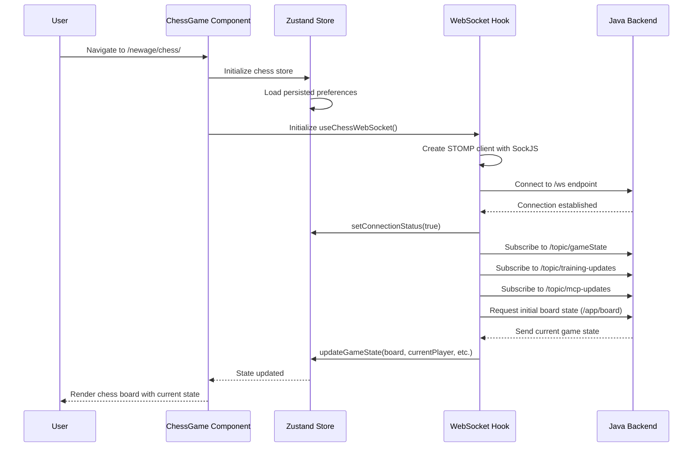
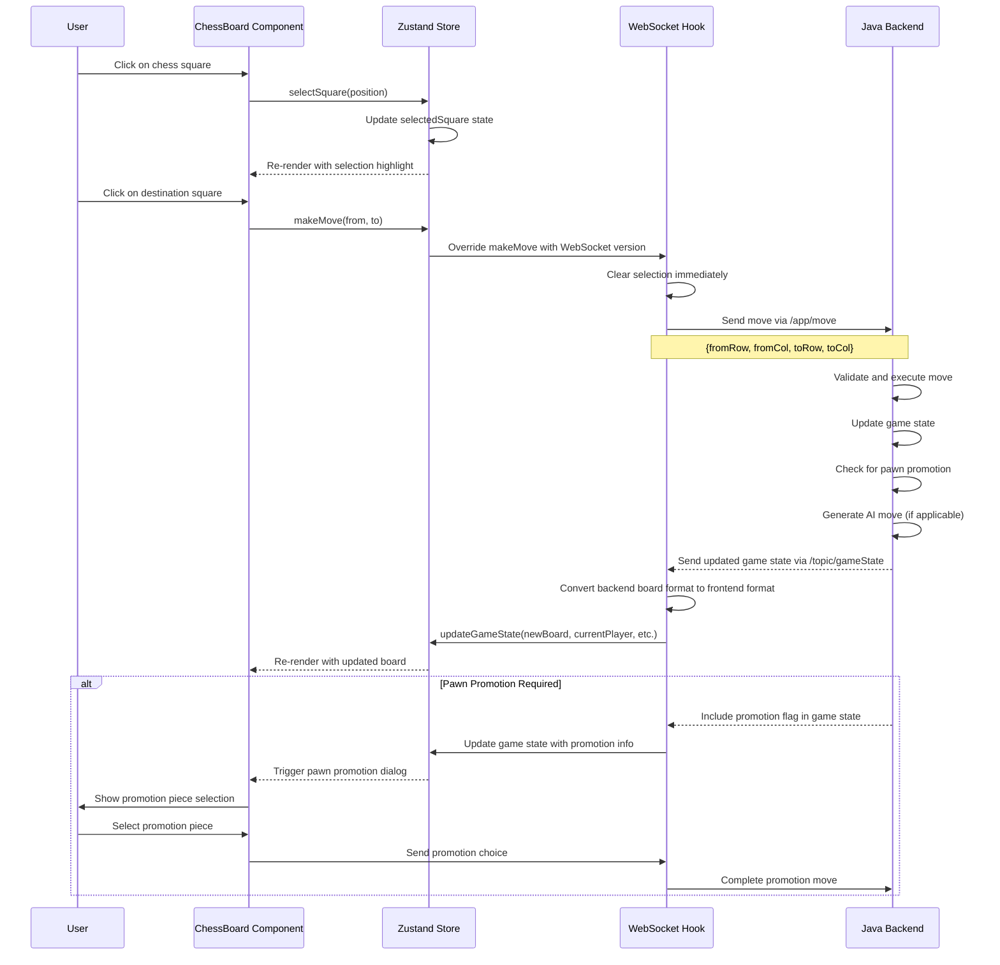
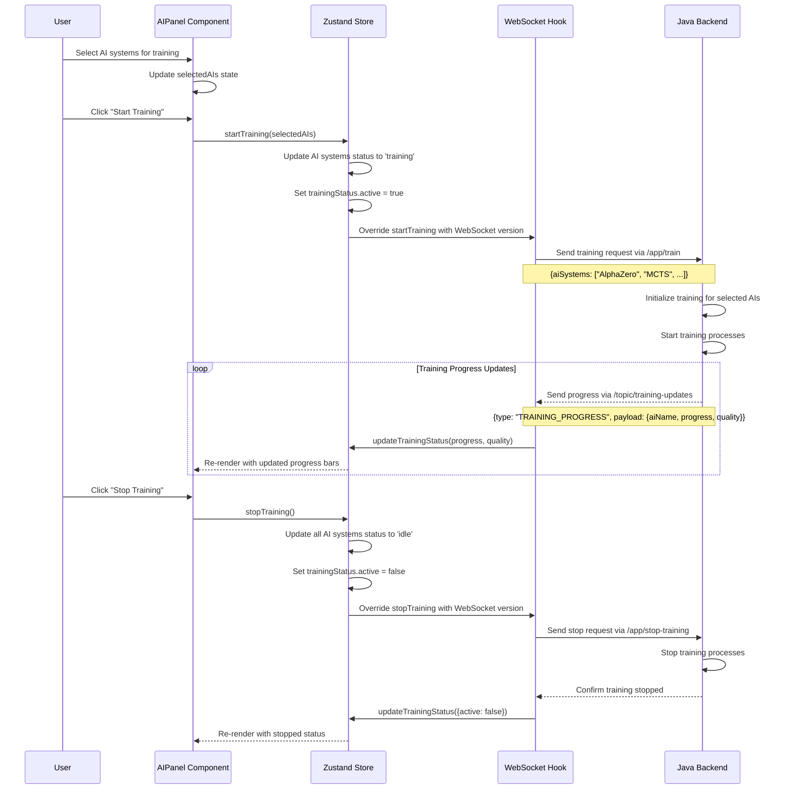
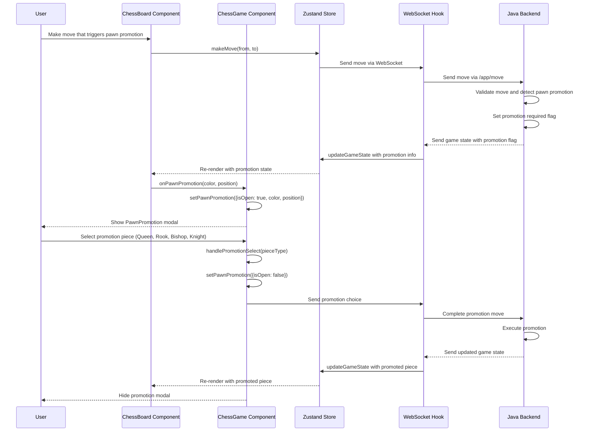
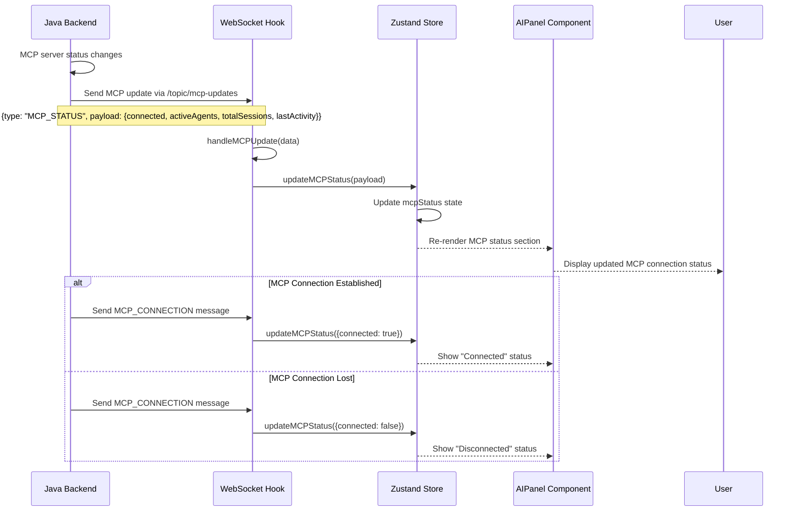
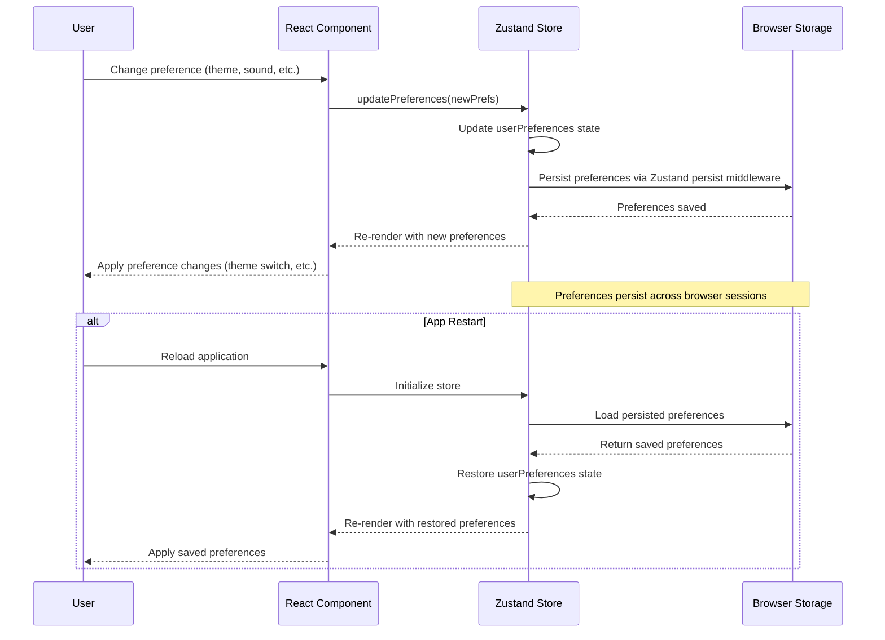
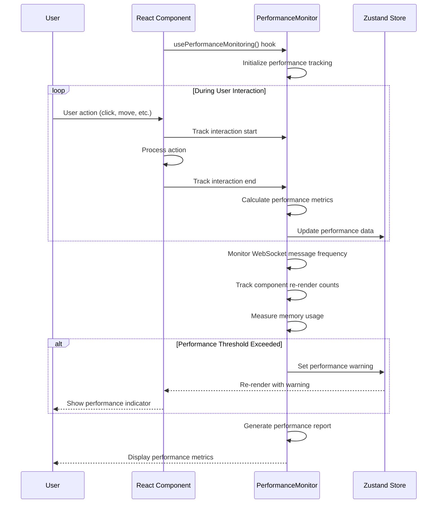

# Chess Application React UI - Sequence Diagrams

## Overview

This document contains sequence diagrams for all major interactions and flows implemented in the new React UI for the Chess Application. The diagrams illustrate the communication patterns between components, state management, WebSocket connections, and user interactions.

---

## 1. Application Initialization Flow



---

## 2. Chess Move Flow



---

## 3. AI Training Management Flow



---

## 4. WebSocket Connection Management Flow

```mermaid
sequenceDiagram
    participant WS as WebSocket Hook
    participant Store as Zustand Store
    participant Backend as Java Backend
    participant User

    WS->>WS: Initialize STOMP client
    WS->>Backend: Attempt connection via SockJS
    Backend-->>WS: Connection successful
    WS->>Store: setConnectionStatus(true)
    WS->>Backend: Subscribe to /topic/gameState
    WS->>Backend: Subscribe to /topic/training-updates
    WS->>Backend: Subscribe to /topic/mcp-updates
    
    Note over WS,Backend: Connection established and stable
    
    alt Connection Lost
        Backend-->>WS: Connection closed
        WS->>Store: setConnectionStatus(false, "Connection closed")
        WS->>WS: Start reconnection timer
        loop Reconnection Attempts (max 5)
            WS->>Backend: Attempt reconnection
            alt Reconnection Successful
                Backend-->>WS: Connection restored
                WS->>Store: setConnectionStatus(true)
                WS->>Backend: Re-subscribe to all topics
                break
            else Reconnection Failed
                WS->>WS: Wait with exponential backoff
                WS->>Store: setConnectionStatus(false, "Reconnecting...")
            end
        end
        
        alt Max Attempts Reached
            WS->>Store: setConnectionStatus(false, "Max reconnection attempts reached")
            WS-->>User: Show connection error
        end
    end
```

---

## 5. Game State Synchronization Flow

```mermaid
sequenceDiagram
    participant Backend as Java Backend
    participant WS as WebSocket Hook
    participant Store as Zustand Store
    participant Board as ChessBoard Component
    participant AIPanel as AIPanel Component

    Backend->>Backend: Game state changes (move, AI response, etc.)
    Backend->>WS: Send game state via /topic/gameState
    Note over Backend,WS: {board: [][], whiteTurn: boolean, gameOver: boolean, aiLastMove: [], kingInCheck: []}
    
    WS->>WS: Convert backend board format to frontend format
    Note over WS: Convert Unicode pieces to Piece objects
    
    WS->>Store: updateGameState({
        board: convertedBoard,
        currentPlayer: gameState.whiteTurn ? 'white' : 'black',
        gameStatus: gameState.gameOver ? 'checkmate' : 'active',
        aiMove: gameState.aiLastMove ? {from, to, aiName} : undefined,
        checkSquares: gameState.kingInCheck ? [position] : []
    })
    
    Store-->>Board: Re-render with new board state
    Store-->>AIPanel: Update AI move indicators
    
    alt AI Move Made
        Backend->>WS: Include aiLastMove in game state
        WS->>Store: Set aiMove with move details
        Store-->>Board: Highlight AI move on board
    end
    
    alt King in Check
        Backend->>WS: Include kingInCheck position
        WS->>Store: Set checkSquares array
        Store-->>Board: Highlight check squares
    end
```

---

## 6. Pawn Promotion Flow



---

## 7. MCP (Model Context Protocol) Status Flow



---

## 8. Error Handling and Recovery Flow

```mermaid
sequenceDiagram
    participant User
    participant Component as React Component
    participant Store as Zustand Store
    participant WS as WebSocket Hook
    participant Backend as Java Backend

    alt WebSocket Connection Error
        WS->>WS: Connection fails
        WS->>Store: setConnectionStatus(false, errorMessage)
        Store-->>Component: Re-render with error state
        Component-->>User: Show connection error message
        
        WS->>WS: Start reconnection attempts
        loop Reconnection Loop
            WS->>Backend: Attempt reconnection
            alt Success
                Backend-->>WS: Connection restored
                WS->>Store: setConnectionStatus(true)
                Store-->>Component: Re-render with connected state
                Component-->>User: Hide error message
                break
            else Failure
                WS->>Store: setConnectionStatus(false, "Reconnecting...")
                Store-->>Component: Show reconnecting message
            end
        end
    end
    
    alt Invalid Game State
        Backend-->>WS: Send malformed game state
        WS->>WS: JSON parsing fails
        WS->>WS: Log error and continue
        WS->>Store: Keep previous valid state
        Store-->>Component: No state change
    end
    
    alt Component Error
        Component->>Component: Runtime error occurs
        Component->>Component: Error boundary catches error
        Component-->>User: Show error fallback UI
        Component->>Component: Log error for debugging
    end
```

---

## 9. User Preferences Management Flow



---

## 10. Performance Monitoring Flow



---

## Technical Implementation Notes

### WebSocket Communication
- Uses **STOMP over SockJS** for reliable WebSocket communication
- Automatic reconnection with exponential backoff (max 5 attempts)
- Heartbeat mechanism (4-second intervals) for connection health
- Message queuing during disconnection periods

### State Management
- **Zustand** for lightweight, performant state management
- **Persistent storage** for user preferences only
- **Immutable updates** to prevent unnecessary re-renders
- **Action overrides** for WebSocket integration

### Component Architecture
- **Functional components** with React hooks
- **Custom hooks** for WebSocket and performance monitoring
- **Error boundaries** for graceful error handling
- **Responsive design** with Tailwind CSS

### Data Flow
- **Unidirectional data flow** from store to components
- **WebSocket updates** trigger store updates
- **Component re-renders** based on state changes
- **Optimistic updates** for immediate user feedback

---

## Conclusion

These sequence diagrams illustrate the comprehensive implementation of the React UI for the Chess Application. The architecture ensures:

1. **Real-time communication** via WebSocket
2. **Robust error handling** and recovery
3. **Efficient state management** with Zustand
4. **Responsive user interface** with modern React patterns
5. **Performance monitoring** and optimization
6. **Persistent user preferences** across sessions

The implementation provides a solid foundation for the dual UI approach, allowing both the existing Java-based UI and the new React UI to coexist seamlessly.
