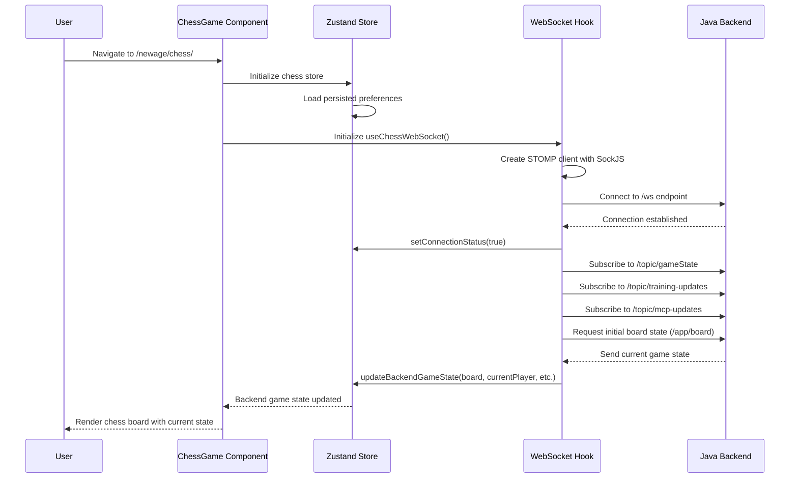
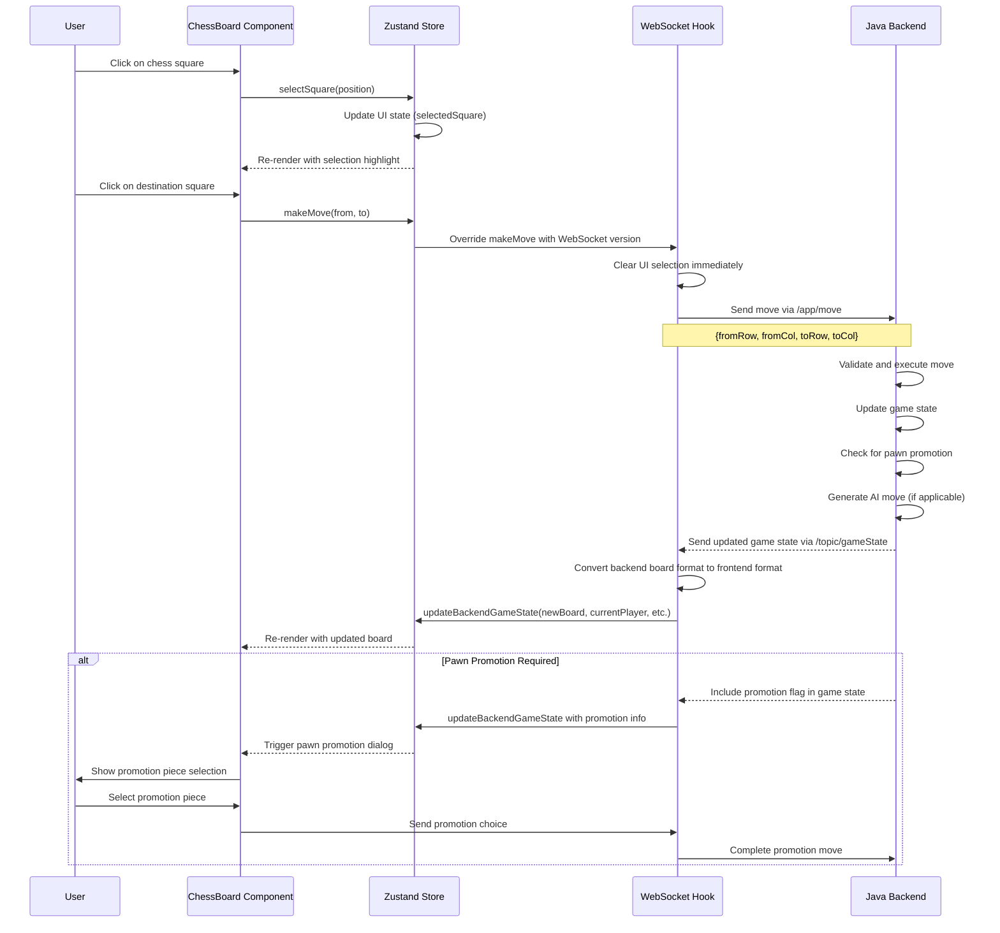
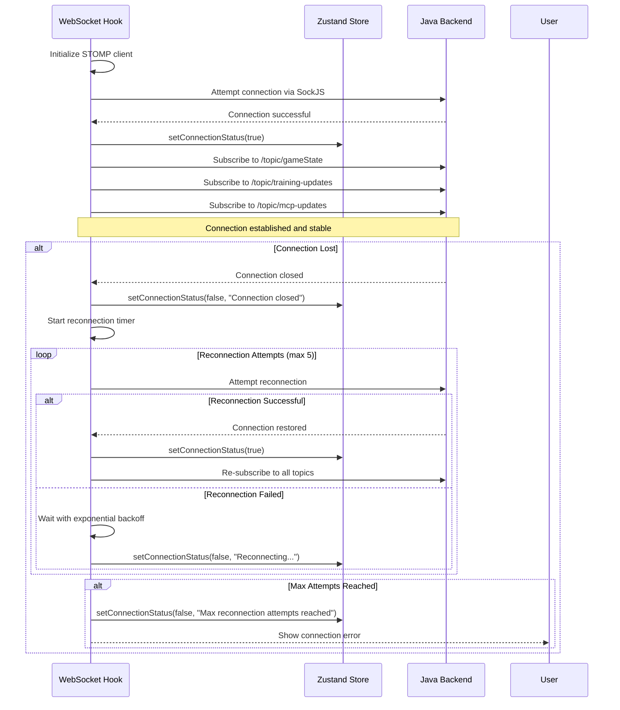
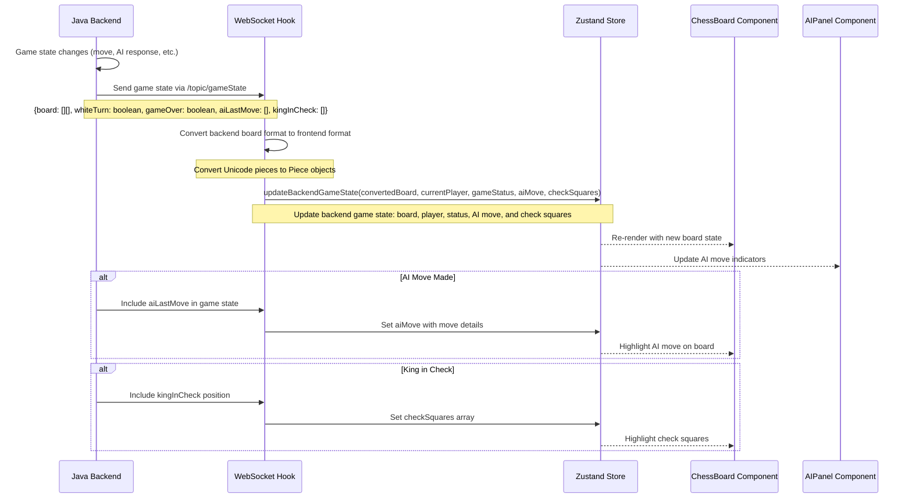
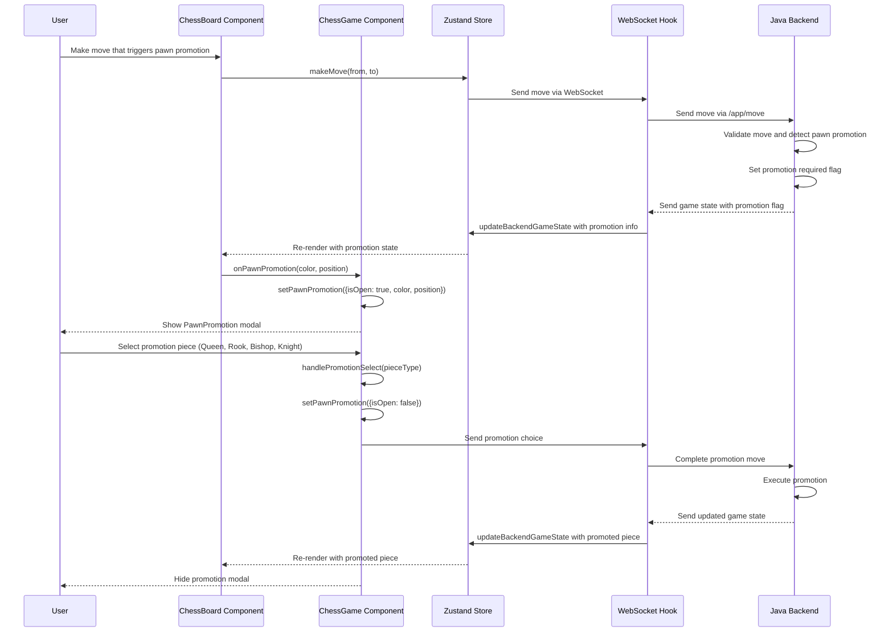
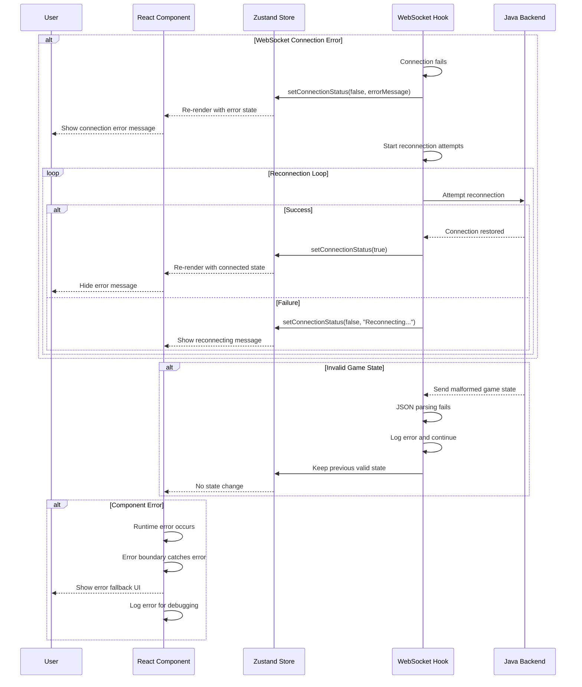
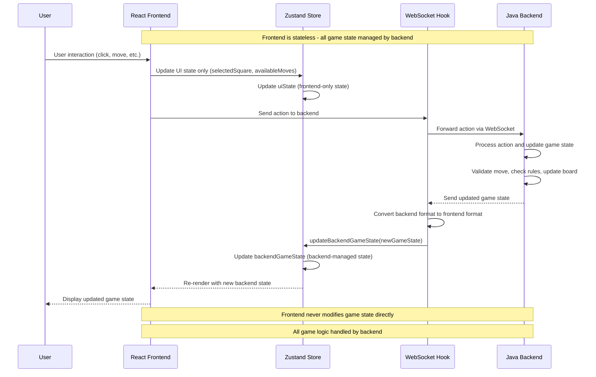
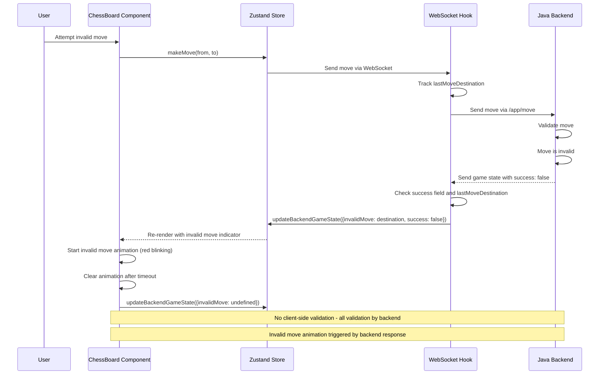
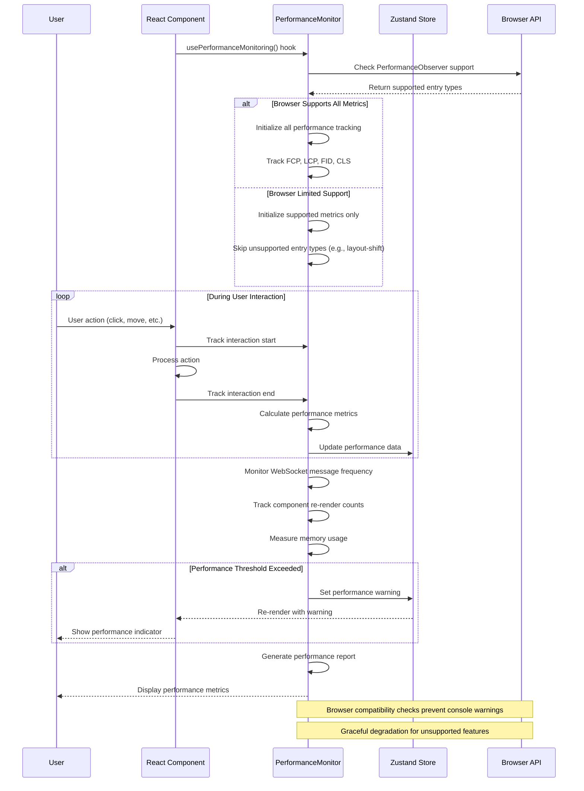

# Chess Application React UI - Sequence Diagrams

## Overview

This document contains sequence diagrams for all major interactions and flows implemented in the new React UI for the Chess Application. The diagrams illustrate the communication patterns between components, state management, WebSocket connections, and user interactions.

## Architecture Changes (Latest Updates)

### Stateless Frontend Architecture
- **Backend as Single Source of Truth**: All game state is managed by the Java backend
- **Frontend as Presentation Layer**: React UI only handles presentation and user interactions
- **State Separation**: 
  - `BackendGameState`: Game data received from backend (board, current player, game status, etc.)
  - `UIState`: Frontend-only state (selected square, available moves, etc.)

### Console Logging Removal
- **Production Ready**: All `console.log` statements removed from frontend code
- **Error Handling Preserved**: `console.error` and `console.warn` statements kept for debugging
- **Clean Production Build**: No debug output in production environment

### Performance Monitoring Enhancements
- **Browser Compatibility**: Added checks for `layout-shift` entry type support
- **Graceful Degradation**: Performance monitoring works across different browsers
- **Error Prevention**: Prevents browser compatibility warnings

---

## 1. Application Initialization Flow

---

## 2. Chess Move Flow

---

## 3. AI Training Management Flow

---

## 4. WebSocket Connection Management Flow

---

## 5. Game State Synchronization Flow

---

## 6. Pawn Promotion Flow

---

## 7. MCP (Model Context Protocol) Status Flow

---

## 8. Error Handling and Recovery Flow

---

## 9. User Preferences Management Flow

---

## 10. Stateless Frontend Architecture Flow

---

## 11. Invalid Move Handling Flow

---

## 12. Performance Monitoring Flow

---

## Technical Implementation Notes

### WebSocket Communication
- Uses **STOMP over SockJS** for reliable WebSocket communication
- Automatic reconnection with exponential backoff (max 5 attempts)
- Heartbeat mechanism (4-second intervals) for connection health
- Message queuing during disconnection periods

### State Management
- **Zustand** for lightweight, performant state management
- **Stateless Frontend**: All game state managed by backend
- **State Separation**: 
  - `BackendGameState`: Game data from backend (board, player, status, etc.)
  - `UIState`: Frontend-only state (selected square, available moves)
- **Persistent storage** for user preferences only
- **Immutable updates** to prevent unnecessary re-renders
- **Action overrides** for WebSocket integration

### Component Architecture
- **Functional components** with React hooks
- **Custom hooks** for WebSocket and performance monitoring
- **Error boundaries** for graceful error handling
- **Responsive design** with Tailwind CSS

### Data Flow
- **Unidirectional data flow** from backend to frontend
- **Backend as single source of truth** for all game state
- **WebSocket updates** trigger store updates
- **Component re-renders** based on state changes
- **No client-side game logic** - all validation by backend
- **Invalid move handling** via backend response

---

## Conclusion

These sequence diagrams illustrate the comprehensive implementation of the React UI for the Chess Application. The architecture ensures:

1. **Real-time communication** via WebSocket
2. **Stateless frontend architecture** with backend as single source of truth
3. **Robust error handling** and recovery
4. **Efficient state management** with Zustand
5. **Responsive user interface** with modern React patterns
6. **Performance monitoring** with browser compatibility
7. **Production-ready code** with console logging removed
8. **Persistent user preferences** across sessions

### Key Architectural Improvements

- **Backend-Driven State**: All game logic and state management handled by Java backend
- **Frontend as Presentation Layer**: React UI focuses solely on user interaction and display
- **No Client-Side Validation**: All move validation performed by backend
- **Clean Production Build**: No debug console output in production
- **Browser Compatibility**: Performance monitoring works across all browsers

The implementation provides a solid foundation for the dual UI approach, allowing both the existing Java-based UI and the new React UI to coexist seamlessly while maintaining a clean separation of concerns.
