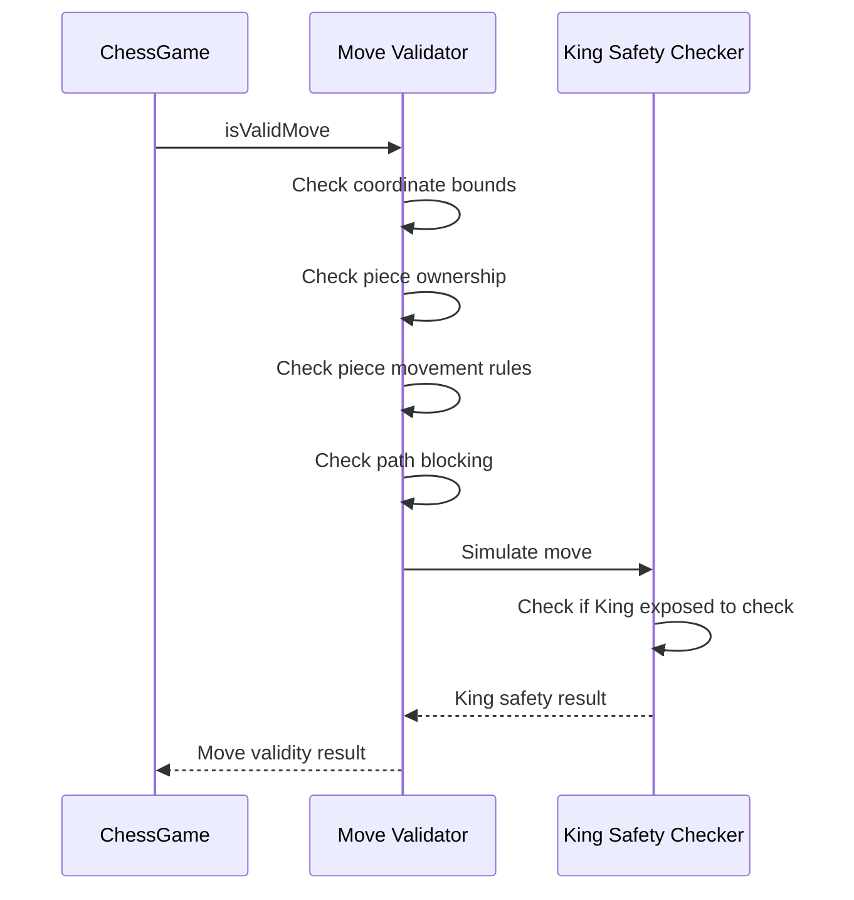
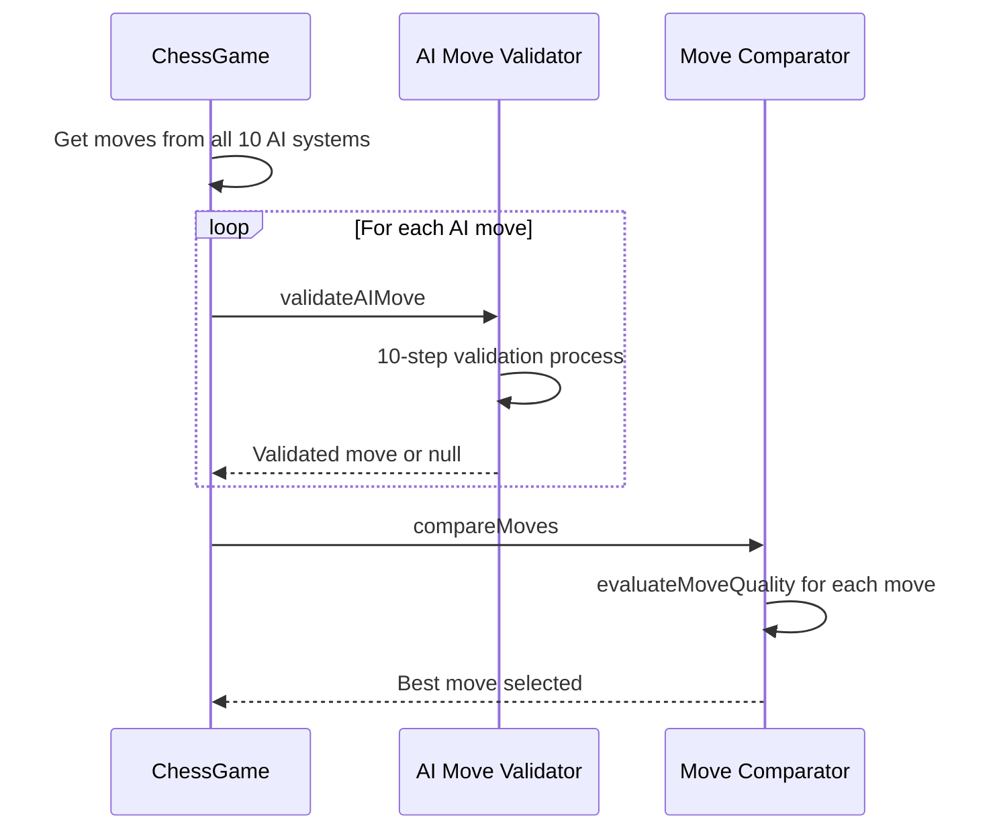
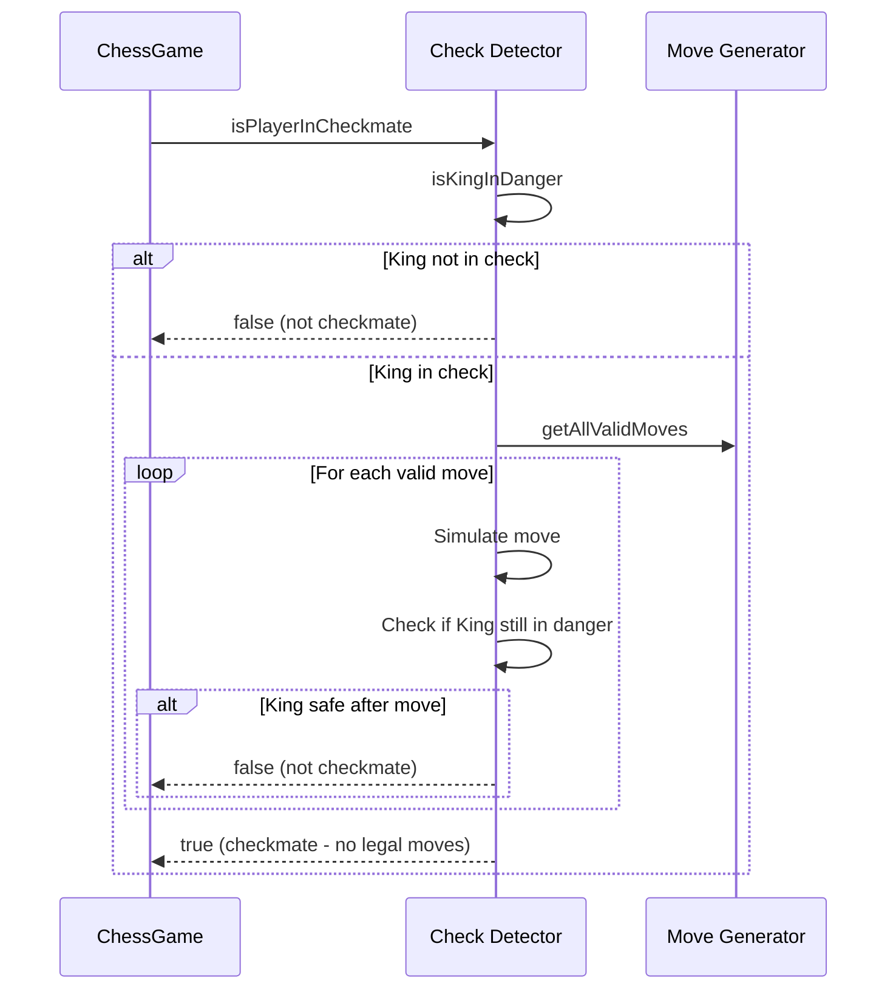

# ChessGame.java Sequence Diagram

## Overview
This sequence diagram illustrates the main interactions and flow within the ChessGame.java class, showing how user moves, AI moves, and game state management work together.

## Main Game Flow Sequence

```mermaid
sequenceDiagram
    participant User
    participant ChessController
    participant ChessGame
    participant AISystem as AI_Systems
    participant OpeningBook as Leela_Opening_Book
    participant WebSocket
    participant GameState as Game_State_Manager

    Note over ChessGame: Game Initialization
    ChessGame->>ChessGame: initializeAfterInjection
    ChessGame->>ChessGame: detectAndConfigureOpenCL
    ChessGame->>OpeningBook: new LeelaChessZeroOpeningBook
    ChessGame->>ChessGame: initializeAISystems
    loop For each enabled AI
        ChessGame->>AISystem: initialize AI system
    end
    ChessGame->>ChessGame: aiSystemsReady = true

    Note over User,GameState: User Move Flow
    User->>ChessController: makeMove
    ChessController->>ChessGame: makeMove
    ChessGame->>ChessGame: isValidMove 9-step validation
    alt Move is valid
        ChessGame->>GameState: saveGameState()
        ChessGame->>ChessGame: execute move on board
        ChessGame->>ChessGame: updateCastlingRights()
        ChessGame->>OpeningBook: addMoveToHistory()
        ChessGame->>ChessGame: whiteTurn = false
        ChessGame->>ChessGame: start makeComputerMove thread
        ChessGame->>WebSocket: broadcastGameState()
    else Move is invalid
        ChessGame-->>ChessController: return false
    end

    Note over ChessGame,AISystem: AI Move Flow
    ChessGame->>ChessGame: makeComputerMove()
    ChessGame->>ChessGame: findBestMove()
    
    alt Opening phase moves 1-10
        ChessGame->>OpeningBook: getOpeningMove()
        OpeningBook-->>ChessGame: return opening move
    else Mid/End game
        ChessGame->>ChessGame: Check for critical threats
        alt King in check
            ChessGame->>ChessGame: findLegalCheckResponse()
            ChessGame->>ChessGame: getAllValidMoves(false)
            loop Test each move
                ChessGame->>ChessGame: actuallyResolvesCheck()
            end
        else Queen under attack
            ChessGame->>ChessGame: findProtectionMove()
            ChessGame->>ChessGame: findAttackersOfSquare()
        else Strategic move selection
            Note over ChessGame,AISystem: Parallel AI Execution
            par Q-Learning AI
                ChessGame->>AISystem: qLearningAI selectMove
            and Deep Learning AI
                ChessGame->>AISystem: deepLearningAI selectMove
            and CNN Deep Learning AI
                ChessGame->>AISystem: deepLearningCNNAI selectMove
            and Deep Q-Network AI
                ChessGame->>AISystem: dqnAI selectMove
            and Monte Carlo Tree Search AI
                ChessGame->>AISystem: mctsAI selectMove
            and AlphaZero AI
                ChessGame->>AISystem: alphaZeroAI selectMove
            and Negamax AI
                ChessGame->>AISystem: negamaxAI selectMove
            and OpenAI Chess AI
                ChessGame->>AISystem: openAiAI selectMove
            and Leela Chess Zero AI
                ChessGame->>AISystem: leelaZeroAI selectMove
            and Genetic Algorithm AI
                ChessGame->>AISystem: geneticAI selectMove
            end
            
            loop For each AI move
                ChessGame->>ChessGame: validateAIMove 10-step validation
            end
            ChessGame->>ChessGame: compareMoves select best move
        end
    end

    ChessGame->>ChessGame: executeBestMove()
    ChessGame->>ChessGame: isValidMove final validation
    ChessGame->>ChessGame: execute AI move on board
    ChessGame->>ChessGame: handlePawnPromotion()
    ChessGame->>GameState: update move history
    ChessGame->>OpeningBook: addMoveToHistory()
    ChessGame->>ChessGame: whiteTurn = true
    ChessGame->>WebSocket: broadcastGameState()

    Note over ChessGame,AISystem: Training Flow
    User->>ChessController: startTraining(games)
    ChessController->>ChessGame: trainAI(games)
    
    par Q-Learning Training
        ChessGame->>AISystem: qLearningAI trainAgainstSelfWithProgress
    and Deep Learning Training
        ChessGame->>AISystem: deepLearningAI startTraining
    and CNN Training
        ChessGame->>AISystem: deepLearningCNNAI startTraining
    and DQN Training
        ChessGame->>AISystem: dqnAI startTraining
    and AlphaZero Training
        ChessGame->>AISystem: alphaZeroAI startSelfPlayTraining
    and LeelaZero Training
        ChessGame->>AISystem: leelaZeroAI startSelfPlayTraining
    and Genetic Training
        ChessGame->>AISystem: geneticAI startTraining
    end

    Note over ChessGame,GameState: Game State Management
    User->>ChessController: undoMove()
    ChessController->>ChessGame: undoMove()
    ChessGame->>GameState: restore previous state
    ChessGame->>WebSocket: broadcastGameState()

    User->>ChessController: resetGame()
    ChessController->>ChessGame: resetGame()
    loop For each AI system
        ChessGame->>AISystem: addHumanGameData()
        ChessGame->>AISystem: saveState()
    end
    ChessGame->>ChessGame: initializeBoard()
    ChessGame->>OpeningBook: resetOpeningLine()
    ChessGame->>WebSocket: broadcastGameState()
```



## Key Method Interactions

### Move Validation Flow


### AI Move Selection Flow


### Checkmate Detection Flow


## Class Relationships and Dependencies

### Core Dependencies
- **Spring Framework**: `@Component`, `@PostConstruct`, `@Value` annotations
- **Logging**: Apache Log4j2 for comprehensive logging
- **AI Systems**: 10 different AI implementations
- **Opening Book**: Leela Chess Zero professional opening database
- **WebSocket**: Real-time communication with frontend

### AI System Integration
1. **Q-Learning AI**: Reinforcement learning with experience replay
2. **Deep Learning AI**: Neural network with GPU acceleration
3. **CNN Deep Learning AI**: Convolutional neural network for spatial patterns
4. **Deep Q-Network AI**: Deep reinforcement learning
5. **Monte Carlo Tree Search AI**: Classical MCTS with tree reuse
6. **AlphaZero AI**: Self-play neural network with MCTS
7. **Negamax AI**: Classical chess engine with alpha-beta pruning
8. **OpenAI Chess AI**: GPT-4 powered chess analysis
9. **Leela Chess Zero AI**: Human game knowledge with transformer architecture
10. **Genetic Algorithm AI**: Evolutionary learning approach

## File Storage Location

This sequence diagram is stored at:
```
CHESS/docs/ChessGame_Sequence_Diagram.md
```

## Additional Documentation

For more detailed information about specific components:
- **AI Systems**: See individual AI class documentation
- **Opening Book**: LeelaChessZeroOpeningBook.java
- **WebSocket Communication**: WebSocketController.java
- **Game Rules**: Chess rule validation methods in ChessGame.java
- **Training System**: AI training coordination methods

## Notes

- The diagram shows the main flow for a typical game session
- Error handling and edge cases are simplified for clarity
- Parallel AI execution is a key feature for move selection
- All AI systems can be individually enabled/disabled via configuration
- The system supports both human vs AI and AI vs AI training modespeningBook.java`
- **WebSocket Communication**: `WebSocketController.java`
- **Game Rules**: Chess rule validation methods in `ChessGame.java`
- **Training System**: AI training coordination methods

## Notes

- The diagram shows the main flow for a typical game session
- Error handling and edge cases are simplified for clarity
- Parallel AI execution is a key feature for move selection
- All AI systems can be individually enabled/disabled via configuration
- The system supports both human vs AI and AI vs AI training modes