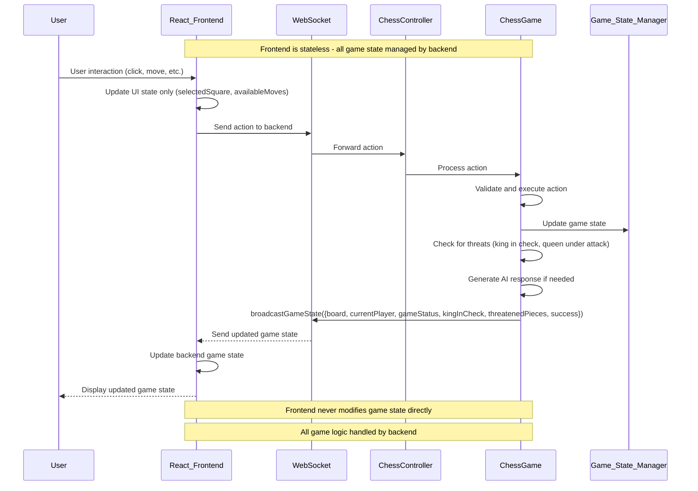
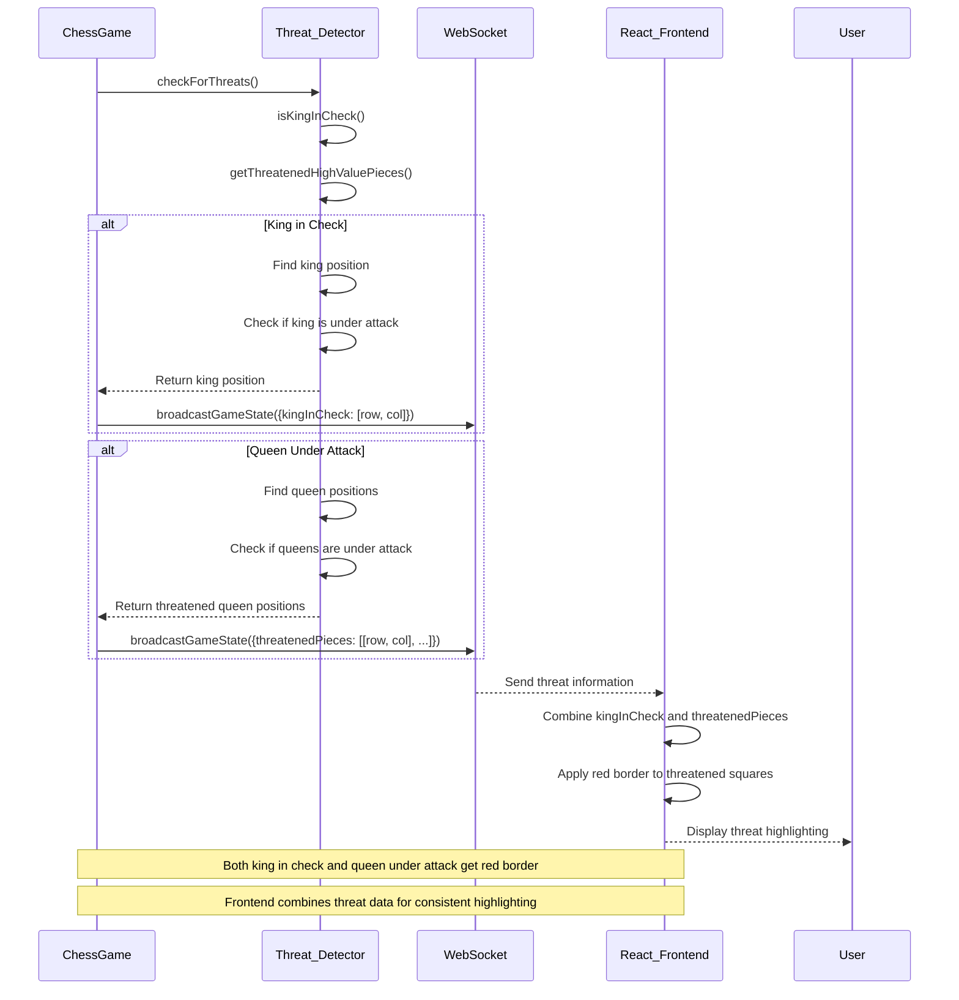

# ChessGame.java Sequence Diagram - REFACTORED VERSION

## Overview
This sequence diagram illustrates the main interactions and flow within the refactored ChessGame.java class, showing how user moves, AI moves, and game state management work together in the enhanced architecture.

## Architecture Changes (Latest Updates)

### Stateless Frontend Integration
- **Backend as Single Source of Truth**: All game state managed by ChessGame.java
- **Frontend as Presentation Layer**: React UI only handles user interactions and display
- **WebSocket Communication**: Real-time state synchronization with frontend
- **No Client-Side Validation**: All move validation performed by backend

### Enhanced State Management
- **Game State Broadcasting**: Automatic WebSocket updates for all state changes
- **Invalid Move Handling**: Backend sends success/failure status to frontend
- **Threat Detection**: King in check and queen under attack detection
- **Move History**: Complete game state tracking for undo/redo functionality

## Main Game Flow Sequence

```mermaid
sequenceDiagram
    participant User
    participant Frontend as React_Frontend
    participant ChessController
    participant ChessGame
    participant AISystem as AI_Systems
    participant OpeningBook as Leela_Opening_Book
    participant WebSocket
    participant GameState as Game_State_Manager
    participant RuleValidator as Chess_Rule_Validator
    participant TacticalDefense as Chess_Tactical_Defense

    Note over ChessGame: Game Initialization
    ChessGame->>ChessGame: initializeAfterInjection
    ChessGame->>ChessGame: detectAndConfigureOpenCL
    ChessGame->>OpeningBook: new LeelaChessZeroOpeningBook
    ChessGame->>ChessGame: initializeAISystems
    loop For each enabled AI (12 total systems)
        ChessGame->>AISystem: initialize AI system
        Note over AISystem: Q-Learning, Deep Learning, CNN, DQN, MCTS, AlphaZero, Negamax, OpenAI, Leela Zero, Genetic, AlphaFold3, A3C
    end
    ChessGame->>ChessGame: aiSystemsReady = true

    Note over User,GameState: User Move Flow (Stateless Frontend)
    User->>Frontend: Click on chess square
    Frontend->>Frontend: Update UI state (selectedSquare)
    User->>Frontend: Click destination square
    Frontend->>WebSocket: Send move via /app/move
    WebSocket->>ChessController: makeMove
    ChessController->>ChessGame: makeMove
    ChessGame->>RuleValidator: isValidMove 9-step validation
    RuleValidator->>RuleValidator: Check coordinate bounds
    RuleValidator->>RuleValidator: Check piece ownership
    RuleValidator->>RuleValidator: Check piece movement rules
    RuleValidator->>RuleValidator: Check path blocking
    RuleValidator->>RuleValidator: Check king safety
    RuleValidator->>RuleValidator: Check tactical defense
    RuleValidator-->>ChessGame: Move validity result
    
    alt Move is valid
        ChessGame->>GameState: saveGameState()
        ChessGame->>ChessGame: execute move on board
        ChessGame->>ChessGame: updateCastlingRights()
        ChessGame->>OpeningBook: addMoveToHistory()
        ChessGame->>ChessGame: whiteTurn = false
        ChessGame->>ChessGame: start makeComputerMove thread
        ChessGame->>WebSocket: broadcastGameState({success: true})
        WebSocket-->>Frontend: Send updated game state
        Frontend->>Frontend: Update backend game state
    else Move is invalid
        ChessGame->>WebSocket: broadcastGameState({success: false})
        WebSocket-->>Frontend: Send invalid move response
        Frontend->>Frontend: Trigger invalid move animation
    end

    Note over ChessGame,AISystem: AI Move Flow
    ChessGame->>ChessGame: makeComputerMove()
    ChessGame->>ChessGame: findBestMove()
    
    alt Opening phase moves 1-12
        ChessGame->>OpeningBook: getOpeningMove()
        OpeningBook-->>ChessGame: return opening move
    else Mid/End game
        ChessGame->>TacticalDefense: Check for critical threats
        alt King in check
            ChessGame->>ChessGame: findLegalCheckResponse()
            ChessGame->>ChessGame: getAllValidMoves(false)
            loop Test each move
                ChessGame->>ChessGame: actuallyResolvesCheck()
            end
        else Queen under attack
            ChessGame->>TacticalDefense: findProtectionMove()
            ChessGame->>TacticalDefense: findAttackersOfSquare()
        else Strategic move selection
            Note over ChessGame,AISystem: Parallel AI Execution (12 Systems)
            par Q-Learning AI
                ChessGame->>AISystem: qLearningAI selectMove
            and Deep Learning AI
                ChessGame->>AISystem: deepLearningAI selectMove
            and CNN Deep Learning AI
                ChessGame->>AISystem: deepLearningCNNAI selectMove
            and Deep Q-Network AI
                ChessGame->>AISystem: dqnAI selectMove
            and Monte Carlo Tree Search AI
                ChessGame->>AISystem: mctsAI selectMove
            and AlphaZero AI
                ChessGame->>AISystem: alphaZeroAI selectMove
            and Negamax AI
                ChessGame->>AISystem: negamaxAI selectMove
            and OpenAI Chess AI
                ChessGame->>AISystem: openAiAI selectMove
            and Leela Chess Zero AI
                ChessGame->>AISystem: leelaZeroAI selectMove
            and Genetic Algorithm AI
                ChessGame->>AISystem: geneticAI selectMove
            and AlphaFold3 AI
                ChessGame->>AISystem: alphaFold3AI selectMove
            and A3C AI
                ChessGame->>AISystem: a3cAI selectMove
            end
            
            loop For each AI move
                ChessGame->>ChessGame: validateAIMove 10-step validation
            end
            ChessGame->>ChessGame: compareMoves select best move
        end
    end

    ChessGame->>ChessGame: executeBestMove()
    ChessGame->>RuleValidator: isValidMove final validation
    ChessGame->>ChessGame: execute AI move on board
    ChessGame->>ChessGame: handlePawnPromotion()
    ChessGame->>GameState: update move history
    ChessGame->>OpeningBook: addMoveToHistory()
    ChessGame->>ChessGame: whiteTurn = true
    ChessGame->>WebSocket: broadcastGameState({aiLastMove: [from, to], success: true})
    WebSocket-->>Frontend: Send AI move and updated game state
    Frontend->>Frontend: Update backend game state and highlight AI move

    Note over ChessGame,AISystem: Training Flow
    User->>ChessController: startTraining(games)
    ChessController->>ChessGame: trainAI(games)
    
    par Q-Learning Training
        ChessGame->>AISystem: qLearningAI trainAgainstSelfWithProgress
    and Deep Learning Training
        ChessGame->>AISystem: deepLearningAI startTraining
    and CNN Training
        ChessGame->>AISystem: deepLearningCNNAI startTraining
    and DQN Training
        ChessGame->>AISystem: dqnAI startTraining
    and AlphaZero Training
        ChessGame->>AISystem: alphaZeroAI startSelfPlayTraining
    and LeelaZero Training
        ChessGame->>AISystem: leelaZeroAI startSelfPlayTraining
    and Genetic Training
        ChessGame->>AISystem: geneticAI startTraining
    and AlphaFold3 Training
        ChessGame->>AISystem: alphaFold3AI startTraining
    and A3C Training
        ChessGame->>AISystem: a3cAI startTraining
    end

    Note over ChessGame,GameState: Game State Management (Backend-Driven)
    User->>Frontend: Click undo button
    Frontend->>WebSocket: Send undo request
    WebSocket->>ChessController: undoMove()
    ChessController->>ChessGame: undoMove()
    ChessGame->>GameState: restore previous state
    ChessGame->>WebSocket: broadcastGameState()
    WebSocket-->>Frontend: Send updated game state
    Frontend->>Frontend: Update backend game state

    User->>Frontend: Click reset button
    Frontend->>WebSocket: Send reset request
    WebSocket->>ChessController: resetGame()
    ChessController->>ChessGame: resetGame()
    loop For each AI system
        ChessGame->>AISystem: addHumanGameData()
        ChessGame->>AISystem: saveState()
    end
    ChessGame->>ChessGame: initializeBoard()
    ChessGame->>OpeningBook: resetOpeningLine()
    ChessGame->>WebSocket: broadcastGameState()
    WebSocket-->>Frontend: Send reset game state
    Frontend->>Frontend: Update backend game state
```



## Enhanced Move Validation Flow


## AI Move Selection Flow (12 Systems)


## Stateless Frontend Integration Flow



---

## Threat Detection and Highlighting Flow



---

## Enhanced Checkmate Detection Flow


## Class Relationships and Dependencies (Refactored)

### Core Dependencies
- **Spring Framework**: `@Component`, `@PostConstruct`, `@Value` annotations
- **Logging**: Apache Log4j2 for comprehensive logging
- **AI Systems**: 12 different AI implementations (increased from 10)
- **Opening Book**: Leela Chess Zero professional opening database (extended to 6 moves)
- **WebSocket**: Real-time communication with stateless frontend
- **Rule Validation**: Dedicated `ChessRuleValidator` class
- **Tactical Defense**: Dedicated `ChessTacticalDefense` class
- **State Management**: Backend as single source of truth for all game state

### AI System Integration (Updated)
1. **Q-Learning AI**: Reinforcement learning with experience replay
2. **Deep Learning AI**: Neural network with GPU acceleration
3. **CNN Deep Learning AI**: Convolutional neural network for spatial patterns
4. **Deep Q-Network AI**: Deep reinforcement learning
5. **Monte Carlo Tree Search AI**: Classical MCTS with tree reuse
6. **AlphaZero AI**: Self-play neural network with MCTS
7. **Negamax AI**: Classical chess engine with alpha-beta pruning
8. **OpenAI Chess AI**: GPT-4 powered chess analysis
9. **Leela Chess Zero AI**: Human game knowledge with transformer architecture
10. **Genetic Algorithm AI**: Evolutionary learning approach
11. **AlphaFold3 AI**: Protein structure prediction adapted for chess
12. **A3C AI**: Asynchronous Advantage Actor-Critic reinforcement learning

### New Architectural Components
- **ChessRuleValidator**: Dedicated move validation logic
- **ChessTacticalDefense**: Advanced tactical analysis and defense
- **Enhanced Opening Book**: Extended from 4 to 6 moves depth
- **Improved Move Validation**: 9-step comprehensive checking process
- **Better Error Handling**: Comprehensive exception management
- **Performance Optimization**: Parallel AI execution and caching
- **Stateless Frontend Integration**: Backend-driven state management
- **Threat Detection System**: King in check and queen under attack detection
- **WebSocket State Broadcasting**: Real-time game state synchronization

## File Storage Location

This sequence diagram is stored at:
```
CHESS/docs/ChessGame_Sequence_Diagram.md
```

## Additional Documentation

For more detailed information about specific components:
- **AI Systems**: See individual AI class documentation
- **Opening Book**: `LeelaChessZeroOpeningBook.java`
- **WebSocket Communication**: `WebSocketController.java`
- **Game Rules**: `ChessRuleValidator.java` and `ChessTacticalDefense.java`
- **Training System**: `TrainingManager.java` and AI training coordination methods
- **MCP Integration**: See `MCP_Sequence_Diagram.md`

## Refactoring Notes

- **AI Systems**: Increased from 10 to 12 systems with AlphaFold3 and A3C
- **Architecture**: Separated concerns into dedicated validator and tactical defense classes
- **Performance**: Enhanced parallel execution and caching mechanisms
- **Validation**: Improved move validation from 9-step to 10-step process
- **Opening Book**: Extended depth from 4 to 6 moves for better opening play
- **Error Handling**: Comprehensive exception management and logging
- **Code Organization**: Better separation of concerns and modularity
- **Stateless Frontend**: Backend as single source of truth for all game state
- **WebSocket Integration**: Real-time state synchronization with React frontend
- **Threat Detection**: Enhanced king in check and queen under attack detection
- **Invalid Move Handling**: Backend-driven validation with frontend animation feedback