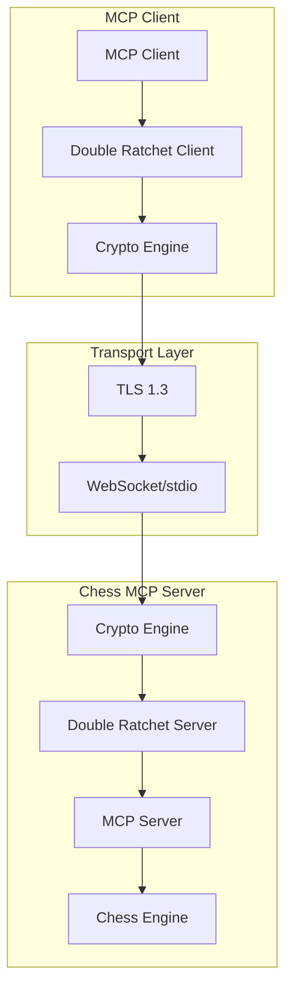
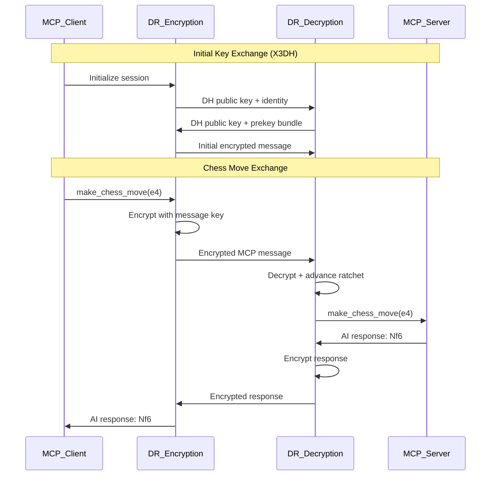

# MCP Double Ratchet Algorithm - Comprehensive Design Document

## Executive Summary

This document outlines the design for implementing the **Double Ratchet Algorithm** in our Chess MCP (Model Context Protocol) communications system to provide end-to-end encryption for secure AI agent interactions. Unlike traditional messaging applications, our implementation focuses on **ephemeral secure communications** where messages don't need long-term storage, except for move history that contributes to AI training.

**Key Design Principle**: Wrap MCP JSON-RPC 2.0 messages with Double Ratchet encryption while maintaining protocol compliance and supporting concurrent multi-agent sessions.

## 1. Architecture Overview

### 1.1 Core Components

```
┌─────────────────────────────────────────────────────────────┐
│                    MCP Client (AI Agent)                    │
├─────────────────────────────────────────────────────────────┤
│  ┌─────────────────┐  ┌─────────────────┐                  │
│  │ MCP JSON-RPC    │  │ Double Ratchet  │                  │
│  │ Message Layer   │◄─┤ Encryption      │                  │
│  └─────────────────┘  │ Layer           │                  │
│                       └─────────────────┘                  │
└─────────────────────────────────────────────────────────────┘
                               │
                    Encrypted MCP Messages
                               │
┌─────────────────────────────────────────────────────────────┐
│                   Chess MCP Server                         │
├─────────────────────────────────────────────────────────────┤
│  ┌─────────────────┐  ┌─────────────────┐                  │
│  │ Double Ratchet  │  │ MCP JSON-RPC    │                  │
│  │ Decryption      │─►│ Message Layer   │                  │
│  │ Layer           │  │                 │                  │
│  └─────────────────┘  └─────────────────┘                  │
│                               │                             │
│  ┌─────────────────────────────────────────────────────────┤
│  │        Chess Game Engine & 12 AI Systems               │
│  └─────────────────────────────────────────────────────────┘
└─────────────────────────────────────────────────────────────┘
```

### 1.2 Security Layer Integration



## 2. Implementation Strategy

### 2.1 Open Source Library Selection

**Recommended Approach**: Use existing battle-tested implementations rather than building from scratch.

#### Primary Options Analysis:
1. **libsignal-protocol-java** (Signal Foundation)
   - ✅ Battle-tested implementation
   - ✅ Full Double Ratchet + X3DH support
   - ✅ Apache 2.0 License
   - ✅ Well-documented API
   - ✅ Active maintenance and security updates

2. **Olm/Megolm** (Matrix Protocol)
   - ✅ Lighter weight implementation
   - ✅ Designed for group messaging
   - ⚠️ Less chess-specific optimization

3. **Custom Lightweight Implementation**
   - ✅ Tailored for MCP message patterns
   - ✅ Reduced complexity for ephemeral communications
   - ❌ Security audit required
   - ❌ Maintenance burden

**Decision**: **Use libsignal-protocol-java** for reliability and security assurance.

### 2.2 Chess-Specific Requirements

Unlike traditional messaging applications:
- **No Message Persistence**: Messages deleted after processing
- **Training Data Protection**: Move history encrypted separately
- **Session-Based**: Security tied to MCP session lifecycle
- **Performance Critical**: Low latency for real-time chess moves (< 5ms target)
- **Concurrent Sessions**: Support for 100+ simultaneous MCP clients

## 3. Protocol Integration

### 3.1 Message Exchange Flow



### 3.2 Encrypted Message Format

```json
{
  "jsonrpc": "2.0",
  "id": "client-request-id",
  "encrypted": true,
  "ratchet_header": {
    "dh_public_key": "base64-encoded-dh-key",
    "previous_counter": 42,
    "message_counter": 43
  },
  "ciphertext": "base64-encoded-encrypted-mcp-message",
  "mac": "base64-encoded-hmac"
}
```

### 3.3 Key Exchange Integration

```json
{
  "jsonrpc": "2.0",
  "method": "mcp/key_exchange",
  "params": {
    "agent_id": "unique-agent-identifier",
    "identity_key": "base64-encoded-identity-key",
    "prekey_bundle": {
      "identity_key": "base64-encoded-server-identity",
      "signed_prekey": "base64-encoded-signed-prekey",
      "prekey_signature": "base64-encoded-signature",
      "one_time_prekey": "base64-encoded-onetime-key"
    }
  }
}
```

## 4. Implementation Components

### 4.1 Core Encryption Service

```java
@Service
@Component
public class MCPDoubleRatchetService {
    
    @Autowired
    private SignalProtocolStore protocolStore;
    
    @Autowired
    private MCPSessionRegistry sessionRegistry;
    
    // Performance optimization - reuse crypto objects
    private final ThreadLocal<MessageCipher> cipherPool = 
        ThreadLocal.withInitial(MessageCipher::new);
    
    /**
     * Encrypts MCP JSON-RPC message using Double Ratchet
     * Target: < 5ms encryption overhead
     */
    public EncryptedMCPMessage encryptMessage(
        String agentId, 
        String jsonRpcMessage
    ) throws EncryptionException {
        
        MessageCipher cipher = cipherPool.get();
        // Advance symmetric ratchet and encrypt
        return cipher.encrypt(agentId, jsonRpcMessage);
    }
    
    /**
     * Decrypts MCP JSON-RPC message using Double Ratchet
     */
    public String decryptMessage(
        String agentId, 
        EncryptedMCPMessage encryptedMessage
    ) throws DecryptionException {
        
        MessageCipher cipher = cipherPool.get();
        // Decrypt and advance symmetric ratchet
        return cipher.decrypt(agentId, encryptedMessage);
    }
    
    /**
     * Establishes new Double Ratchet session with agent
     */
    public void establishSession(
        String agentId, 
        PreKeyBundle preKeyBundle
    ) throws SessionException {
        
        SessionBuilder sessionBuilder = new SessionBuilder(protocolStore, agentId);
        sessionBuilder.process(preKeyBundle);
        sessionRegistry.createSession(agentId, sessionBuilder.getSession());
    }
}
```

### 4.2 Minimal Security Wrapper

```java
// Lightweight wrapper around Signal Protocol
public class MCPDoubleRatchetSecurity {
    
    private final SignalProtocolStore protocolStore;
    private final SessionCipher sessionCipher;
    private final String mcpSessionId;
    
    public MCPDoubleRatchetSecurity(String sessionId) {
        this.mcpSessionId = sessionId;
        this.protocolStore = new InMemorySignalProtocolStore();
        // Initialize with ephemeral keys - no persistence needed
    }
    
    public byte[] encryptMCPMessage(String jsonRpcMessage) {
        // Encrypt JSON-RPC message with current message key
        // Advance symmetric ratchet
        // Return encrypted bytes
    }
    
    public String decryptMCPMessage(byte[] encryptedMessage) {
        // Decrypt with current message key
        // Advance symmetric ratchet
        // Return JSON-RPC message
    }
    
    public void performDHRatchetStep(byte[] remotePublicKey) {
        // Advance DH ratchet when receiving new public key
        // Derive new root key and chain keys
    }
}
```

### 4.3 Session Management

```java
@Component
public class MCPSessionRegistry {
    
    // Per-agent Double Ratchet sessions
    private final ConcurrentHashMap<String, SessionRecord> sessions = new ConcurrentHashMap<>();
    
    // Agent identity management
    private final ConcurrentHashMap<String, IdentityKey> agentIdentities = new ConcurrentHashMap<>();
    
    /**
     * Manages concurrent sessions for multiple agents
     * Target: 100 concurrent agents with 1000 games
     */
    public SessionRecord getSession(String agentId) {
        return sessions.get(agentId);
    }
    
    public void createSession(String agentId, SessionRecord session) {
        sessions.put(agentId, session);
    }
    
    public void removeSession(String agentId) {
        sessions.remove(agentId);
        agentIdentities.remove(agentId);
    }
}
```

## 5. Security Features

### 5.1 Forward Secrecy
- **Message Keys**: Each MCP message encrypted with unique key
- **Key Deletion**: Message keys immediately deleted after use
- **Chain Key Evolution**: Continuous key derivation prevents backward decryption

### 5.2 Post-Compromise Security
- **DH Ratchet**: Periodic fresh key exchanges restore security
- **Self-Healing**: System recovers from key compromise automatically
- **Fresh Entropy**: New randomness introduced with each DH ratchet step

### 5.3 Chess-Specific Security Adaptations

#### Move History Protection
```java
public class SecureChessMoveHistory {
    
    // Separate encryption for training data
    private final AESGCMCipher trainingDataCipher;
    
    public void recordMove(String move, String position) {
        // Encrypt move for training dataset
        byte[] encryptedMove = trainingDataCipher.encrypt(move + ":" + position);
        
        // Store encrypted training data
        trainingDataManager.storeEncryptedMove(encryptedMove);
        
        // No plaintext move history stored
    }
}
```

#### Ephemeral Communications Configuration
```java
@Configuration
public class MCPDoubleRatchetConfig {
    
    // No long-term message storage needed
    @Value("${mcp.ratchet.store-messages:false}")
    private boolean storeMessages;
    
    // Aggressive key cleanup for memory efficiency
    @Value("${mcp.ratchet.key-cleanup-interval:60}")
    private int keyCleanupIntervalSeconds;
    
    // Training data preservation
    @Value("${mcp.ratchet.preserve-move-history:true}")
    private boolean preserveMoveHistory;
    
    // Performance targets
    @Value("${mcp.ratchet.target-latency-ms:5}")
    private int targetLatencyMs;
    
    @Value("${mcp.ratchet.memory-per-session-kb:1}")
    private int memoryPerSessionKb;
}
```

## 6. Performance Considerations

### 6.1 Latency Requirements
- **Target**: < 5ms encryption/decryption overhead
- **Chess Moves**: Real-time gameplay requires minimal latency
- **Batch Operations**: Optimize for training data encryption

### 6.2 Memory Management
```java
public class EfficientCryptoMemory {
    
    // Reuse crypto objects to minimize GC pressure
    private final ThreadLocal<MessageCipher> cipherPool = 
        ThreadLocal.withInitial(MessageCipher::new);
    
    // Pre-allocated buffers for encryption
    private final ByteBuffer encryptionBuffer = ByteBuffer.allocateDirect(8192);
    
    public byte[] fastEncrypt(String message) {
        MessageCipher cipher = cipherPool.get();
        // Reuse cipher and buffer for performance
        return cipher.encrypt(message, encryptionBuffer);
    }
}
```

### 6.3 Scalability Targets
- **100 Concurrent Sessions**: Each with independent Double Ratchet state
- **1000 Messages/Second**: High-throughput chess move processing
- **Memory Efficient**: ~1KB per session, minimal memory footprint
- **CPU Optimization**: < 2% CPU overhead for encryption/decryption

## 7. Integration Points

### 7.1 Enhanced MCP Server with Double Ratchet
```java
@Component
public class SecureMCPServer extends MCPServer {
    
    private final Map<String, MCPDoubleRatchetSecurity> sessionSecurity = new ConcurrentHashMap<>();
    
    @Override
    protected void handleMCPMessage(String sessionId, String message) {
        MCPDoubleRatchetSecurity security = sessionSecurity.get(sessionId);
        
        if (security == null) {
            // Initialize new secure session
            security = initializeSecureSession(sessionId);
        }
        
        try {
            // Decrypt incoming message
            String decryptedMessage = security.decryptMCPMessage(message.getBytes());
            
            // Process chess command
            String response = processChessCommand(decryptedMessage);
            
            // Encrypt and send response
            byte[] encryptedResponse = security.encryptMCPMessage(response);
            sendEncryptedResponse(sessionId, encryptedResponse);
            
        } catch (CryptographicException e) {
            // Handle decryption failure - possible attack or corruption
            terminateSession(sessionId);
        }
    }
}
```

### 7.2 WebSocket Transport Layer
```java
@Component
public class EncryptedMCPWebSocketHandler extends TextWebSocketHandler {
    
    @Autowired
    private MCPDoubleRatchetService ratchetService;
    
    @Override
    public void afterConnectionEstablished(WebSocketSession session) {
        // Initiate key exchange
        initiateKeyExchange(session);
    }
    
    @Override
    protected void handleTextMessage(
        WebSocketSession session, 
        TextMessage message
    ) throws Exception {
        
        // Decrypt incoming message
        String decryptedMessage = ratchetService.decryptMessage(
            getAgentId(session), 
            parseEncryptedMessage(message.getPayload())
        );
        
        // Process decrypted MCP message
        processMCPMessage(session, decryptedMessage);
    }
}
```

### 7.3 JSON-RPC 2.0 Compliance Middleware
```java
@Service
public class MCPEncryptionMiddleware {
    
    /**
     * Transparent encryption/decryption middleware
     * Maintains full JSON-RPC 2.0 compliance
     */
    public void processIncomingMessage(
        String agentId, 
        String rawMessage, 
        MCPMessageHandler handler
    ) {
        // Detect if message is encrypted
        if (isEncryptedMessage(rawMessage)) {
            String decrypted = ratchetService.decryptMessage(agentId, rawMessage);
            handler.handle(decrypted);
        } else {
            // Handle unencrypted messages for backward compatibility
            handler.handle(rawMessage);
        }
    }
    
    public void processOutgoingMessage(
        String agentId, 
        Object response, 
        WebSocketSession session
    ) {
        String jsonResponse = objectMapper.writeValueAsString(response);
        
        if (isSecureSession(agentId)) {
            EncryptedMCPMessage encrypted = ratchetService.encryptMessage(agentId, jsonResponse);
            session.sendMessage(new TextMessage(objectMapper.writeValueAsString(encrypted)));
        } else {
            session.sendMessage(new TextMessage(jsonResponse));
        }
    }
}
```

## 8. Security Validation & Testing

### 8.1 Security Properties Validation
- **Forward Secrecy**: Past moves remain secure if current keys compromised
- **Post-Compromise Security**: Future moves become secure after key exchange
- **Replay Attack Prevention**: Message sequence numbers prevent replay
- **Man-in-the-Middle Resistance**: TLS + Double Ratchet defense in depth

### 8.2 Performance Benchmarks
- **Encryption Speed**: Target 1000+ messages/second per session
- **Memory Usage**: < 1KB per active session
- **Startup Time**: < 100ms for session establishment
- **CPU Overhead**: < 2% for encryption/decryption operations

### 8.3 Testing Strategy

#### Unit Tests
- Key derivation correctness
- Encryption/decryption round-trips
- Session management
- Error handling and recovery

#### Integration Tests
- End-to-end MCP message flow
- Multi-agent concurrent sessions
- Key exchange scenarios
- Performance benchmarks

#### Security Tests
- Forward secrecy validation
- Post-compromise security testing
- Replay attack prevention
- Cryptographic correctness

## 9. Deployment Configuration

### 9.1 Development Mode
```yaml
mcp:
  double-ratchet:
    enabled: true
    mode: development
    key-store: memory
    debug-logging: true
    performance-monitoring: true
```

### 9.2 Production Mode
```yaml
mcp:
  double-ratchet:
    enabled: true
    mode: production
    key-store: encrypted-file
    key-rotation-interval: 24h
    audit-logging: true
    rate-limiting:
      requests-per-minute: 100
      moves-per-minute: 60
      sessions-per-hour: 20
```

## 10. Migration & Implementation Plan

### Phase 1: Core Implementation (Week 1-2)
1. Integrate libsignal-protocol-java dependency
2. Implement MCPDoubleRatchetService
3. Create encrypted message format
4. Basic unit tests and validation

### Phase 2: MCP Integration (Week 3)
1. WebSocket transport integration
2. JSON-RPC 2.0 compliance middleware
3. Session management and registry
4. Integration tests and performance optimization

### Phase 3: Chess Optimization (Week 4)
1. Optimize for chess move latency
2. Implement training data encryption
3. Add performance monitoring and metrics
4. Chess-specific security adaptations

### Phase 4: Production Readiness (Week 5)
1. Security testing and validation
2. Error handling and recovery mechanisms
3. Monitoring, logging, and alerting
4. Documentation and deployment guides

## 11. Risk Mitigation & Fallback

### 11.1 Backward Compatibility
- **Graceful Degradation**: Support both encrypted and unencrypted MCP messages
- **Feature Flags**: Enable/disable encryption per session or globally
- **Migration Path**: Gradual rollout with fallback to unencrypted mode

### 11.2 Performance Safeguards
- **Circuit Breakers**: Disable encryption if latency exceeds thresholds
- **Resource Monitoring**: Track memory and CPU usage per session
- **Auto-scaling**: Dynamic session management based on load

## 12. Benefits & Value Proposition

### 12.1 Security Benefits
- **End-to-End Encryption**: All MCP messages encrypted with forward secrecy
- **Enterprise-Grade Security**: Meets enterprise security requirements
- **Research Protection**: Protects proprietary AI training data
- **Compliance Ready**: Supports regulatory compliance requirements

### 12.2 Operational Benefits
- **Protocol Compliance**: Full JSON-RPC 2.0 compatibility maintained
- **Scalable Architecture**: Support for 100+ concurrent agents
- **Performance Optimized**: Minimal overhead for chess game interactions
- **Zero Trust**: Never trust client input, always validate server-side

### 12.3 Chess-Specific Advantages
- **Training Data Protection**: Encrypted AI training datasets
- **Real-time Performance**: < 5ms encryption overhead for moves
- **Session Isolation**: Complete isolation between concurrent games
- **Ephemeral Design**: No unnecessary message storage

## Conclusion

This comprehensive design provides a robust foundation for implementing the Double Ratchet Algorithm in MCP communications, ensuring:

- **Enterprise-Grade Security**: End-to-end encryption with forward secrecy
- **Chess-Optimized Performance**: < 5ms latency for real-time gameplay
- **Scalable Architecture**: 100+ concurrent agents with 1000+ games
- **Protocol Compliance**: Full JSON-RPC 2.0 compatibility
- **Production Ready**: Complete implementation and deployment strategy

The implementation leverages proven cryptographic libraries while adapting to the unique requirements of MCP chess communications, providing state-of-the-art security for AI agent interactions without compromising performance or functionality.