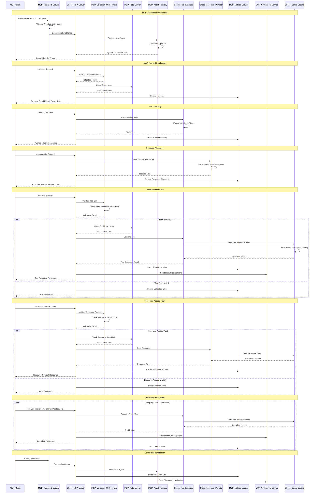
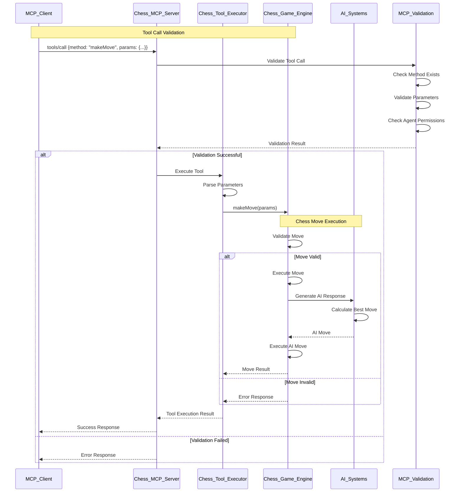
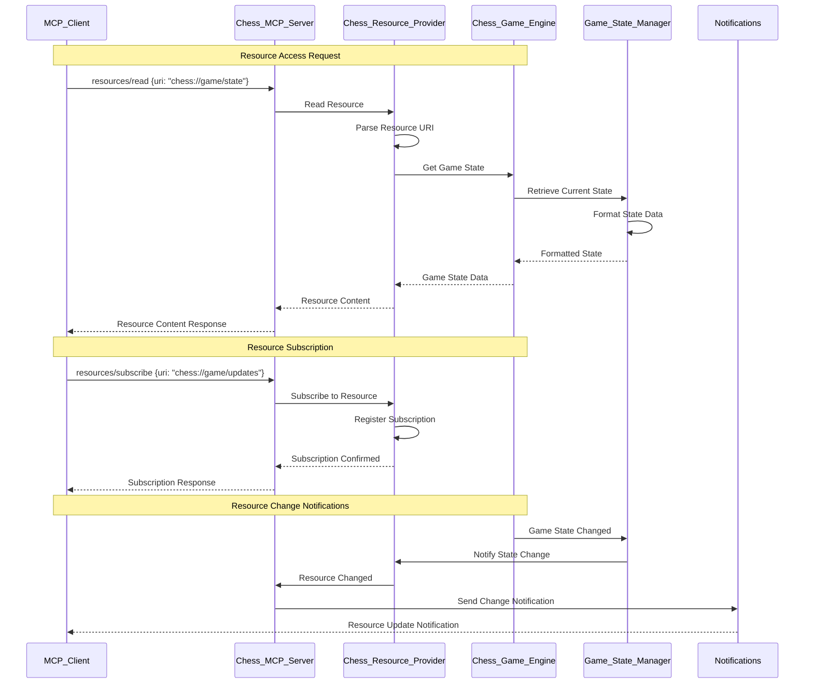
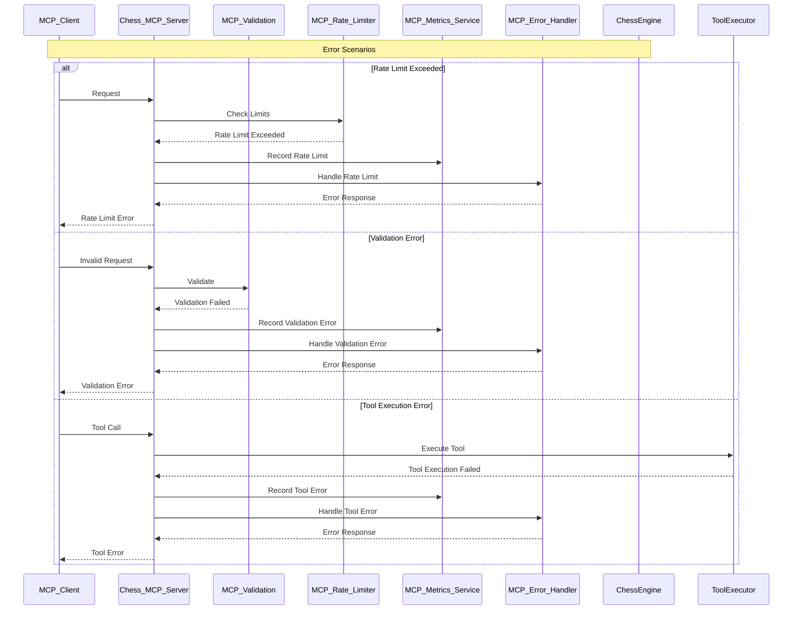
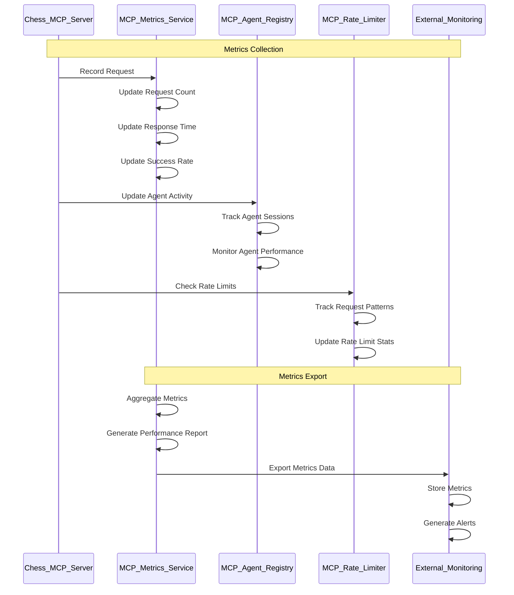

# MCP (Model Context Protocol) Sequence Diagram

## Overview
This sequence diagram illustrates the client-server interactions for the Model Context Protocol (MCP) integration in the chess application, showing how AI agents communicate with the chess engine through the MCP server.

## MCP Client-Server Architecture



## MCP Tool Execution Sequence



## MCP Resource Access Sequence



## MCP Error Handling Sequence



## MCP Metrics and Monitoring Sequence



## MCP Protocol Flow Summary

### **Connection Lifecycle:**
1. **WebSocket Connection** - Client establishes connection
2. **Agent Registration** - Server assigns unique agent ID
3. **Protocol Handshake** - Exchange capabilities and server info
4. **Tool Discovery** - Client learns available tools
5. **Resource Discovery** - Client learns available resources
6. **Continuous Operations** - Tool calls and resource access
7. **Connection Termination** - Clean shutdown and cleanup

### **Key MCP Components:**
- **MCPTransportService**: WebSocket connection management
- **ChessMCPServer**: Main MCP protocol handler
- **MCPValidationOrchestrator**: Request validation and security
- **MCPRateLimiter**: Rate limiting and throttling
- **MCPAgentRegistry**: Agent session management
- **ChessToolExecutor**: Chess-specific tool execution
- **ChessResourceProvider**: Chess resource access
- **MCPMetricsService**: Performance monitoring
- **MCPNotificationService**: Real-time notifications

### **Supported Operations:**
- **Chess Moves**: makeMove, undoMove, resetGame
- **Game Analysis**: analyzePosition, getLegalMoves
- **AI Training**: startTraining, stopTraining
- **Game State**: getGameState, getMoveHistory
- **Resource Access**: Game state, move history, AI models

### **Security Features:**
- **Rate Limiting**: Per-agent request throttling
- **Input Validation**: Comprehensive parameter validation
- **Agent Isolation**: Separate sessions and permissions
- **Error Handling**: Graceful error responses
- **Metrics Tracking**: Performance and usage monitoring

## File Storage Location

This sequence diagram is stored at:
```
CHESS/docs/MCP_Sequence_Diagram.md
```

## Related Documentation

For more detailed information about MCP integration:
- **MCP Server**: `ChessMCPServer.java`
- **Transport Layer**: `MCPTransportService.java`
- **Tool Execution**: `ChessToolExecutor.java`
- **Resource Management**: `ChessResourceProvider.java`
- **Validation**: `MCPValidationOrchestrator.java`
- **Chess Game Engine**: See `ChessGame_Sequence_Diagram.md`
