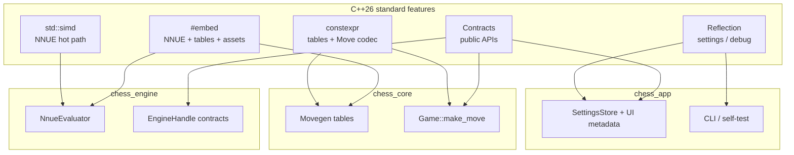
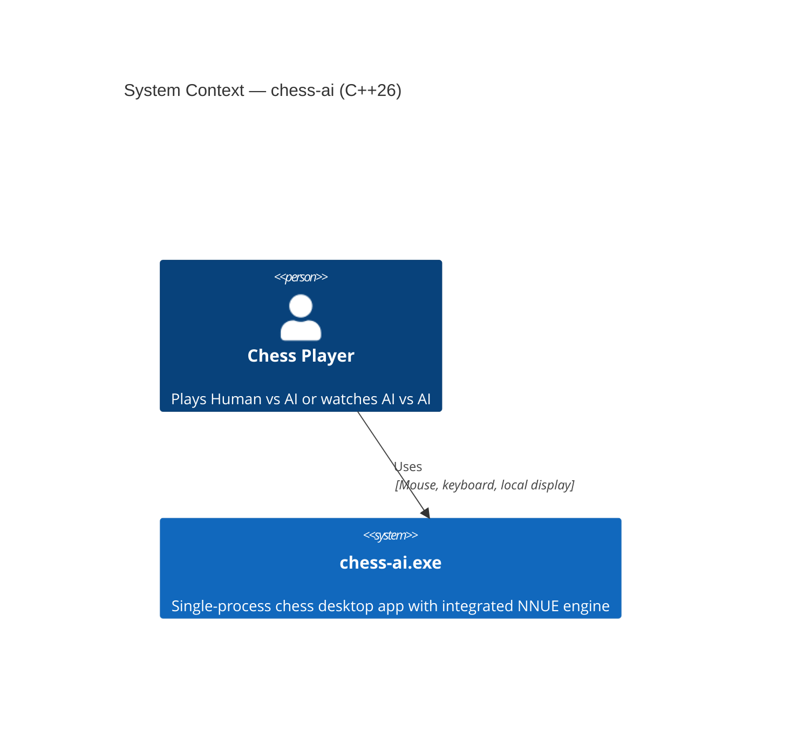
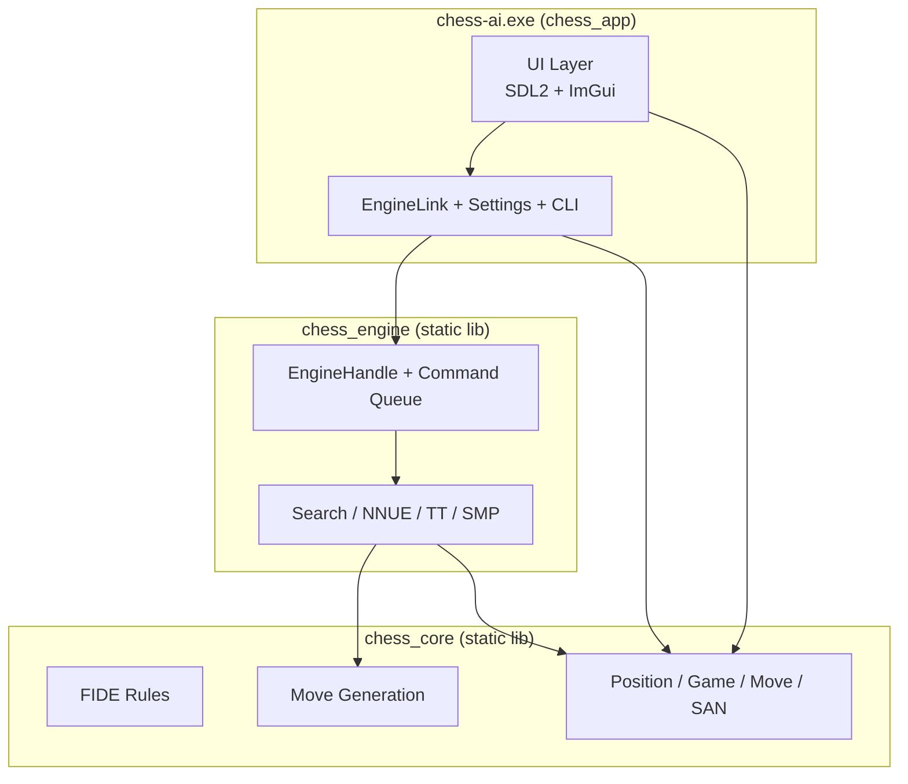
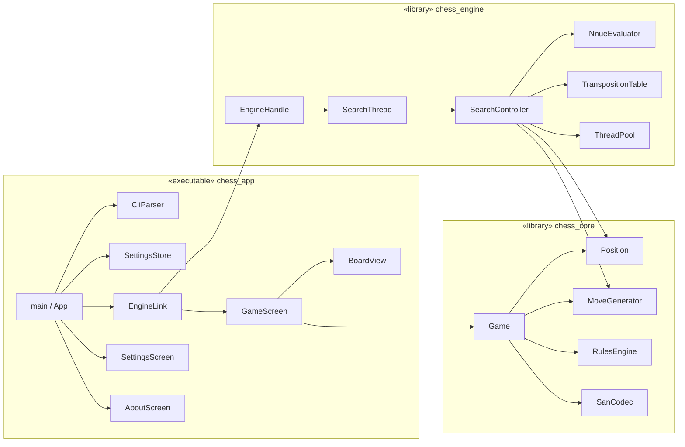
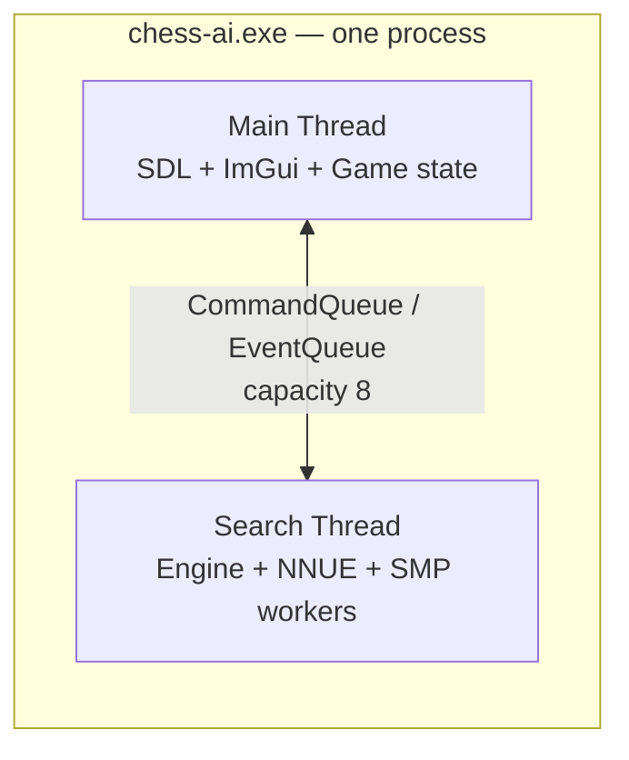
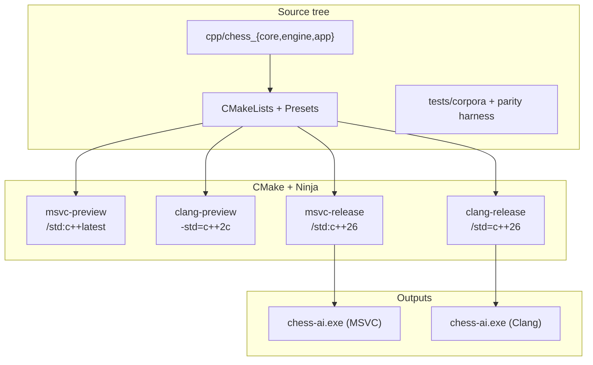
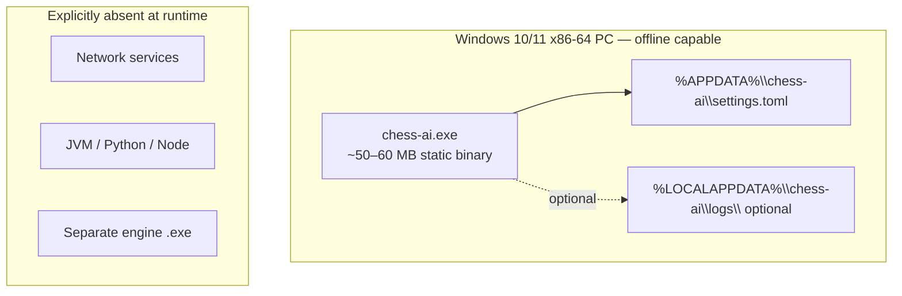
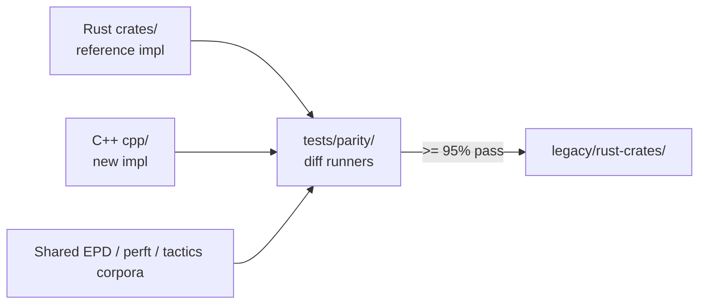

# High-Level Design (HLD): Chess AI — C++26 Migration

**Feature**: `002-rust-cpp26-rewrite`  
**Version**: 1.1  
**Date**: 2026-05-20  
**Status**: Approved for implementation  
**Related**: [spec.md](./spec.md) · [plan.md](./plan.md) · [lld.md](./lld.md)

---

## 1. Purpose and scope

This document describes the **high-level architecture** for reimplementing the constitution-compliant chess product in **C++26** as a single Windows x86-64 desktop executable. It is the authoritative design view for engineering leads and implementers before coding.

**In scope**: Process structure, module boundaries, runtime topology, build/deploy model, external dependencies, major data/control flows, and **C++26 language-feature adoption** (reflection, contracts, `#embed`, constexpr, safety, concurrency strategy).

**Out of scope**: Class-level APIs and algorithm internals — see [lld.md](./lld.md).

---

## 2. Design goals and constraints

| Goal | Design response |
|------|-----------------|
| Parity with Rust product | Rust `crates/` + test corpora are behavioral oracle (FR-003, SC-011) |
| Single executable | One `chess-ai.exe` per compiler build; static link UI + engine + core |
| One integrated engine | `chess_engine` library; no UCI/subprocess (Constitution II) |
| Native desktop UI | Dear ImGui + SDL2; no browser (Constitution III) |
| Offline operation | No runtime network in engine; settings file only disk I/O (FR-020) |
| Dual compiler release | CMake + Ninja; MSVC and Clang release presets (FR-022a, SC-013) |
| C++26 gate | Preview under `/std:c++latest` / `-std=c++2c`; production under `/std:c++26` |
| **Use C++26 deliberately** | Adopt standard features where they reduce boilerplate, improve safety, or replace build hacks — not “C++17 code compiled as C++26” |

---

## 3. C++26 language feature architecture (HLD)

C++26 (ISO finalized March 2026) is a **first-class design input**, not only a compiler flag. This section maps headline standard features to modules in `chess-ai`. Implementation detail and code patterns are in [lld.md §2](./lld.md#2-c26-feature-application-lld).

### 3.1 Adoption matrix

| C++26 theme | Standard feature | Adoption | Primary module | Rationale |
|-------------|------------------|----------|----------------|-----------|
| **Asset embedding** | `#embed` | **MUST** (release) | `chess_engine`, `chess_core` | Replace Rust `include_bytes!` / CMake blob generation for `net.bin`, magic bitboards, piece atlas — single-source, reproducible binaries |
| **API safety** | **Contracts** (`[[pre]]` / `[[post]]` / `[[assert]]`) | **MUST** | `chess_core`, `chess_engine`, `chess_app` public APIs | Preconditions on moves, search config, queue bounds; documents invariants for engine/UI boundary |
| **Compile-time introspection** | **Static reflection** | **SHOULD** | `chess_app` (settings), `chess_core` (diagnostics) | Generate TOML field validators, settings UI metadata, parity struct printers — reduces manual schema drift vs 001 |
| **Compile-time computation** | **constexpr** expansion (containers, algorithms, placement new) | **MUST** | `chess_core` | Zobrist keys, attack tables, perft constants, `Move` encode/decode — zero runtime init cost |
| **Metaprogramming** | **Pack indexing** | **SHOULD** | `chess_core` templates | Cleaner move-list / square-batch helpers in hot movegen templates |
| **Diagnostics** | Improved **`assert`** / `= delete("reason")` | **SHOULD** | All modules | Deleted copy on `Engine`; explicit reasons on non-copyable handles |
| **Numeric performance** | **SIMD** / parallel ranges improvements | **SHOULD** | `chess_engine` (NNUE) | Vectorized accumulator updates where `std::simd` + AVX2/SSE2 paths available |
| **Memory safety culture** | Safer initialization + contracts + `std::expected` | **MUST** | `chess_core`, `chess_app` | `Game::make_move` returns `expected<void,E>`; no uninitialized engine state |
| **Async/concurrency** | **`std::execution`** (senders/receivers) | **DEFER** v1 | — | Desktop monolith with one search thread; channel model matches Rust parity and is simpler (see §3.3) |
| **Runtime async** | Coroutines + execution | **OUT OF SCOPE** | — | No network, no distributed pipeline |

**Preview builds** (`/std:c++latest`, `-std=c++2c`): use **feature macros** from `cmake/ToolchainGate.cmake` (`CHESS_HAS_CONTRACTS`, `CHESS_HAS_EMBED`, `CHESS_HAS_REFLECTION`) with **documented fallbacks** (e.g. CMake `EmbedNetwork.cmake` when `#embed` unavailable).

### 3.2 C++26 features × logical layers



### 3.3 Concurrency: why not `std::execution` in v1

| Factor | `std::execution` | **Chosen: thread + bounded queues** |
|--------|------------------|-------------------------------------|
| Problem shape | Many async I/O stages, schedulers | One UI thread + one search thread |
| Parity | New design | Matches Rust `crossbeam-channel` model |
| Latency | Excellent for I/O pipelines | Engine already uses `std::jthread` + atomics for SMP |
| Dependencies | Heavy header surface | Minimal — aligns with Constitution V |
| Offline desktop | Overkill | Sufficient |

**Future (v2)**: Re-evaluate `std::execution` if adding network play, analysis workers as senders, or GPU offload — not required for FR-020 offline scope.

### 3.4 Compiler / feature maturity (2026)

| Feature | GCC 16 | Clang | MSVC | Project stance |
|---------|--------|-------|------|----------------|
| `#embed` | Early | Implementing | Progressive | **Required** for release; fallback until green |
| Contracts | Partial | Partial | Partial | **Required** on public APIs; degrade to `assert` in preview if needed |
| Reflection | Experimental | Experimental | Experimental | **Optional** with `#ifdef CHESS_HAS_REFLECTION`; manual schema until stable |
| `std::execution` | Partial | Partial | Partial | **Not used** v1 |
| `std::simd` | Via experimental | Via experimental | Via experimental | **Optional** NNUE fast path |

`scripts/smoke-cpp26.ps1` MUST probe and record feature macros in `docs/toolchain-gate-status.json` (extends SC-012).

### 3.5 Measurable “C++26-ness” success criteria (design)

| ID | Criterion |
|----|-----------|
| C26-1 | ≥ 90% of embedded binary bytes loaded via `#embed` (not runtime file I/O) in release builds |
| C26-2 | 100% of public functions in `contracts/public_api.hpp` headers carry contracts or documented `assert` fallback |
| C26-3 | Settings schema drift detected at compile time when reflection enabled (field count match) |
| C26-4 | No regression vs Rust parity tests when C++26 features enabled vs fallback path |

---

## 4. System context

The application is a **standalone thick client**. The only external actor is the human player (or observer in AI-vs-AI mode). No servers, browsers, or cloud services participate at runtime.



---

## 5. Logical architecture

### 5.1 Layered modular monolith

Three compile-time libraries and one executable. **Dependency rule**: `chess_app` → `chess_engine` → `chess_core` (no upward or circular deps).



### 5.2 Component responsibilities

| Component | Responsibility | Thread affinity |
|-----------|----------------|-----------------|
| **chess_core** | Board state, legal moves, game history, draw/mate detection, SAN | Called from UI and engine threads (immutable `Position`; `Game` owned by UI thread) |
| **chess_engine** | NNUE eval, alpha-beta search, time management, reproducible mode, command queue | Dedicated **search thread** + worker pool for SMP |
| **chess_app** | Rendering, input, screens, settings persistence, CLI, orchestration | **Main/UI thread** (SDL event loop) |

### 5.3 Component diagram (UML)



---

## 6. Runtime architecture

### 6.1 Process model

Single OS process, **two logical thread roles**:



| Thread | Must not | Must do |
|--------|----------|---------|
| Main | Block > ~1 ms on search; touch engine internal state | Poll SDL + ImGui; poll engine events each frame |
| Search | Touch ImGui/SDL; block UI | Own transposition table, NNUE weights, search state |

### 6.2 High-level game loop (control flow)

```mermaid
sequenceDiagram
    autonumber
    actor User
    participant UI as chess_app (Main)
    participant Game as chess_core::Game
    participant Link as EngineLink
    participant Eng as chess_engine (Search Thread)

    User->>UI: Launch exe
    UI->>UI: Load settings.toml
    UI->>Eng: spawn Engine
    loop Each frame (~60 FPS)
        UI->>UI: SDL poll + ImGui render
        UI->>Link: try_recv events
        Link-->>UI: SearchProgress / Complete
    end
    User->>UI: Play move
    UI->>Game: make_move (validate)
    Game-->>UI: ok / error
    UI->>Link: SetPosition + StartSearch
    Link->>Eng: Command queue
    Eng-->>Link: SearchComplete
    Link->>Game: apply engine move
    UI->>User: Update board
```

---

## 7. Data architecture (logical)

| Data store | Format | Location | Lifetime |
|------------|--------|----------|----------|
| Active game | In-memory `Game` | `chess_app` heap | Session |
| Engine position mirror | `Position` + history vector | Search thread | Per search session |
| User settings | TOML v1 | `%APPDATA%\chess-ai\settings.toml` | Persistent |
| NNUE + magics | Embedded binary | `.exe` read-only section | Build-time |
| Debug logs (optional) | Text | `%LOCALAPPDATA%\chess-ai\logs\` | Rotating |

No database, no game files, no runtime downloads (FR-014, FR-021).

---

## 8. Build and deployment architecture



| Preset | Purpose | Shippable |
|--------|---------|-----------|
| `msvc-preview` / `clang-preview` | Developer integration (US1–US4) | **No** |
| `msvc-release` / `clang-release` | CI + release candidates | **Yes** (after Release Gate) |

**Release Gate** (see [tasks.md](./tasks.md)): engine port, SC-001 Elo match, parity suite, dual CI green, official C++26 flags.

---

## 9. Deployment view



---

## 10. External dependencies (HLD)

| Dependency | Role | Linking |
|------------|------|---------|
| Dear ImGui | Immediate-mode UI | Static |
| SDL2 | Window, input, GPU backend | Static |
| toml++ | Settings parse/serialize | Header-only |
| {fmt} | Logging | Static/header |
| GoogleTest | Tests only | Test targets |
| MSVC / Clang CRT | C++ runtime | Static CRT preferred (`/MT`) |

Vendored under `cpp/third_party/`. No Qt, no Boost, no networking stack in product code.

---

## 11. Cross-cutting concerns

| Concern | Approach |
|---------|----------|
| **Error handling** | `std::expected` / exceptions at boundaries; UI shows human-readable reject reasons |
| **Logging** | `{fmt}` + optional file sink when `debug_logging=true` |
| **Concurrency** | Lock-free or mutex-backed SPSC queue main↔search; `std::jthread` for workers |
| **Security** | No network attack surface; settings path under user profile only |
| **Licensing** | GPL-3.0 executable (Carp engine lineage); documented in About screen |
| **Testability** | GoogleTest per layer; parity harness vs Rust; CTest in CI |

---

## 12. Migration and parity strategy



---

## 13. Traceability to requirements

| Requirement area | HLD section |
|------------------|-------------|
| FR-001–FR-004 migration | §3–4, §11 |
| FR-005–FR-007 rules | §4.2 `chess_core` |
| FR-008–FR-012 engine | §4.2, §5.1 `chess_engine` |
| FR-013–FR-019 UI | §4.2 `chess_app`, §5.2 |
| FR-020–FR-022 distribution | §7–8 |
| FR-025 CMake/Ninja | §8 |
| SC-012–SC-014 toolchain/build | §8 |
| **C++26 feature adoption** | **§3**, [lld.md §2](./lld.md) |
| C26-1–C26-4 embed/contracts/reflection | §3.5 |

---

## 14. Document map

| Document | Audience | Content depth |
|----------|----------|---------------|
| **hld.md** (this) | Architects, leads | System / component / deployment |
| **lld.md** | Implementers | **§2 C++26 patterns**; classes, sequences, states, packages |
| [data-model.md](./data-model.md) | All | Entity fields |
| [contracts/](./contracts/) | All | Observable APIs |

**Next step for engineers**: Read HLD → LLD (UML) → [tasks.md](./tasks.md) Phase 1+.
