# Low-Level Design (LLD): Chess AI — C++26 Migration

**Feature**: `002-rust-cpp26-rewrite`  
**Version**: 1.1  
**Date**: 2026-05-20  
**Status**: Approved for implementation  
**Prerequisite**: [hld.md](./hld.md) (especially [§3 C++26 architecture](./hld.md#3-c26-language-feature-architecture-hld))  
**Related**: [data-model.md](./data-model.md) · [contracts/](./contracts/)

---

## 1. Purpose

This document provides **implementable low-level design** for the C++26 chess application: namespaces, key types, interfaces, threading contracts, **C++26 language-feature patterns** (reflection, contracts, `#embed`, constexpr, SIMD), and **UML diagrams** software engineers use during coding and review.

### 1.1 UML diagram index

| § | Diagram type | Name | Primary audience |
|---|--------------|------|------------------|
| **2** | **Design** | **C++26 feature application** | **All layers / build** |
| 3 | Package | Module dependency | Build / ownership |
| 4 | Class | `chess_core` domain model | Core developers |
| 5 | Class | `chess_engine` search subsystem | Engine developers |
| 6 | Class | `chess_app` presentation layer | UI developers |
| 7 | Sequence | Human move → AI reply | Full-stack integration |
| 8 | Sequence | Settings load / save | App config |
| 9 | Sequence | Undo / Redo | Game history |
| 10 | Sequence | Hint / analysis | Engine analysis mode |
| 11 | Sequence | AI-vs-AI tick | Self-play |
| 12 | State | `Game` lifecycle | Rules / QA |
| 13 | State | Engine search lifecycle | Concurrency |
| 14 | State | UI screen navigation | UX |
| 15 | Activity | Application startup | `main` / CLI |

---

## 2. C++26 feature application (LLD) {#2-c26-feature-application-lld}

This section is the **implementation companion** to [hld.md §3](./hld.md#3-c26-language-feature-architecture-hld). It specifies headers, macros, fallbacks, and code patterns — not merely “compile with C++26.”

### 2.1 Feature detection and build integration

`cmake/ToolchainGate.cmake` runs `try_compile` snippets per compiler and defines:

| Macro | When `ON` | Fallback when `OFF` |
|-------|-----------|---------------------|
| `CHESS_HAS_EMBED` | `#embed` compiles in current standard mode | `cmake/EmbedNetwork.cmake` + generated `*_data.cpp` (T004) |
| `CHESS_HAS_CONTRACTS` | Contract attributes accepted | `CHESS_CONTRACT_FALLBACK` → `assert` + `[[nodiscard]]` |
| `CHESS_HAS_REFLECTION` | Static reflection introspects test struct | Manual `UserSettings` field table in `settings_schema.hpp` |
| `CHESS_HAS_SIMD` | `std::simd` + target intrinsics probe | Scalar NNUE accumulator loop |

Central header (all libraries include via `chess_core/c26_config.hpp`):

```cpp
// cpp/chess_core/include/chess_core/c26_config.hpp
#pragma once
#if defined(CHESS_HAS_CONTRACTS)
#  include <contract>  // or vendor contract header when standardized
#  define CHESS_PRE(cond) [[pre: cond]]
#  define CHESS_POST(cond) [[post: cond]]
#else
#  define CHESS_PRE(cond) /* assert fallback in .cpp */
#  define CHESS_POST(cond)
#endif
```

`scripts/smoke-cpp26.ps1` records macro values in `docs/toolchain-gate-status.json` (SC-012, C26-4).

### 2.2 `#embed` — binary assets (MUST for release)

**Sources** (parity with Rust `include_bytes!`):

| Asset | Rust path | C++ path | Consumer |
|-------|-----------|----------|----------|
| NNUE weights | `crates/chess-engine-chess/bins/net.bin` | `cpp/chess_engine/bins/net.bin` | `NnueEvaluator` |
| Magic bitboards | `crates/chess-engine-chess/bins/*.bin` | `cpp/chess_core/bins/*.bin` | `MoveGenerator` |
| Piece atlas | `crates/chess-app/assets/pieces.png` | `cpp/chess_app/assets/pieces.png` | `BoardView` texture upload |

**Primary pattern** (`CHESS_HAS_EMBED`):

```cpp
// cpp/chess_engine/include/chess_engine/nnue_weights.hpp
namespace chess_engine {
inline constexpr std::array<std::byte, N> nnue_blob() {
    return std::to_array<std::byte>(#embed "bins/net.bin");
}
}
```

Engine loads weights from `nnue_blob()` at init — **no** `fopen`, **no** runtime path to `bins/` in release (C26-1).

**Fallback** (preview MSVC without `#embed`): T004 generates `network_data.cpp` with `alignas(64) constexpr std::byte kNetData[] = { 0x.. };` — byte-identical to `#embed` output; parity tests MUST pass on both paths.

**About screen**: SHA-256 of embedded bytes computed once at startup (`std::span` over `nnue_blob()`), matching [contracts/cli-flags.md](./contracts/cli-flags.md).

### 2.3 Contracts — public API safety (MUST)

Contract-bearing headers live beside each library’s public API:

| Header | Examples |
|--------|----------|
| `chess_core/contracts/public_api.hpp` | `Game::make_move`, `Position::make_move`, `Move::decode` |
| `chess_engine/contracts/public_api.hpp` | `EngineHandle::send`, queue depth, `SearchConfig` |
| `chess_app/contracts/public_api.hpp` | `SettingsStore::save`, time-control parse |

**Core — move legality and bounds**:

```cpp
// chess_core/include/chess_core/game.hpp
std::expected<void, std::string> make_move(Move m)
    CHESS_PRE(m.from < 64 && m.to < 64)
    CHESS_POST(is_terminal().has_value() || legal_moves().size() >= 0);
```

**Engine — bounded command queue** (L-4):

```cpp
bool EngineHandle::try_send(Command cmd)
    CHESS_PRE(command_queue_.size() < kMaxQueueDepth)  // kMaxQueueDepth == 8
    CHESS_POST(returned == true || command_queue_.size() == kMaxQueueDepth);
```

**Search config**:

```cpp
void set_time_control(TimeControl tc)
    CHESS_PRE(tc.millis() > 0 || tc.depth() > 0);
```

When `CHESS_HAS_CONTRACTS` is off, equivalent `assert` in `.cpp` plus contract comments in header satisfy C26-2 for preview builds.

### 2.4 Static reflection — settings and diagnostics (SHOULD)

**Target struct** (`chess_app::UserSettings` per [data-model.md](./data-model.md)):

```cpp
struct UserSettings {
    std::string engine_strength;
    int search_threads;
    // ... mirrors settings-file.md v1
};
```

When `CHESS_HAS_REFLECTION`:

- `settings_meta.hpp` generated (or macro-expanded) from `std::meta::members_of<UserSettings>` — field names, types, default hints for ImGui widgets.
- Compile-time check: `static_assert(std::meta::size_of_members_v<UserSettings> == kSchemaFieldCount)` against `kSchemaFieldCount` from TOML schema version (C26-3).
- `to_toml(UserSettings)` / `from_toml` walk reflected members — reduces drift vs 001 manual serde.

**Fallback**: `settings_schema.hpp` lists `(member_ptr, key, type)` triples; same public API.

**Diagnostics** (debug builds): `chess_core::debug::print_move(Move)` uses reflection on `Move` fields for parity logs — optional.

### 2.5 `constexpr` — compile-time tables (MUST)

| Table | Location | Notes |
|-------|----------|-------|
| Zobrist keys | `position.cpp` | `constexpr` init; no static ctor order fiasco |
| Attack / ray tables | `movegen_tables.hpp` | Built from embedded magics or constexpr generators |
| Perft golden counts | `tests/core/perft_constants.hpp` | `static_assert` depth-5 count |
| `Move::encode` / `decode` | `move.hpp` | `constexpr` round-trip for unit tests |

C++26 allows more container/algorithm use in `constexpr` contexts — prefer `std::array` + `std::ranges` in table builders over macro-generated `.inc` files.

### 2.6 Pack indexing — movegen templates (SHOULD)

Replace recursive `get<I>(pack...)` patterns in batch square helpers:

```cpp
template <std::size_t... Is, typename Fn>
constexpr void for_each_square(std::index_sequence<Is...>, Fn&& fn) {
    (fn(square_from_index(Is)), ...);
}
// C++26: direct pack indexing where supported for cleaner batch updates
```

Used in knight/ king attack batch updates — keeps hot paths readable without Boost.Hana.

### 2.7 `std::simd` — NNUE hot path (SHOULD)

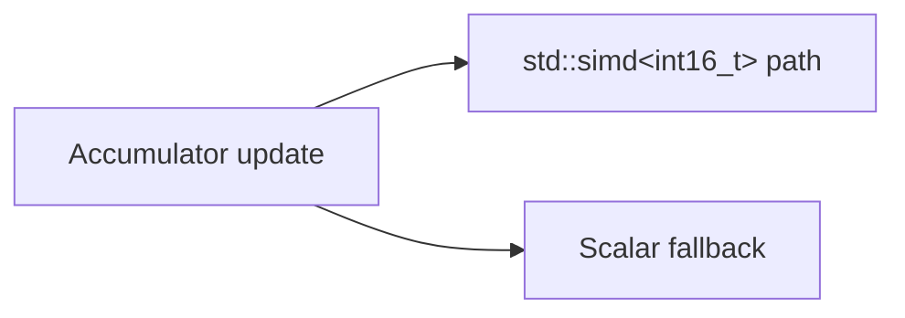

- Probe AVX2/SSE2 at CMake configure; define `CHESS_USE_SIMD`.
- `nnue.cpp`: vectorized add/sub of feature accumulators when `CHESS_HAS_SIMD && CHESS_USE_SIMD`.
- Reproducible mode (`ReproducibleMode`) **forces scalar** for deterministic parity (FR-004, R-7).

### 2.8 Memory safety patterns (MUST)

| Pattern | Application |
|---------|-------------|
| `std::expected<T,E>` | `Game::make_move`, settings parse, engine command errors |
| Default member initializers | All `UserSettings`, `SearchConfig`, queue structs |
| `= delete("reason")` | `Engine(const Engine&) = delete("Engine is owned by search thread");` |
| Placeholder `[[maybe_unused]]` / `_` | Ignore unused SAN parse scratch, callback params |
| `std::span<const std::byte>` | NNUE weights view — no raw pointer length mismatch |

No `std::execution` in v1 — see [hld.md §3.3](./hld.md#33-concurrency-why-not-stdexecution-in-v1). Concurrency remains `std::jthread` + bounded `std::deque` command queue (§13).

### 2.9 C++26 feature × file map

| Feature | Primary files |
|---------|----------------|
| `#embed` | `nnue_weights.hpp`, `movegen_tables.hpp`, `assets_embed.hpp` |
| Contracts | `*/contracts/public_api.hpp`, enforced in `game.cpp`, `engine_handle.cpp` |
| Reflection | `settings_meta.hpp`, `settings.cpp` (generated or macro) |
| constexpr | `move.hpp`, `movegen_tables.hpp`, `zobrist.hpp` |
| SIMD | `nnue.cpp`, `cmake/SimdProbe.cmake` |
| Feature macros | `c26_config.hpp`, `ToolchainGate.cmake` |

### 2.10 Parity and testing requirements

- **Dual-path tests**: `tests/engine/embed_test.cpp` asserts `nnue_blob()` hash equals CMake-fallback blob.
- **Contract tests**: `tests/core/contracts_test.cpp` — invalid moves trigger contract violation / assert in debug.
- **Reflection tests** (if enabled): changing `UserSettings` without schema bump fails compile.
- Release Gate includes C26-1–C26-4 from [hld.md §3.5](./hld.md#35-measurable-c26-ness-success-criteria-design).

---

## 3. Package diagram (UML)

Shows **compile-time** dependencies. Dashed arrow = uses types from; solid = links library.

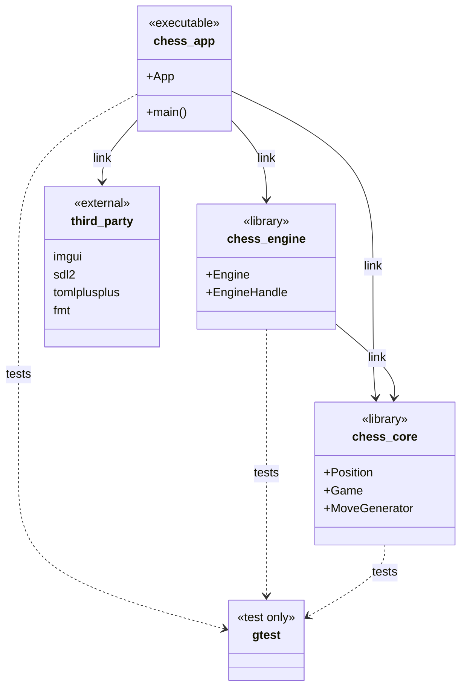

**Include path rule**: Public headers live under `include/<lib>/`; private implementation under `src/`.

---

## 4. Class diagram — `chess_core`

Core domain is **UI-agnostic**. `Position` is immutable on `make_move`; `Game` owns session state and undo stacks.

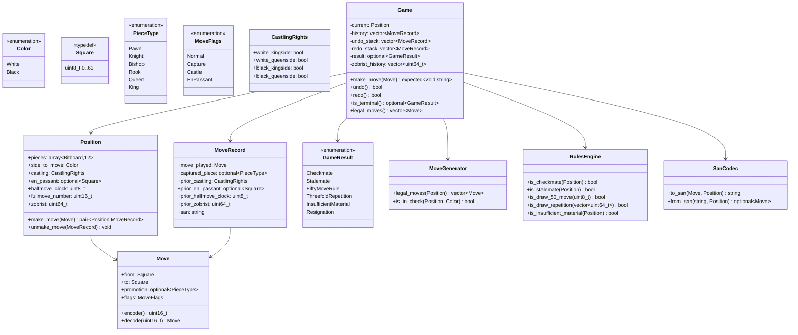

### 4.1 Key invariants

- `Game::make_move` MUST call `MoveGenerator::legal_moves` before applying.
- `zobrist_history` stores hash after each ply for threefold detection.
- `Move` 16-bit encoding MUST match Rust layout for parity tests.

---

## 5. Class diagram — `chess_engine`

Search runs on a **worker thread**. `EngineHandle` is the only type `chess_app` includes from this library.

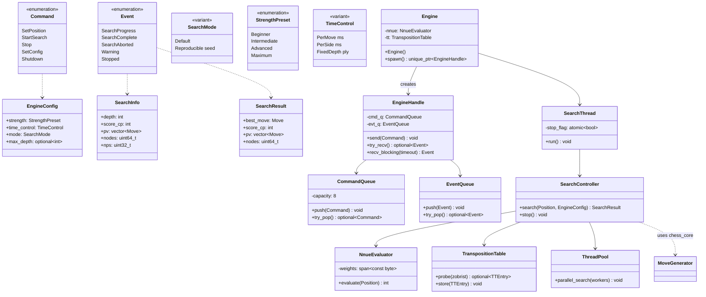

### 5.1 Thread-safety contract

| Type | Thread-safe? | Notes |
|------|--------------|-------|
| `EngineHandle::send` | Yes | Producers: main thread only |
| `EngineHandle::try_recv` | Yes | Consumer: main thread only |
| `Engine` internals | No | Owned exclusively by search thread |

---

## 6. Class diagram — `chess_app`

Presentation layer; holds `Game` and bridges to engine.

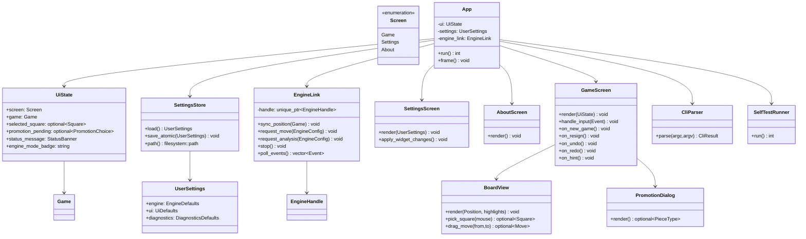

---

## 7. Sequence diagram — Human move and AI reply

Primary integration path (US1). Synchronous validation on main thread; search async on engine thread.

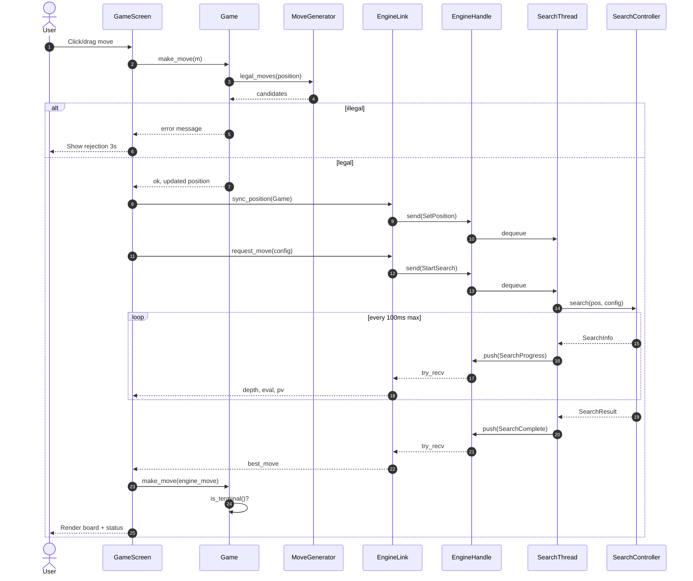

---

## 8. Sequence diagram — Settings persistence

Debounced save (250 ms) per UI contract.

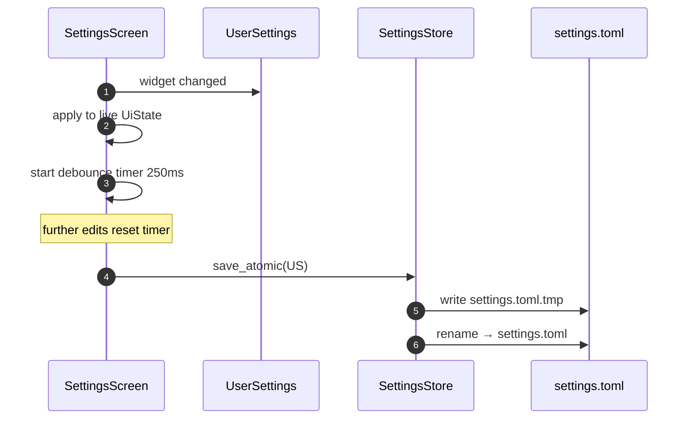

---

## 9. Sequence diagram — Undo and Redo

Undo pops human + engine plies when needed; stops search first.

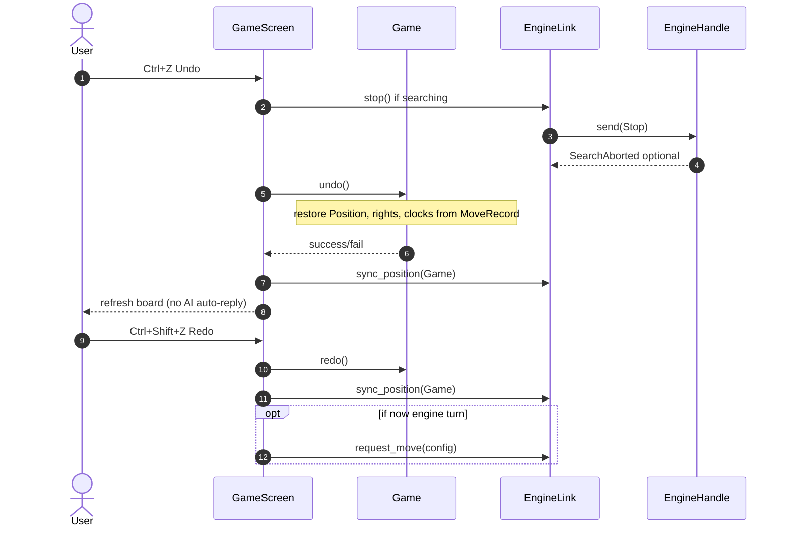

---

## 10. Sequence diagram — Hint / analysis

Analysis uses same engine; does not commit move to `Game`.

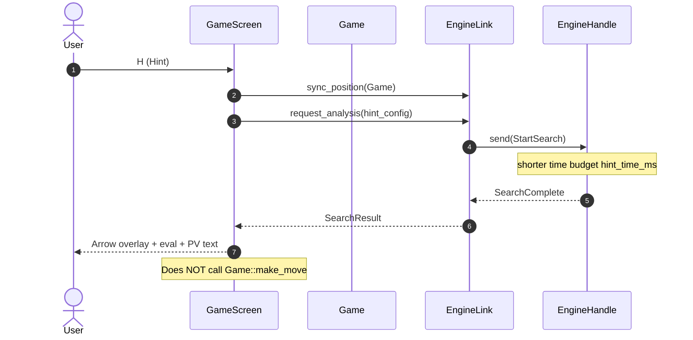

---

## 11. Sequence diagram — AI vs AI tick

Auto-play loop on main thread; one search per frame batch when not paused.

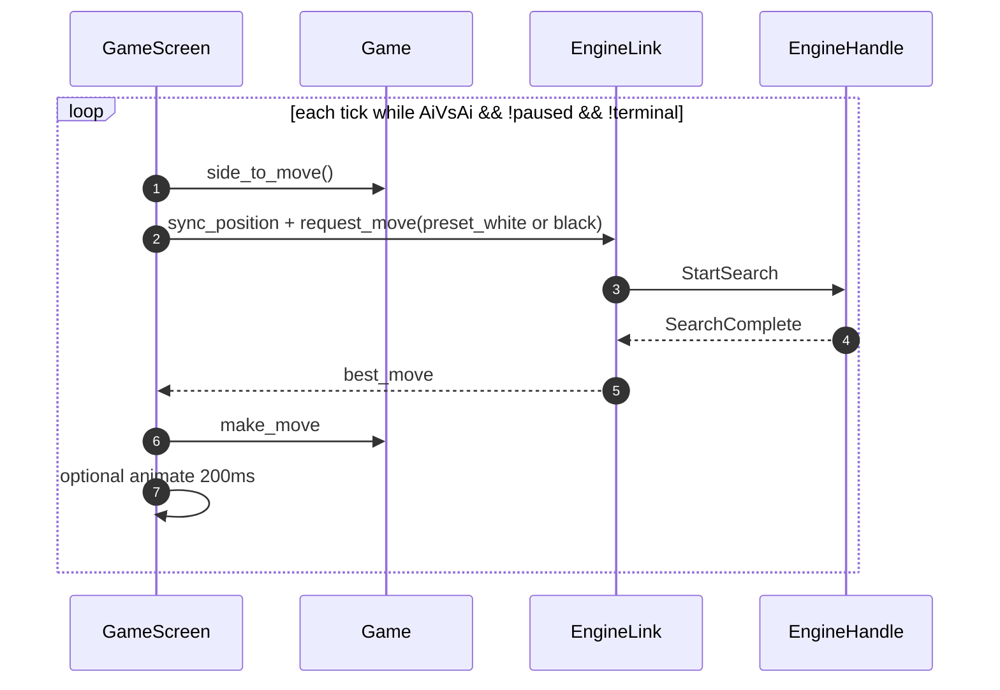

---

## 12. State diagram — `Game` lifecycle

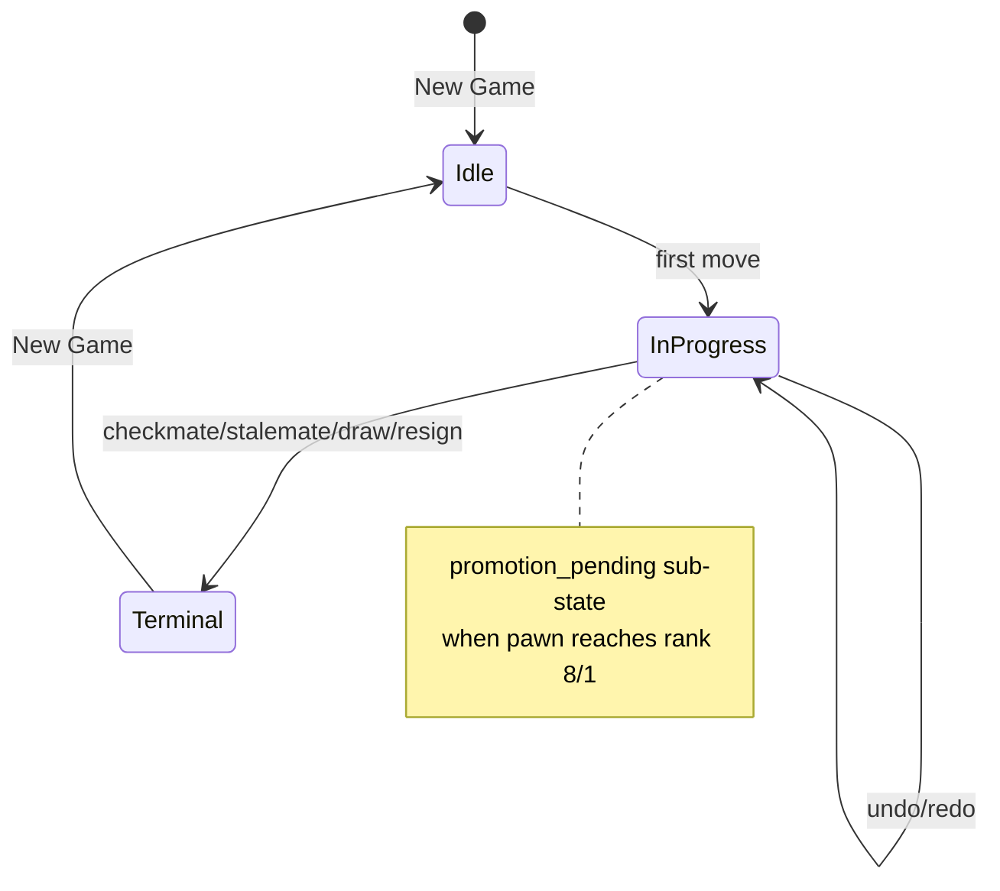

---

## 13. State diagram — Engine search lifecycle

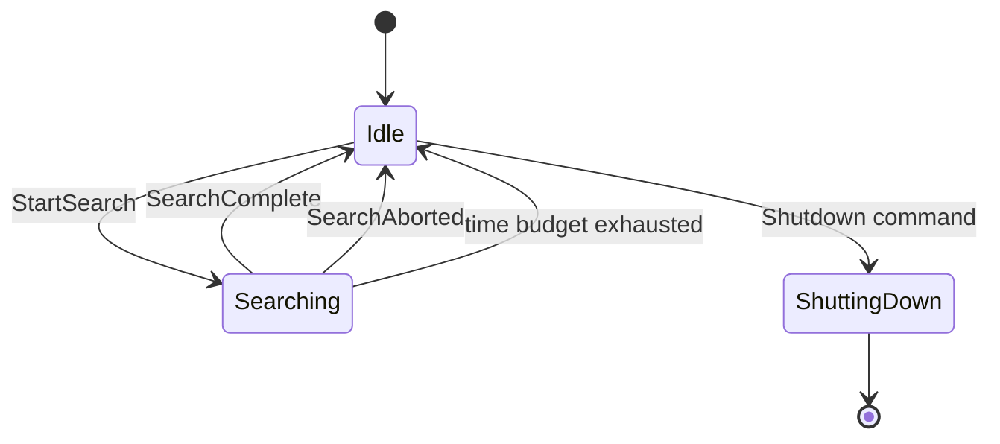

**Invariant**: At most one active search per `EngineHandle` at a time; `StartSearch` while `Searching` queues or rejects per implementation (recommend reject with Warning event).

---

## 14. State diagram — UI screen navigation

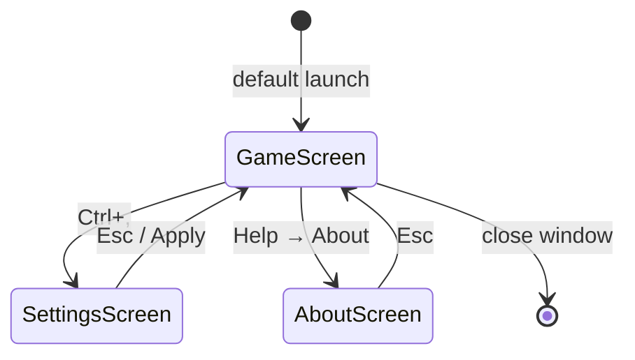

---

## 15. Activity diagram — Application startup

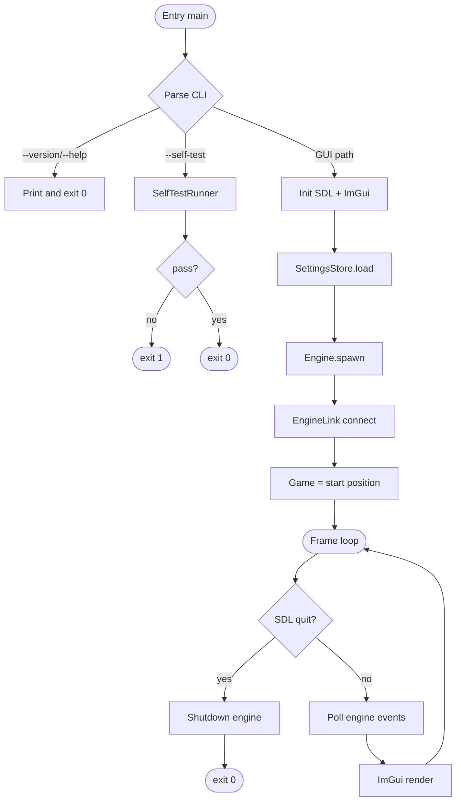

---

## 16. Physical file layout (implementation map)

| LLD type | Primary files |
|----------|----------------|
| C++26 config / macros | `cpp/chess_core/include/chess_core/c26_config.hpp`, `cmake/ToolchainGate.cmake`, `cmake/SimdProbe.cmake` |
| `#embed` assets | `nnue_weights.hpp`, `movegen_tables.hpp`, `assets_embed.hpp` |
| Contracts | `cpp/*/include/*/contracts/public_api.hpp` |
| Reflection / settings | `cpp/chess_app/include/chess_app/settings_meta.hpp`, `settings_schema.hpp` (fallback) |
| `Position`, `Move` | `cpp/chess_core/include/chess_core/position.hpp`, `move.hpp` |
| `Game` | `cpp/chess_core/src/game.cpp` |
| `MoveGenerator` | `cpp/chess_core/src/movegen.cpp` |
| `Engine`, `EngineHandle` | `cpp/chess_engine/include/chess_engine/engine.hpp`, `src/engine_handle.cpp` |
| `SearchController` | `cpp/chess_engine/src/search.cpp`, `nnue.cpp`, `smp.cpp` |
| `EngineLink` | `cpp/chess_app/src/engine_link.cpp` |
| `GameScreen` | `cpp/chess_app/src/ui/game_screen.cpp` |
| `SettingsStore` | `cpp/chess_app/src/settings.cpp` |

---

## 17. Design decisions (LLD level)

| ID | Decision | Rationale |
|----|----------|-----------|
| L-1 | `EngineHandle` channel API vs virtual interface | Matches Rust parity; clear thread boundary |
| L-2 | Immutable `Position` | Simplifies SMP race analysis; undo via `MoveRecord` |
| L-3 | ImGui immediate mode | Parity with egui; fast board redraw |
| L-4 | Bounded queue depth 8 | Back-pressure; prevents unbounded command pile-up |
| L-5 | Search progress throttle 100 ms | Prevents UI event flood (contract) |
| L-6 | `std::jthread` for SMP workers | C++20/26 stop token support on shutdown |
| L-7 | `#embed` primary, CMake blob fallback | C26-1; preview compiler support |
| L-8 | Contracts on all `public_api.hpp` surfaces | C26-2; degrade to assert when macro off |
| L-9 | Reflection optional behind `CHESS_HAS_REFLECTION` | C26-3; manual schema until compilers stable |
| L-10 | `std::execution` not used v1 | Parity with Rust channels; see HLD §3.3 |
| L-11 | SIMD optional; scalar in ReproducibleMode | Deterministic NNUE for parity tests |
| L-12 | `constexpr` tables for Zobrist / magics | Zero runtime init; matches R-17 |

---

## 18. Review checklist for implementers

Before opening a PR against a module, confirm:

- [ ] C++26 patterns in §2 applied or fallback documented (embed, contracts, constexpr)
- [ ] Class names and relationships match diagrams in §4–§6
- [ ] Sequence behavior matches §7–§11 for your feature
- [ ] No upward dependency (`chess_core` must not include engine/app headers)
- [ ] Engine search states follow §13 (no concurrent searches)
- [ ] Game termination follows §12 before accepting new moves
- [ ] Parity-sensitive types (`Move` encoding) unchanged without harness update
- [ ] Embedded asset hash unchanged or reflected in About / self-test

---

## 19. Document history

| Version | Date | Change |
|---------|------|--------|
| 1.0 | 2026-05-20 | Initial LLD with UML for C++26 migration |
| 1.1 | 2026-05-20 | §2 C++26 feature application: `#embed`, contracts, reflection, constexpr, SIMD, safety patterns |
